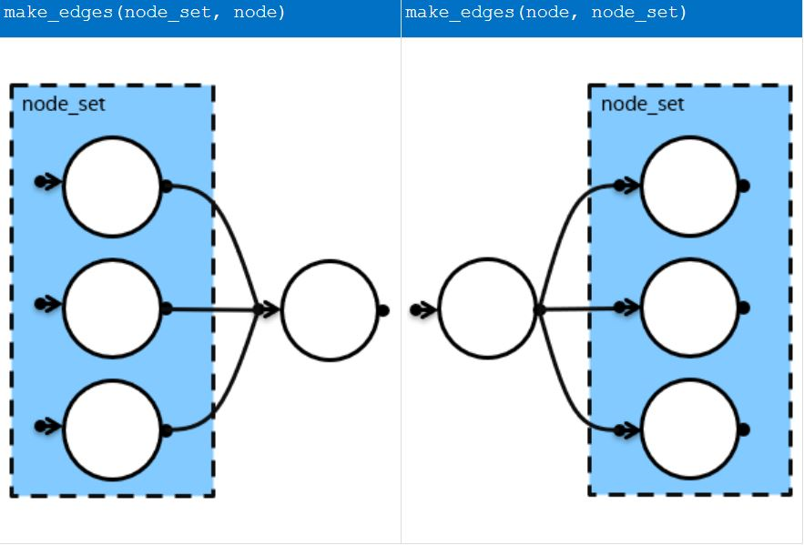
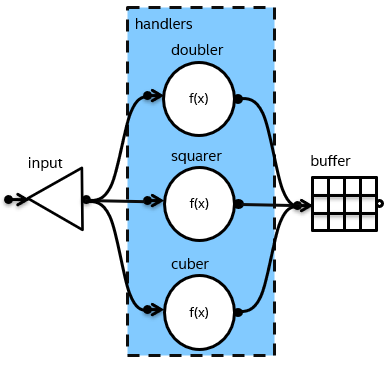

.. _make_edges:

=======================
``make_edges`` function
=======================
**[flow_graph.helper_functions.make_edges]**

.. note::
   To enable this :ref:`preview feature<preview_features>`, define the
   ``TBB_PREVIEW_FLOW_GRAPH_FEATURES`` macro to 1.

The ``make_edges`` function template creates edges between a single node
and each node in a set of nodes.

There are two ways to connect nodes in a set and a single node using
``make_edges``:

Syntax
------

.. code:: cpp

    // Defined in header <oneapi/tbb/flow_graph.h>

    namespace oneapi {
        namespace tbb {
            namespace flow {

            // node_set is an exposition-only name for the type returned from make_node_set function

            template <typename NodeType, typename Node, typename... Nodes>
            void make_edges(node_set<Node, Nodes...>& set, NodeType& node);

            template <typename NodeType, typename Node, typename... Nodes>
            void make_edges(NodeType& node, node_set<Node, Nodes...>& set);

            } // namespace flow
        } // namespace tbb
    } // namespace oneapi

Example
-------

The example implements the graph structure in the picture below.

.. literalinclude:: ./examples/make_edges_function_example.cpp
    :language: c++
    :start-after: /*begin_make_edges_function_example*/
    :end-before: /*end_make_edges_function_example*/
