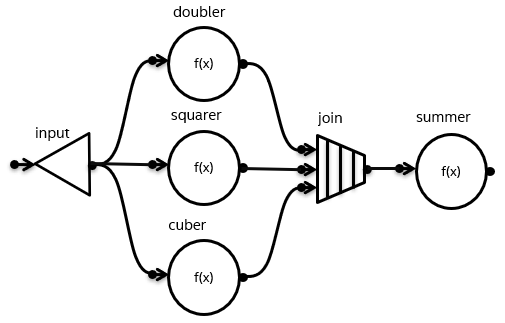

.. _helpers_for_expressing_graphs:

Helper Functions for Expressing Graphs (preview)
================================================
**[flow_graph.helper_functions]**

.. note::
    To enable this feature, define the ``TBB_PREVIEW_FLOW_GRAPH_FEATURES`` macro to ``1``.

This feature adds ``make_edges``, ``make_node_set``, ``follows`` and ``precedes`` functions to
``oneapi::tbb::flow`` namespace.

These functions simplify the process of building flow graphs by gathering nodes
into sets and connect them to other nodes in the graph.

.. toctree::
    :titlesonly:

    helper_functions/follows_and_precedes_functions
    helper_functions/constructors_for_nodes
    helper_functions/make_node_set_function
    helper_functions/make_edges_function

Example
-------

Consider the graph depicted below.

In the examples below, C++17 Class Template Argument Deduction is used
to avoid template parameter specification where possible.

**Regular API**

.. literalinclude:: ./examples/helpers_for_expressing_graphs_regular_api_example.cpp
    :language: c++
    :start-after: /*begin_helpers_for_expressing_graphs_regular_api_example*/
    :end-before: /*end_helpers_for_expressing_graphs_regular_api_example*/

**Preview API**

.. literalinclude:: ./examples/helpers_for_expressing_graphs_preview_api_example.cpp
    :language: c++
    :start-after: /*begin_helpers_for_expressing_graphs_preview_api_example*/
    :end-before: /*end_helpers_for_expressing_graphs_preview_api_example*/

.. rubric:: See Also

    :ref:`Preview Features<preview_features>`
