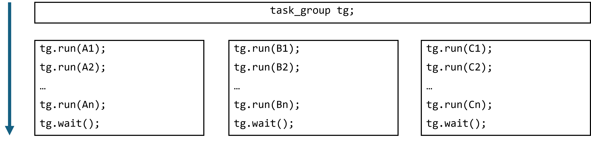
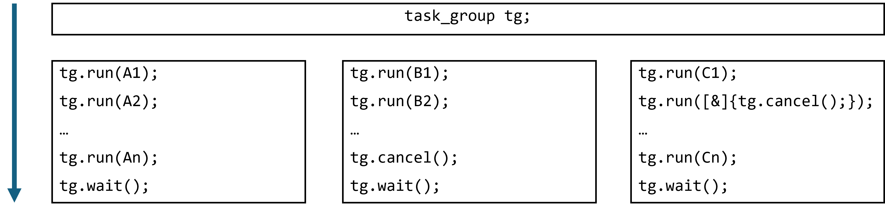

.. _task_group_thread_safety:

task_group Thread Safety
========================

The use of a shared ``task_group`` object across different threads is safe and easy to reason about
in many common cases, such as recursive algorithms. But there are some cases where it is difficult
to reason about the concurrent use of a single shared ``task_group`` across threads.

In :ref:`creating_tasks_with_task_group`, tasks that are executing within a ``task_group`` add additional tasks
by calling ``run`` on the same ``task_group`` object. The call to ``task_group::wait`` is then made
from the thread that started the recursive parallel algorithm. The calls to ``run`` are logically nested
within a recursive algorithm and that single call to ``wait`` from the main thread is guaranteed to wait
for all of the children tasks, even those added from a worker thread.

Generally, calls to ``task_group::run`` and ``task_group::wait`` on the same object from different threads
do not offer simple guarantees. Here is a diagram that shows a single ``task_group``
object that is accessed in parallel by three different threads. Each thread runs some tasks and then calls wait
on the shared ``task_group``:

.. container:: fignone
   :name: conurrent_tasks

   .. container:: imagecenter

      |image0|

If none of the tasks run in the ``task_group`` throw an exception or cancel the execution of the
``task_group``, there two execution guarantees. 

First, all tasks created by calls to ``run`` that *happens before* a call to ``wait`` on the same thread 
are guaranteed to be complete when the call to wait returns. So for example, the thread that runs the
`A` tasks is guaranteed to wait for all the `A` tasks in its call to ``wait``. 

Second, any run that *inter-thread happens before* a call to ``wait`` on another thread will be complete
when that call to wait returns.

Both of these guarantees mean that if you use C++ mechanism to order the calls to ``run``
and ``wait`` on the same ``task_group``, this ordering will be respected. But if you do not
enforce an ordering, then there can be races between when a task is run in a ``task_group`` and
a the ``wait`` on that ``task_group`` in another thread.

If however, you use cancellation, it becomes difficult to reason about ordering. Here is
the same example, including cancellation:

.. container:: fignone
   :name: conurrent_tasks_canceled

   .. container:: imagecenter

      |image1|

