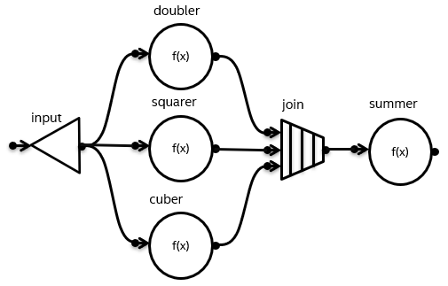
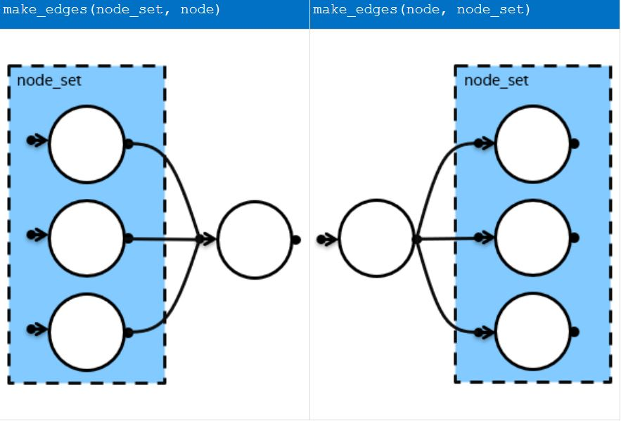

# Helper Functions for Expressing Flow Graphs

## Introduction

The flow graph API lacks a simple way to create multiple edges with a single call. The result of this
limitation is verbose, less-readable code.  For example, the following picture shows a flow graph where the
node `input` has three successors.



Without the proposed extensions, three separate calls to `make_edge` are required to connect the
single `input` node to its three successors: 

```cpp
    broadcast_node<int> input(g);

    function_node doubler(g, unlimited, [](const int& v) { return 2 * v; });
    function_node squarer(g, unlimited, [](const int&) { return v * v; });
    function_node cuber(g, unlimited, [](const int& v) { return v * v * v; });

    make_edge(input, doubler);
    make_edge(input, squarer);
    make_edge(input, cuber);
```

To reduce verbosity and improve readability, additional functions were added to the flow graph API
to simpify these cases. A shorter and more readable implementation of the previous code snippet that
uses these extensions is shown below:

```cpp
    function_node doubler(g, unlimited, [](const int& v) { return 2 * v; });
    function_node squarer(g, unlimited, [](const int&) { return v * v; });
    function_node cuber(g, unlimited, [](const int& v) { return v * v * v; });

    broadcast_node input(precedes(doubler, squarer, cuber));
```

## Proposal

Several helper functions and additional constructors have been added as experimental features.
These additions simplify expressing dependencies between nodes when building oneTBB flow graphs.
This experimental feature is described in more detail in the
[Developer Guide](https://www.intel.com/content/www/us/en/docs/onetbb/developer-guide-api-reference/2022-0/helper-functions-for-expressing-graphs.html)

There are four main parts to the extension:

- make_node_set function template
- make_edges function template
- two additional constructors for each flow graph node
- follows and precedes function templates

### Node Sets

In this proposal, `node_set` is an exposition-only name for the type returned from the
`make_node_set` function. The `make_node_set` function template creates a set of nodes that
can be passed as arguments to the `make_edges`, `follows` and `precedes` functions that are
described in later sections.

```cpp
    // node_set is an exposition-only name for the type returned from make_node_set function

    template <typename Node, typename... Nodes>
    /*unspecified*/ make_node_set( Node& node, Nodes&... nodes );
```

### The `make_edges` function template

The make_edges function template creates edges between a single node and each node in a set of nodes.

There are two ways to connect nodes in a set and a single node using make_edges:



The order of the arguments determines the predecessor / successor relationship. The node or nodes represented
by the left argument becomes the predecessor or predecessors of the node or nodes represented by the right
argument.

### Additional Constructors for Flow Graph nodes

Each flow graph node has been extended with two new constructors, one that receives a *follows* 
set of nodes `[1]` and another that receives a *precedes* set of nodes `[2]`. These node sets are 
created using the `precedes` and `follows` helper functions described in the next section.

The object returned by follows or precedes replaces the graph argument, which in other constructors is passed
as the first argument. The graph argument for the node being constructed is obtained either from the specified
node set or the sequence of nodes passed to follows or precedes.

```cpp
    // continue_node
    continue_node(follows(...), Body body, Policy = Policy());  // [1]
    continue_node(precedes(...), Body body, Policy = Policy()); // [2]

    continue_node(follows(...), int number_of_predecessors, Body body, Policy = Policy());
    continue_node(precedes(...), int number_of_predecessors, Body body, Policy = Policy());

    // function_node
    function_node(follows(...), std::size_t concurrency, Policy = Policy());
    function_node(precedes(...), std::size_t concurrency, Policy = Policy());

    // input_node
    input_node(precedes(...), body);

    // multifunction_node
    multifunction_node(follows(...), std::size_t concurrency, Body body);
    multifunction_node(precedes(...), std::size_t concurrency, Body body);

    // async_node
    async_node(follows(...), std::size_t concurrency, Body body);
    async_node(precedes(...), std::size_t concurrency, Body body);

    // overwrite_node
    explicit overwrite_node(follows(...));
    explicit overwrite_node(precedes(...));

    // write_once_node
    explicit write_once_node(follows(...));
    explicit write_once_node(precedes(...));

    // buffer_node
    explicit buffer_node(follows(...));
    explicit buffer_node(precedes(...));

    // queue_node
    explicit queue_node(follows(...));
    explicit queue_node(precedes(...));

    // priority_queue_node
    explicit priority_queue_node(follows(...), const Compare& comp = Compare());
    explicit priority_queue_node(precedes(...), const Compare& compare = Compare());

    // sequencer_node
    sequencer_node(follows(...), const Sequencer& s);
    sequencer_node(precedes(...), const Sequencer& s);

    // limiter_node
    limiter_node(follows(...), std::size_t threshold);
    limiter_node(precedes(...), std::size_t threshold);

    // broadcast_node
    explicit broadcast_node(follows(...));
    explicit broadcast_node(precedes(...));

    // join_node
    explicit join_node(follows(...), Policy = Policy());
    explicit join_node(precedes(...), Policy = Policy());

    // split_node
    explicit split_node(follows(...));
    explicit split_node(precedes(...));

    // indexer_node
    indexer_node(follows(...));
    indexer_node(precedes(...));
```

A few points to note. 

- The constructor receives a set of predecessor nodes or a set of successor nodes,
but not both.
- The type of set determines the ordering relationship, unlike for `make_edges` where
the predecessor / successor relationship is inferred from the relative ordering of the
arguments.
- A special rule must be established for nodes that support multiple input or output ports.

For nodes with multiple input or output ports, the size of the set must be exactly equal to
the number of ports. A single edge is then created for each port to or from the node with the
same index in the set.

For example in the following code, the use of `tbb::flow::precedes(n2, n3)` causes two edges
to be created ``output_port<0>(n1) --> n2`` and ``output_port<1>(n1) --> n3``.

```cpp
  int main()
  {
      tbb::flow::graph g;

      tbb::flow::function_node<int,int> n2{ g, 1,
          [](int msg) {
              std::printf("2:%d\n", msg);
              return msg;
          } };

      tbb::flow::function_node<int,int> n3(g, 1,
          [](int msg) {
              std::printf("3:%d\n", msg);
              return msg;
          });

      using mfn_t = tbb::flow::multifunction_node<int, std::tuple<int, int> >;
      mfn_t n1(tbb::flow::precedes(n2, n3), 1,
          [](int msg, mfn_t::output_ports_type& p) {
              std::printf("1:%d\n", msg);
              std::get<0>(p).try_put(msg * 2);
              std::get<1>(p).try_put(msg * 4);
          });

      n1.try_put(100);
      g.wait_for_all();
      return 0;
  }
```

When run, the above code results in:

```
  1:100
  3:400
  2:200
```

The multi-port nodes include `multifunction_node`, `join_node`, `split_node` and `indexer_node`.
The rule for creating edges from sets is the same for each of these types.

### `follows` and `precedes` Helper Functions

These functions creates or annotates a `node_set` with its ordering type. That is, the
output is a node set that is a precedes or follows set. The signatures of the `follows`
and `precedes` functions are shown below:

```cpp
    // node_set is an exposition-only name for the type returned from make_node_set function

    template <typename NodeType, typename... NodeTypes>
    /*unspecified*/ follows( node_set<NodeType, NodeTypes...>& set );  // [1]

    template <typename NodeType, typename... NodeTypes>
    /*unspecified*/ follows( NodeType& node, NodeTypes&... nodes );    // [2]

    template <typename NodeType, typename... NodeTypes>
    /*unspecified*/ precedes( node_set<NodeType, NodeTypes...>& set ); // [3]

    template <typename NodeType, typename... NodeTypes>
    /*unspecified*/ precedes( NodeType& node, NodeTypes&... nodes );   // [4]
```

The template functions `[1]` and `[3]` take a node set and add the ordering to it. For example:

```cpp
  auto handlers = make_node_set(n1, n2, n3);
  broadcast_node<int> input(precedes(handlers));
```

While template functions `[2]` and `[4]` take a sequence of nodes and creates a node set that includes
an ordering.  The following code is equivalent to the previous example:

```cpp
  broadcast_node<int> input(precedes(n1, n2, n3));
```

## Exit Criteria

The following conditions need to be met to move the feature from experimental to fully supported:
* Collecting feedback on user experience confirming the choices made on the open questions and limitations:
  * Limitation that constructors can be used to set predecessors or successors but not both.
  * The multiport node rule that makes edges from each node in the set to the corresponding port.
* The corresponding oneTBB specification update should be done backed by the user feedback provided.
