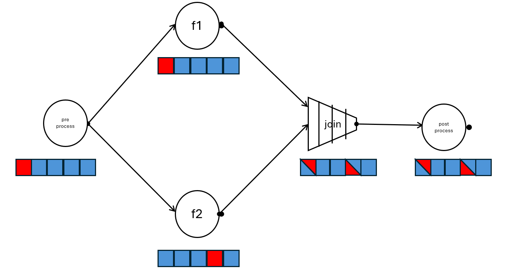
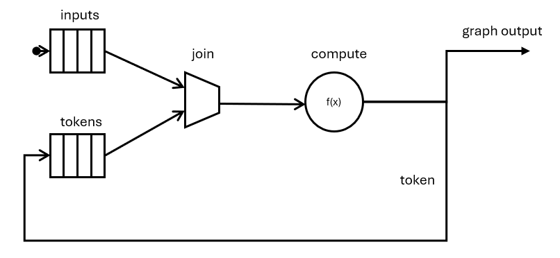
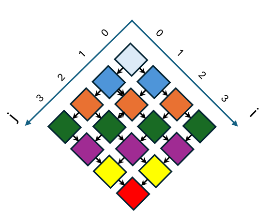
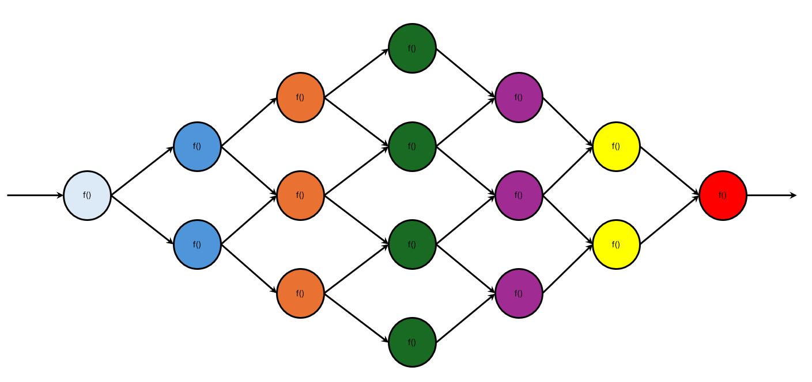

# Waiting for single messages in the Flow Graph

This feature extends the oneTBB Flow Graph interface with a ``try_put_and_wait(msg)`` that supports waiting
for completion of the chain of tasks related to the ``msg``.

The feature may improve Flow Graph performance in scenarios where multiple threads submit work into the same
Flow Graph and each of them need to wait for only the work associated with their message to complete.

## Introduction

Without this feature, the oneTBB Flow Graph supports two basic actions after building the graph:

- Submitting messages in some nodes using the ``receiver::try_put`` or ``input_node::activate`` API.
- Waiting for completion of **all** messages in the graph using the ``graph::wait_for_all``.

Since the only API currently available for waiting for a work to complete is ``wait_for_all`` and it waits for all
tasks in the graph to complete, there can be negative performance impact in use cases when the thread submitting the work 
should be notified as soon as possible when the work is done. 

Consider the following example:

```cpp
struct ComputeInput;
struct ComputeOutput;

// High-level computation instance that performs some work
// using the oneTBB Flow Graph under the hood
// but the Flow Graph details are not expressed as part of public API
class ComputeTool
{
private:
    oneapi::tbb::flow::graph m_graph;
    oneapi::tbb::flow::broadcast_node<ComputeInput> m_start_node;
    // Other Flow Graph nodes
public:
    ComputeTool()
    {
        // Builds the Flow Graph
    }

    // Performs the computation using the user-provided input
    ComputeOutput compute(ComputeInput input)
    {
        m_start_node.try_put(input); // Submit work in the graph
        m_graph.wait_for_all(); // Waiting for input to be processed
    }
};

int main()
{
    ComputeTool shared_tool;

    oneapi::tbb::parallel_for(0, 10,
        [&](int i)
        {
            // Preparing the input for index i

            ComputeOutput output = shared_tool.compute(input);

            // Post process output for index i
        });
}

```

The ``ComputeTool`` is a user interface that performs some computations on top of oneTBB Flow Graph. The function ``compute(input)`` should
submit the input provided to the computation graph and wait for completion of the input. 
This function also can be executed concurrently from several threads as it shown in the ``main``.

While using the ``wait_for_all()``, each thread submitting the work to the graph is required to wait
until **all** of the tasks to be done, even those that are unrelated to the input submitted. If some
post-processing is required on each thread after receiving the computation result, it would only be safe to start it when the 
Flow Graph is completed. That is inefficient since the post-processing of lightweight graph tasks are blocked by processing of unrelated inputs.

To remove this negative performance effect, the ``try_put_and_wait`` extension waits only for completion of one message by each node in the graph
(instead of the full completion of the graph):

```cpp
ComputeOutput compute(ComputeInput input)
{
    // Submits input and waits for its completion
    m_start_node.try_put_and_wait(input);
}
```

## Overview of experimental feature

This feature extends the existing Flow Graph API with an additional member function for each of the receiver nodes -
``node.try_put_and_wait(msg)``. This function submits the ``msg`` into the Flow Graph (similarly to ``try_put(msg)``)
and wait for its completion.

The function blocks until all of the tasks related to processing ``msg`` complete and is allowed to skip waiting for any other tasks to
complete.

Consider the following graph:

```cpp
namespace flow = oneapi::tbb::flow;

flow::graph g;

flow::function_node<int, int> pre_process(g, flow::serial, pre_process_body);

flow::function_node<int, int> f1(g, flow::unlimited, f1_body);
flow::function_node<int, int> f2(g, flow::unlimited, f2_body);

flow::join_node<std::tuple<int, int>, flow::queueing> join(g);

flow::function_node<int, int> post_process(g, flow::serial, post_process_body);

flow::make_edge(pre_process, f1);
flow::make_edge(pre_process, f2);

flow::make_edge(f1, flow::input_port<0>(join));
flow::make_edge(f2, flow::input_port<1>(join));

flow::make_edge(join, post_process);

// Parallel submission
oneapi::tbb::parallel_for (0, 100, [](int input) {
    pre_process.try_put(input);
});

start.try_put_and_wait(444);
// Post-processing 444

g.wait_for_all();
```



Each input message is pre-processed in the serial ``pre_process`` node and the output is broadcasted to two concurrent computational functions
``f1`` and ``f2``.

The result is joined into a single tuple in ``join`` node and then post-processed in a serial ``post_process`` functional node.

The order of processing the tasks corresponding to each input item is exposed under each node in the picture. 

The tasks are shown in the right-to-left order - the tasks on the right are submitted earlier then the tasks on the left.

Blue tasks relates to the parallel loop 0-100. Red tasks relates to the ``444`` message submitted as an input to ``try_put_and_wait``.

Since ``pre_process`` is a serial ``function_node``, the items processing cannot be re-ordered and the red task will be in the leftmost position
since it was submitted after the blue tasks.

``f1`` and ``f2`` are ``unlimited`` ``function_node``s, so the tasks ordering is arbitrary since tasks for each computed item are spawned.

``join`` is a queueing ``join_node`` and it should preserve the ordering of items as they are processed by ``f1`` and ``f2``. The tasks are shown
as partially blue and partially red since the output of red task from ``f1`` can be combined with the output of blue task from ``f2`` and wise versa.

Since ``post_process`` is a serial ``function_node``, the ordering of the tasks will be the same as in ``join``.

The ``try_put_and_wait`` is expected to exit when all of the red (including partially red) tasks are completed. It may require some amount of blue tasks
to be completed as well, e.g. to execute previously stored tasks in the ``function_node``'s queue. 

Completion of all blue tasks as in ``wait_for_all`` is not guaranteed.

## Feature Design

This feature is implemented by creating an instance of special private class ``message_metainfo`` for each input message in ``try_put_and_wait``. This instance
wraps the pointer to the dedicated ``wait_context`` object representing the reference counter for single input message.

``message_metainfo`` is broadcasted through the graph together with the message itself. The actual value and the type of the message can be changed during the computation, but the stored 
metainformation is preserved.

The reference counter in the ``wait_context`` inside of the ``message_metainfo`` is increased in the following cases:
* The task associated with the computations of the ``try_put_and_wait`` input message is created (*).
* The item associated with the computations of the desired input is stored in the buffering node or in the internal buffer of the other node type.
* When the ``continue_msg`` with the non-empty associated waiter is received by ``continue_node``. In this case, the node buffers the ``message_metainfo``s received from each
  predecessor and increases the underlying reference counter to prolonge the wait until signals from each predecessor is received. 

The reference counter is decreased when:
* The task associated with the computations of the ``try_put_and_wait`` input is finalized. If the output of the task should be propagated to the successors of the node, it is done
  from the task body and hence the reference counter is decreased only after creating the task for each successor and increasing the reference counter for them.
* The item associated with the computations is taken from the buffering node or from the internal buffer.
* When the desired number of signals from the predecessors was received by the ``continue_node`` (after spawning a task for executing the body).
  This case is equivalent to retrieving the set of buffered ``message_metainfo``s received previously from each predecessor. 

``message_metainfo`` class may be reused in the future to support additional use-cases when it is required to push additional information about the input message through the graph. E.g. supporting
priorities for single messages - the corresponding priority tag can be assigned as part of the metainfo.

Metainformation class supports containing multiple reference counters at the same time to support joining messages with different associated reference counters in the ``join_node``. 
See [separate section](#details-about-metainformation-class) for more details.

Currently processing the metainformation is exposed by adding new virtual member functions to various Flow Graph instances. 
Note that the described functions are internal, may change over time and should not be used directly.

``` cpp
template <typename T>
class receiver {
protected:
    virtual bool try_put_task(const T& t) = 0; // Existing API
    virtual bool try_put_task(const T& t, const message_metainfo& info) = 0; // New API
};
```

For each particular implementation of ``receiver``, the ``try_put_task`` performs ab action that is required by the corresponding Flow Graph node. 

It may buffer both ``t`` and ``metainfo`` or broadcast the result and the ``info`` to the successors of the node. 

The existing API ``try_put_task(const T& t)`` can reuse the new one with the empty metainfo object if that does not incur a noticeable overhead for the regular use of flow graphs.

```cpp
template <typename T>
class sender {
public:
    // Existing API
    virtual bool try_get(T& t) { return false; }
    virtual bool try_reserve(T& t) { return false; }

    // New API
    virtual bool try_get(T& t, message_metainfo& info) { return false; }
    virtual bool try_reserve(T& t, message_metainfo& info) { return false; }
};
```

For each particular implementation of ``sender``, ``try_get`` gets the element and the metainfo from the buffer and assigns the message to ``t`` and
the metainfo to ``info``. The reference counter/s, associated with the stored metainfo are decremented.

``try_reserve`` implementation reserves the element and the corresponding metainfo inside of the buffer and feels the placeholders provided. Since the elements are not
removed from the buffer, the reference counter/s remains unchanged. They will be decremented when ``try_consume`` is called.

To handle the backward compatibility issues caused by adding new virtual interfaces to ``receiver`` and ``sender``, the ``detail::d`` namespace version number for Flow Graph interfaces
should be increased while moving ``try_put_and_wait`` out of preview.

## Nodes behavior

This chapter describes detailed behavior of each Flow Graph node when the item and the metainformation is received. Similarly to the message itself, the metainformation
can be received from the predecessor node (explicit ``try_put_task`` call) or initially from ``try_put_and_wait``.

### Queueing ``function_node``

If the concurrency of the ``function_node`` is set to ``unlimited``, the node creates a task for executing the body of the node. The created task holds the reference counter on each
``wait_context`` stored in ``metainfo`` and also wraps the ``metainfo`` object itself to broadcast it to the successors when the task is completed.

If the concurrency is not ``unlimited``, the call to ``try_put_task`` tries to occupy the concurrency of the node. If the thread limit is not yet reached - behaves the same as 
in the ``unlimited`` case. Otherwise, both input message and the metainfo are stored in the internal queue of the node. When one of the node tasks is completed, it retrieves 
the postponed message and the corresponding metainfo from the queue and spawns a task to process it.

Since the ``function_node`` guarantees that all of the elements will be retrieved from the internal queue at some time, [buffering issues](#buffering-the-metainfo) cannot take place.

### Rejecting ``function_node``

If the concurrency of the node is set to ``unlimited``, behaves the same as in the ``queueing`` case described above.

Otherwise, if the concurrency limit of the node is reached, both message and the associated metainformations are rejected and the predecessor that called the ``try_put_task``
is responsible on buffering both of them.

If the predecessor is not a buffering node, both message and the metainfo are not processed or stored somewhere. From the waiting perspective, it means that the computations
of the waited message are considered completed and if there are no other tasks/ buffered items corresponding to the same ``try_put_and_wait`` input in the graph, the ``try_put_and_wait``
call is exited.

When some ``function_node`` task is completed, it will try to get a buffered message and the metainfo from the predecessor by calling the ``try_get(msg, metainfo)`` method. 

Since the ``function_node`` guarantees that all of the elements will be retrieved from the predecessor, [buffering issues](#buffering-the-metainfo) cannot take place
for buffering nodes, preceding the rejecting ``function_node``.

### Lightweight ``function_node``

Calls to ``try_put_task`` in the lightweight node will operate on the concurrency limit of the node in the same manner as is defined by the message buffering policy -
``queueing`` (default)  or ``rejecting``.

The difference is that for lightweight nodes no tasks are created and spawned in most of the cases and the node body will be executed by the calling thread.
Since there are no tasks, the calling thread broadcasts the output and the metainformation to the successors after completing the function.

### ``continue_node``

``continue_node`` only executes the associated body (and broadcasts the signal to the successors) when it receives ``N`` signals from the predecessors, where ``N``
is the number of predecessors. 

It means that prior to executing the body, the node can receive several ``metainfo`` instances from different predecessors. To handle this, the node initially stores an
empty metainfo instance inside itself and each call to ``try_put_task`` with non-empty metainfo, merges the received metainformation with the stored instance.

Additional reference counter is holding on each input ``wait_context`` to make sure the corresponding ``try_put_and_wait`` will remain blocked until the item leaves the
``continue_node``.

When the ``continue_node`` receives the last signal from the predecessors, it first saves a copy of the metainfo stored in the node and containing the merged metainfo from all of the
predecessors and stores the empty metainformation in the node. Then, the node creates and spawns a task to complete the associated body. The copy of the previously stored metainfo objects
is associated with the new task.

Implementation-wise, copying and resetting the metainfo is done under the ``continue_node`` mutex together with the internal predecessor counter update and check. The task is spawned after
releasing the mutex, so other threads can operate with the stored counter and metainfo while body task is executing.

The lightweight ``continue_node`` behaves the same as described above, but without creating any tasks to perform a body.

### Multi-output functional nodes

``multifunction_node`` and ``async_node`` classes are not currently supported by this feature because of issues described in [the separate section](#multi-output-nodes-support).

Passing the metainformation to such a node by the predecessor have no effect and no metainfo is broadcasted to further successors. If there are no other tasks/ buffered items corresponding to the
same ``try_put_and_wait`` input in the graph, the ``try_put_and_wait`` call is exited.

### Single-push buffering nodes

This section describes the behavior for ``buffer_node``, ``queue_node``, ``priority_queue_node`` and ``sequencer_node`` classes. The only difference between them is
ordering of retrieving the elements from the buffer.

As it was described above, once the buffering node receives a message and the metainformation, both of them should be stored into the buffer.

Since buffering nodes are commonly used as part of the Flow Graph push-pull protocol, e.g. before the rejecting ``function_node`` or reserving ``join_node``,
the waiting for the message should be prolonged once it is stored into the buffer. In particular, once the metainformation is in the buffer, the buffer should call ``reserve(1)`` on each
associated ``wait_context`` to prologue the wait and call ``release(1)`` once the element is retrieved from the buffer (while calling ``try_get`` or ``try_consume``).

Once the element and the metainfo are stored in the buffer, the node will try to push them to the successor. If one of the successors accepts the message and the metainfo,
both of them are removed from the buffer. Otherwise, the push-pull protocol works and the successor should return for the item once it becomes available by calling
``try_get(msg, metainfo)`` or ``try_reserve(msg, metainfo)``.

Since placing the buffers before rejecting nodes is not the only use-case, there is a risk of issues relates to buffering. It is described in details in the [separate section](#buffering-the-metainfo).

### Broadcast-push buffering nodes

The issue with broadcast-push ``overwrite_node`` and ``write_once_node`` is these nodes stores the received item and even if this item is accepted by one of the successors,
it is broadcasted to other successors and kept in the buffer.

Since the metainformation is kept in the buffer together with the message itself, even if the message is consumed by a successor, 
``try_put_and_wait`` will not complete because of the reference held by the buffer until the node is explicitly cleared.

Even the ``wait_for_all()`` call is able to finish in this case since it counting only the tasks in progress and ``try_put_and_wait`` will be blocked.

``try_put_and_wait`` feature for the graph containing these nodes should be used carefully because of this issue:

* The ``overwrite_node`` should be explicitly reset by calling ``node.clear()`` or the element with the stored metainfo should be overwritten with another element.
* The ``write_once_node`` should be explicitly reset by calling ``node.clear()`` since the item cannot be overwritten.

### ``broadcast_node``

While ``broadcast_node::try_put_task`` is called with the metainfo argument - both item and the associated metainformation are broadcasted to each successor of the node.

### ``limiter_node``

If the threshold of the node was not reached, both value and the metainformation should be broadcasted to the successors. Otherwise- both should be rejected and buffered by another node. 

Metainformation on the decrement port is ignored since this signal should not be considered part of working on the original message.

### Queueing ``join_node``

Each input port of the join_node should support the queue for both values and the associated metainformations. Once all of the input ports contain the value, the values
should be combined into single tuple output and the metainformation objects should be combined into single metainfo using `metainfo1.merge(metainfo2)`, associated with the tuple
and submitted to successors.

If an item with the metainformation is stored in the internal queue of one of the input ports, but items are never received by other ports, the item and the metainformation will be kept in the
queue and block the corresponding ``try_put_and_wait`` call.

### Reserving ``join_node``

Buffering node should be used before each input port for storing the values and the associated metainformations.

Once all of the input ports are triggered with the input value, the values and the metainformations are reserved in the buffering nodes,
values are combined into a single tuple output and the metainformation objects are combined into a single metainfo using `metainfo1.merge(metainfo2)`. The merged metainfo is
associated with the tuple and is submitted to the successors of the ``join_node``.

Similar to the ``queueing`` case, if one of the input ports was triggered with the input value, but others never receive any values, the item and the metainformation are kept in the
buffer and block the corresponding ``try_put_and_wait`` call.

### Key-matching ``join_node``

Behaves the same as other ``join_node`` policies, except the values and the metainformation objects are stored in the hash map inside of the port.

### ``split_node``

The split node takes the tuple object and the corresponding metainformation, split the tuple and submit the single values from the tuple to the corresponding ports. 
Metainformation object copy is submitted together with each element into each output port.

Metainfo should not be split since is is unclear what is the relation between elements in the tuple and the metainformation objects stored in the internal list so all of them should
be provided to the successors.

### ``indexer_node``

``indexer_node`` only tags the input value and broadcasts it with the original metainfo to the successors.

### ``composite_node``

``composite_node`` does not require any additional changes. `try_put_and_wait` feature and the explicit support for metainformation should be done by the nodes inside of the composite.

## Additional implementation details

### Details about metainformation class

``message_metainfo`` class synopsis:

```cpp
class message_metainfo
{
public:
    using waiters_type = std::forward_list<d1::wait_context_vertex*>;

    message_metainfo();

    message_metainfo(const message_metainfo&);
    message_metainfo(message_metainfo&&);

    message_metainfo& operator=(const message_metainfo&);
    message_metainfo& operator=(message_metainfo&&);

    const waiters_type& waiters() const &;
    waiters_type&& waiters() &&;

    bool empty() const;

    void merge(const message_metainfo&);
};
```

The current implementation of ``message_metainfo`` class wraps only the list of single message waiters. The class may be extended if necessary to cover additional use-cases.

The metainfo is required to hold a list of message waiters instead of single waiter to cover the ``continue_node`` and ``join_node`` joining use-cases. Consider the example:

```cpp
using namespace oneapi::tbb;

flow::function_node<int, int> start1(g, ...);
flow::function_node<int, int> start2(g, ...);

flow::join_node<std::tuple<int, int>> join(g);

flow::function_node<std::tuple<int, int>, int> post_process(g, ...);

flow::make_edge(start, flow::input_port<0>(join));
flow::make_edge(start, flow::input_port<1>(join));
flow::make_edge(join, post_process);

std::thread t1([&]() {
    start1.try_put_and_wait(1);
});

std::thread t2([&]() {
    start2.try_put_and_wait(2);
})
```

### Combined or separated wait

Current proposal describes only the case where submitting the work into the flow graph and waiting for it are combined in a single use API `node.try_put_and_wait`.
In theory, it can be useful to also have the ability to split these phases:

```cpp

oneapi::tbb::flow::graph g;
oneapi::tbb::flow::function_node<int, int> start_node(g, ...);

auto desc = node.try_put(work); // other API name can be selected

// Other work
// May submit more work into the Flow Graph
// May create other descriptors that are waited later

g.wait(desc);

```

In that case it would be needed to extend the node with the new API returning some descriptor that can be used as the argument to the work waiting function `g.wait` that also should be added.
This descriptor can wrap the metainformation class for the current proposal, but the exact semantics and API should be defined since it makes the metainfo class public in some manner.

### Buffering the metainfo

As described in the [buffering nodes description section](#single-push-buffering-nodes), current proposal requires the nodes that stores the user values as part of buffers to store
also the metainformation associated with these values in the same buffer for future use and also to hold the additional reference counter to force the `try_put_and_wait` to wait 
until the rejecting receiver take the item from the buffer and process it. 

Such a behavior may significantly affect the other common use-case for buffering nodes: when they are used to store the result of the computation at the end of the Flow Graph. 
In such scenarios, the metainformation will be stored in the buffer and never taken from it by any Flow Graph node since the buffering node is not used as part of push-pull
protocol and hence there is no rejecting successor.

The `try_put_and_wait` function associated with such a metainformation will not return until any external consumer drains the elements from the buffers and decrease the reference counter
associated with the corresponding ``wait_context``. If no such external consumers exists, ``try_put_and_wait`` will never finish.

It is impossible to rely on the number of successors while making a decision to store the metainformation in the buffer since if the node is used as part of the push-pull protocol,
the number of successors is also equal to `0` since the edge is reversed.

Current design considers this scenario as a `try_put_and_wait` feature limitation and does not provide any support for that.

### ``try_put_and_wait`` and token-based graphs

The limitation described in the [buffering-related section](#buffering-the-metainfo) also limits usage of ``try_put_and_wait`` with the graphs implementing
the [token-based systems](https://uxlfoundation.github.io/oneTBB/main/tbb_userguide/create_token_based_system.html) to limit access the number of messages:

```cpp
using flow = oneapi::tbb::flow;

struct token {};
struct graph_input;
struct graph_output;

flow::graph g;

flow::queue_node<graph_input> inputs(g);
flow::queue_node<token> tokens(g);

using tuple_type = std::tuple<graph_input, token>;

flow::join_node<tuple_type, flow::reserving> join(g);

using compute_node_type = flow::multifunction_node<tuple_type, std::tuple<graph_output, token>>;
compute_node_type compute(g, flow::unlimited,
    [](const tuple_type& input, auto& output_ports) {
        // Compute and send the output
        graph_output output = compute_output(std::get<0>(input));
        std::get<0>(output_ports).try_put(output);

        // Return back the token
        std::get<1>(output_ports).try_put(token{});
    });

flow::make_edge(inputs, flow::input_port<0>(join));
flow::make_edge(tokens, flow::input_port<1>(join));
flow::make_edge(join, compute);
flow::make_edge(flow::output_port<0>(compute), following-graph-node-accepting-graph-output);
flow::make_edge(flow::output_port<1>(compute), tokens);

tokens.try_put(token{});

inputs.try_put_and_wait(graph_input{});
```



Since ``multifunction_node`` is not currently supported by the ``try_put_and_wait`` implementation, we can instead consider the ``function_node``
with two successors - ``input`` and ``tokens``. It requires ``token`` and ``graph_output`` to be the same type:

The call to ``input.try_put_and_wait`` creates a ``message_metainfo`` object ``m`` associated with the waiting and store it in the node. Once the input can be combined
with the token in ``join``, the tuple of message and the token is be passed to ``compute`` with the merged metainfo. Since the initial metainfo in ``tokens`` is empty, the merged
metainfo is equivalent to ``m``. After making the computations, the metainfo ``m`` is passed by ``compute`` to the following graph nodes and also returned back to
``tokens`` and stored there. 

Since there is only one input in the graph above, the token is kept in the ``tokens`` node even after completing of all other nodes in the graph.

Similar to the previously described cases, the graph above will hang until all of the tokens are drained from ``tokens`` by an external consumer, which is not required
while using ``wait_for_all``.

To improve this case, the following improvements can be considered:
* Extending buffering nodes with the special policy tag that results in ignoring the metainfo even if it was received. In the example above, ``tokens`` node can be tagged with
  such a policy.
* ``multifunction_node`` support can be defined in a way that allows to explicitly mark the ports to which the metainfo would be passed.

### Buffering as part of ``join_node``

Consider a non-reserving ``join_node`` with 2 input ports. As it was described above, if the first port accepts a message with a non-empty metainfo, it will be stored
in the internal queue (for ``queueing``) or hash map (for ``key_matching``). 

If no inputs for the second port are received during the executing of the Flow Graph, the element in the first port is kept in the buffer and the corresponding
reference counter is not decreased. Since ``join_node`` does not provide any functionality to clear the internal buffers, the only way to drain elements from the internal
buffers is to provide input into each input port.

To improve this, the following improvements can be considered:
* Add ``clear()`` method for non-reserving ``join_node``s that would remove all elements from the buffers on each input port.
* Add ``get_partial()`` method for ``join_node`` returning a tuple of optional elements. If there is an item in the input port, the corresponding element of the tuple would be
  non-empty optional.

### ``try_put_and_wait`` applicability for dependency graphs

Consider a 2D wavefront on a 4x4 grid that is implemented using a dependency graph with separate ``continue_node`` for computations on each cell of the grid:



```cpp
struct cell_body; // computes cell [i, j]

using flow = oneapi::tbb::flow;
using cell_node_type = flow::continue_node<flow::continue_msg>;

flow::graph g;

const std::size_t x_size = 4;
const std::size_t y_size = 4;

std::vector<std::vector<cell_node_type>> cell_nodes;
cell_nodes.reserve(x_size);

for (std::size_t i = 0; i < x_size; ++i) {
    cell_nodes[i].reserve(y_size);
    for (std::size_t j = 0; j < x_size; ++j) {
        cell_nodes[i][j].emplace_back(/*cell_node_type*/g, cell_body(i, j));

        // make edge with the north node
        if (i != 0) {
            flow::make_edge(cell_nodes[i - 1][j], cell_nodes[i][j]);
        }

        // make edge with the west node
        if (j != 0) {
            flow::make-edge(cell_nodes[i][j - 1], cell_nodes[i][j]);
        }
    }
}

// run the dependency graph
cell_nodes[0][0].try_put_and_wait(flow::continue_msg{});
```



As described [above](#continue_node), each ``continue_node`` in the graph merges the associated metainfo objects received from each predecessor and the merging is done (at least
in the current implementation) without avoiding the duplications to make ``merge`` operation more lightweight.

In the graph above, call to ``try_put_and_wait`` on the first light blue node will create ``wait_context`` and the associated metainfo. The blue node would increase the associated
reference counter once, pass the signal to the successors and decrease the reference counter. The number of reference counter operations made by the light blue node is `2`, total number is `2`
as well.

Similarly, when the signal is passed from the first light blue node to it's successors (blue nodes), each of them would increase the associated reference counter once, pass the signal to orange
nodes and decrease the reference counter. The number of reference counter operations made by the blue nodes is `4` (`2` for each node), the total number of operations is `6`.

The situation changes starting from the orange nodes layer. As it was mentioned above, each ``continue_node`` merges the metainfo from it's successors. Hence, the middle node of the orange layer
merges the metainfos from both blue nodes on the previous layer, each of them contains one pointer to the same ``wait_context``. The resulting metainfo contains two pointers to the same 
``wait_context`` object and the reference counter is increased and then decreased on each ``wait_context`` in the list.

As a result, a middle orange node makes `2` increases of the reference counter (`1` for each element in the merged metainfo), passes this merged metainfo to each of middle green nodes and
decreases the reference counter twice as well. We have `4` reference counter operations made by the middle orange node only.

The utmost orange nodes behaves the same as blue node and make `4` operations with a reference counter (`1` increase and `1` decrease each). The number of reference counter operations made by
the orange layer is `8` and the total number of operations with a reference counter in ``wait_context`` is `14`.

Similarly, the middle nodes in the green layer merges the reference metainfo from the predecessors. Each of these nodes receives a metainfo with `1` stored pointer from the utmost orange nodes
and a metainfo with `2` stored pointers from the middle orange node. The merged metainfo contains `3` pointers to the same ``wait_context`` and each of the nodes makes `3` increases and `3` decreases
of the same reference counter.

The utmost green nodes makes `2` operations each, similarly to the utmost orange nodes. The number of operations on the reference counter made on the green layer is `16` (`6` operations for each
of the middle nodes and `2` operations for each of the utmost nodes). The total number of operations is `30`.

Each node on the purple layer also merges the metainfos from it's predecessors. Similarly to the logic shown above, the utmost nodes metainfo contains `4` elements and the middle node
metainfo contains `6` elements. The number of operations made on the purple layer is `28` (`8` operations for each of the utmost nodes and `12` operations for the middle node).
The total number of operations is `58`.

On the yellow level, we will have a metainfo of `10` pointers on each node and `40` more operations with the reference counter(`98` in total).

The last red node receives a merged metainfo of `20` pointers and adds `40` more operations as well. The total number of operations is `138` - `69` increases and `69` decreases.

The table below summarizes the number of operations made on each layer.

| Layer      | Number of operations made | Total |
|------------|---------------------------|-------|
| Light blue | 2                         | 2     |
| Blue       | 4                         | 6     |
| Orange     | 8                         | 14    |
| Green      | 16                        | 30    |
| Purple     | 28                        | 58    |
| Yellow     | 40                        | 98    |
| Red        | 40                        | 138   |

The situation above shows that the usage of ``try_put_and_wait`` for dependency graphs exponentially increases the number of pointers in the metainfo and hence the number of operations
made with the reference counters. For the wavefront example, all `138` operations are made with the same ``wait_context`` object since only one ``try_put_and_wait`` was called.

We also expect only one data flow in the dependency graph at a time (otherwise, the ``continue_node``s would be triggered multiple times by the signals that belong to different streams and
the node would start earlier than expected).

We would need to reconsider the implementation of ``try_put_and_wait`` for such Flow Graphs or do not support it at all.

### Multi-output nodes support

Multi-output nodes (`multifunction_node` and `async_node`) creates an extra issue for the ``try_put_and_wait`` feature. Consider the following example (all of the examples shown
in this section are for `multifunction_node` but also affects `async_node` in the same manner):

```cpp

using mf_node_type = multifunction_node<int, std::tuple<int, int>>;
using output_ports = typename mf_node_type::output_ports_type;

mf_node_type mfn(g, unlimited,
    [](int input, output_ports& ports) {
        std::get<0>(ports).try_put(output);
        std::get<1>(ports).try_put(output);
    })

```

Unlike the `function_node`, the computed output is not propagated implicitly to the successors. It is done explicitly by the user by calling
`try_put(output)` on the corresponding output_port of the node. Since the metainformation associated with the particular input is hidden from the user
inside of the Flow Graph implementation, it cannot be propagated to the successors as part of the explicit user try_put.

An other interesting use-case is when the `multifunction_node` is used as a reduction for multiple input values with only one output. In that case the metainformation
should not be automatically propagated at all and should be accumulated simultaneously with the outputs.

Current implementation does not support ``multifunction_node`` and ``async_node``. 

Possible approaches for implementing such support:

* Hiding metainfo inside of ``output_ports`` to preserve automatic metainfo propagation.
* Merging the input and the ``message_metainfo`` together into some publicly available type ``tagged_input<T>`` and require the user to explicitly specify this type
for multi-output nodes. We can also consider propagating metainfo as part of ``tagged_input`` for each node type, not only the multi-output nodes.
* Introducing an extra unspecified type ``node_type::hint_type`` and require the user to accept it as a third argument of the body. This option implies significant changes since
  it makes ``message_metainfo`` public in some manner by expressing the ``hint_type`` including describing the safety guarantees for each action. Also, it would be needed to extend
  ``output_ports::try_put`` function with the ``hint_type`` argument and potentially to extend ``receiver::try_put`` with such an argument.

## Possible improvements for design and implementation

### ``message_metainfo`` semantic changes

Increment and decrement of the reference counter/s stored in the ``message_metainfo`` can be done in the RAII manner - increase while creating and copying the object and decreased
while destroying the object.

Extending this approach would allow implementing move semantics for ``message_metainfo`` and optimize passing it to the last successor of the buffering node or a ``continue_node`` without
modifying the reference counter.

## Exit criteria

The following questions should be addressed before moving this feature to ``supported``:
* Multi-output nodes support should be described and implemented. See [separate section](#multi-output-nodes-support) section for more details.
* Changes described in [metainfo semantic changes](#message_metainfo-semantic-changes) should be considered.
* Reasonable solutions for buffering the metainfo issues should be described. See [buffering section](#buffering-the-metainfo), [join_node section](#buffering-as-part-of-join_node)
  and [token-based graphs section](#try_put_and_wait-and-token-based-graphs) for more details.
* Concurrent safety guarantees for ``clear()`` methods for ``overwrite_node`` and ``write_once_node`` should be defined (e.g. is it safe to clear the buffer when other thead
  tries to insert the new item).
* Applicability of ``try_put_and_wait`` for dependency graphs should be reconsidered or the implementation should be changed.
  See [separate section](#try_put_and_wait-applicability-for-dependency-graphs) for more information.
* Feedback from the customers should be received
* Necessity of separation of submitting the input to the graph and waiting for it's completion should be considered. See [separate section](#combined-or-separated-wait) for more details.
* More multithreaded tests should be implemented for the existing functionality
* More deep performance analysis should be done, including both proven performance boost when ``try_put_and_wait`` is used and absence of performance regression for regular graph usages.
* The corresponding oneAPI specification update should be done
