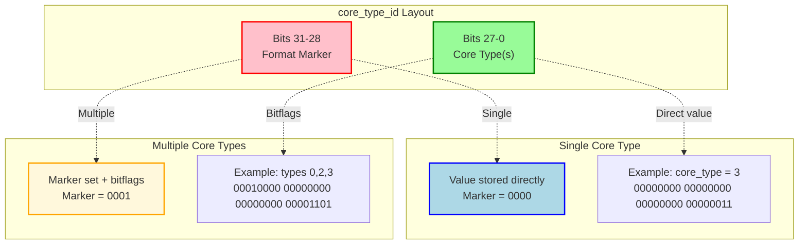

# Advanced Core Type Selection

## Introduction

### Motivation

By default, oneTBB includes all available core types in a task arena unless explicitly constrained. 
The current oneTBB API allows users to constrain task execution to a single core type using
`task_arena::constraints::set_core_type(core_type_id)`. While this provides control, it creates limitations for
real-world applications running on processors with more than two core types (e.g., on a system with performance (P),
efficient (E), and low power efficient (LP E) cores):

#### 1. **Flexibility and Resource Utilization**

While it is often best to allow the OS to use all core types and flexibly schedule threads, some advanced users may find it necessary to constrain scheduling. 
When there are more than two core types, it may be desired to constrain execution to not just a single core type.
Many parallel workloads can execute efficiently on multiple core types that make up a subset of the available core types. For example:
- A parallel algorithm with good scalability works well on both P-cores and E-cores
- Background processing can run on E-cores or LP E-cores depending on availability
- Mixed workloads benefit from utilizing any available performance-class cores (P or E)

Restricting to a single core type may leave available cores idle, reducing overall system throughput.

#### 2. **Workload Classification Challenges**

Applications often have workloads that don't fit neatly into a single core type category:
- **Moderate priority tasks**: Not critical enough to demand P-cores exclusively, but shouldn't use LP E-cores
- **Adaptive workloads**: Performance requirements that vary based on input size or system state
- **Mixed computation phases**: Algorithms that alternate between compute-intensive and throughput-oriented phases

#### 3. **Avoiding Inappropriate Core Selection**

Without the ability to specify "P-cores OR E-cores (but not LP E-cores)" or 
"LP E-cores OR E-cores but not P-cores" applications face dilemmas.
For example, without being able to specify "P-cores OR E-cores (but not LP E-cores)":
- **No constraint**: Work might be scheduled on LP E-cores, causing significant performance degradation
- **P-cores only**: Leaves E-cores idle, reducing parallelism
- **E-cores only**: Misses opportunities to use faster P-cores when available

### Current API Limitation

The existing API only supports single core type constraints:

```cpp
auto core_types = tbb::info::core_types();
// Assume: [0] = LP E-core, [1] = E-core, [2] = P-core

tbb::task_arena arena(
    tbb::task_arena::constraints{}.set_core_type(core_types[2])  // Only P-cores
);
```

This forces applications to choose one of these suboptimal strategies:

| Strategy | Pros | Cons |
|----------|------|------|
| **P-cores only** | Maximum single-threaded performance | Leaves E-cores idle; limited parallelism; higher power |
| **E-cores only** | Good for parallel workloads | Doesn't utilize P-core performance; excludes LP E-cores |
| **LP E-cores only** | Minimal power consumption | Severe performance impact for some workloads that require large, shared caches. |
| **No constraint** | Maximum flexibility | May schedule on inappropriate cores (e.g., LP E-cores for compute) |

None of these options provide the desired behavior: **"Use P-cores or E-cores, but avoid LP E-cores"** or **"Use any
efficiency cores (E-core or LP E-core)"**.

### Compatibility Requirements

This proposal must maintain compatibility with previous oneTBB library versions:
- **API and Backward Compatibility (Old Application + New Library)**: Existing code using the current
  `set_core_type(core_type_id)` API must compile and behave identically with newer oneTBB binaries.
- **Binary Compatibility (ABI)**: The `task_arena::constraints` struct layout must remain unchanged.
- **Forward Compatibility (New Application + Old Library)**: Applications compiled with the proposed new functionality
  must be able to handle execution against older oneTBB binaries gracefully, without crashes or undefined behavior.
  This requirement is mandated by the necessity for the key customer, OpenVINO, to support their users
  that might not be ready to upgrade to the latest version of oneTBB.

## Proposal

We propose extending the `task_arena::constraints` API to support specifying multiple acceptable core types, enabling
applications to define flexible core type policies that adapt to workload requirements and available hardware
resources.

### New API

Add the following methods to `tbb::task_arena::constraints`:

#### Header

```cpp
#include <oneapi/tbb/task_arena.h>
```

#### Syntax

```cpp
namespace oneapi {
namespace tbb {
class task_arena {

struct constraints {
    // Existing API (unchanged)
    constraints& set_core_type(core_type_id id);

    // NEW: Set multiple acceptable core types
    constraints& set_core_types(const std::vector<core_type_id>& ids);

    // NEW: Retrieve configured core types
    std::vector<core_type_id> get_core_types() const;
};

};
}}
```

### Design Details

#### Encoding Scheme

We propose using bit-packing within the existing `core_type` field to maintain binary compatibility:

- **Field type**: `core_type_id` (32-bit signed integer)
- **Special value of -1**: still represents "any core type"
- **Upper 4 bits**: Reserved for format marker, allowing up to 2<sup>4</sup>-1=15 format versions (`1111` is already
  taken by the special value of -1)
  - `0000` = Single core type (backward compatible)
  - `0001` = Multiple core types (bitmap encoding)
- **Bits 0-27**: Core type selection
  - **Single mode**: Direct core type ID value (e.g., 0, 1, 2)
  - **Multiple mode**: Bitmap with one bit per core type ID



**Design Properties:**
- **Backward compatible**: Single core type would use the same encoding as before
- **Zero memory overhead**: No additional storage
- **Efficient**: Simple bit operations for encoding/decoding
- **Scalable**: Supports up to 28 distinct core types (sufficient for foreseeable hardware)
- **Unambiguous**: Format marker prevents confusion between single and multiple types

#### Implementation Strategy

**1. Setting Multiple Core Types:**

When provided with an empty vector, the `set_core_types()` method would set no constraint, allowing automatic core
selection. A single core type would be encoded directly using the original format, preserving binary compatibility
with existing code. For multiple core types, the method would switch to a bitmap-based encoding: it would set a format
marker in the upper bits to signal the multi-type mode, then represent each requested core type as a set bit in
the lower portion of the field. This approach would enable efficient representation of arbitrary core type
combinations while maintaining the original data structure size.

**2. Retrieving Core Types:**

The `get_core_types()` method would examine the format marker to determine the encoding strategy. For automatic
constraints or single core types, it would return a single-element vector containing the stored value. For multiple
core types (identified by the format marker), it would scan the bitmap and extract each core type ID whose
corresponding bit is set, returning them as a vector.

**3. Affinity Mask Handling in TBBBind:**

The system topology binding layer (TBBBind) would combine affinity masks for multiple core types by performing a
logical OR operation across the hardware affinity masks of all specified core types. This combined mask would then be
intersected with other constraint masks (NUMA node, threads-per-core) to produce the final thread affinity constraint,
ensuring threads can be scheduled on any of the specified core types while respecting all other constraints.

### Backward Compatibility

The design ensures full backward compatibility:

| Aspect | Guarantee |
|--------|-----------|
| **API** | Existing `set_core_type(int)` remains unchanged |
| **Encoding** | Single core type would use identical bit pattern |
| **Behavior** | All existing code paths would preserve exact semantics |
| **ABI** | No changes to struct size or layout |

### Forward Compatibility

With the `constraints` API being header-only, the unmodified ABI, and no new library entry points, applications
compiled with the proposed new functionality can handle execution against older oneTBB binaries through runtime
detection and fallback mechanisms. Runtime detection is achieved using `TBB_runtime_interface_version()`, which allows
applications to verify that the loaded oneTBB binary supports the new API before attempting to use it. When the runtime
check indicates an older library version, applications can gracefully fall back to alternative strategies: either using
all available core types (no constraint) or constraining to a single core type using the existing `set_core_type()`
API. This approach satisfies the forward compatibility requirement stated in the "Compatibility Requirements" section.

### Testing Strategy

Tests should cover:

* **Encoding/decoding correctness**: Verify that core type combinations are accurately stored and retrieved
* **Backward compatibility**: Ensure existing single core type constraints work identically
* **Comprehensive combination testing**: Test all possible core type combinations on the target hardware

#### Core Type Combination Generation

The test infrastructure could generate all possible core type combinations using a **power set approach**, producing
2<sup>n</sup>-1 combinations for *n* core types:

1. **Discover** available core types from the system
2. **Enumerate** bit patterns from 1 to 2<sup>n</sup>-1
3. **Map** each pattern to a core type combination
4. **Generate** test cases for each combination

### Performance Considerations

| Aspect | Expected Impact |
|--------|-----------------|
| **Memory overhead** | None |
| **Encoding cost** | O(k) where k = number of core types (typically ≤ 3) |
| **Decoding cost** | O(28) worst case (scanning bitmap) |
| **Runtime impact** | Negligible compared to task scheduling overhead |
| **Affinity operations** | Linear in number of core types, performed once at arena creation |

### Open Questions

1. **API Naming**: Is `set_core_types` (plural) sufficiently distinct from `set_core_type` (singular)?
   - Alternative: overload the existing `set_core_type` to accept `vector<core_type_id>`
   - Alternative: `set_acceptable_core_types` or `allow_core_types`

2. **Empty Vector Semantics**: Should `set_core_types({})` mean "automatic" or throw an exception?
   - Current proposal: treat as automatic (-1)
   - Alternative: require at least one core type

3. **Query API**: Should we add convenience methods?

```cpp
bool has_core_type(core_type_id id) const;
size_t num_core_types() const;
```

4. **Builder Pattern Extensions**: Should we support incremental building?

```cpp
constraints& add_core_type(core_type_id id);
constraints& remove_core_type(core_type_id id);
void clear_core_types();
```

5. **Core Types Data member**: Should we store core types in a new container data member instead of bit-packing?
   - Pros: Simpler logic, easier to extend
   - Cons: Increases struct size, breaks ABI compatibility

6. **Info API**: Should `info::core_types()` be augmented with a method to return a count instead of a vector, e.g.,
   `info::num_core_types()`?

## Alternative 1: Accept Multiple Constraints Instances

Instead of modifying the `constraints` struct, introduce a new `task_arena` constructor that accepts a vector of
`constraints` instances. The arena would compute the union of affinity masks from all provided constraints, enabling
specification of multiple NUMA nodes and core types in a single arena.

```cpp
// Example usage
tbb::task_arena arena({
    tbb::task_arena::constraints{}.set_core_type(core_types[1]),
    tbb::task_arena::constraints{}.set_core_type(core_types[2])
});
```

**Pros:**
- More scalable: can extend to any other constraint type and specify multiple platform portions as a unified constraint
- Reuses existing `constraints` struct without modification
- Avoids bit-packing, format markers, and special value handling
- No risk of misinterpretation of existing single core type constraints

**Cons:**
- Requires creating multiple `constraints` objects for simple core type combinations
- Vector of `constraints` instances vs. single integer field with bit-packing creates memory overhead

**Future Extensibility Consideration:** This approach naturally extends to other constraint types—if `set_core_types`
is added, a corresponding `set_numa_ids` function would likely follow. The choice between a vector of `constraints`
instances versus dedicated multi-value setters affects API consistency and usability: the former provides a unified
pattern for combining any constraints, while the latter offers more intuitive, type-specific methods.

As proposed in the discussion of PR [#1926]{https://github.com/uxlfoundation/oneTBB/pull/1926}, this approach can be
combined with the Alternative 2 below; namely, a user-defined selector function could create and return a container
of constraints.

## Alternative 2: Selector-based API

Another alternative proposal takes a different approach to the API, motivated by
[SYCL device selectors](https://registry.khronos.org/SYCL/specs/sycl-2020/html/sycl-2020.html#sec:device-selection).
In SYCL, "a device selector which is a ranking function that will give an integer ranking value to all the devices
on the system". It takes a device as an argument and returns a score for that device, according to user's criteria.
The SYCL implementation calls that function on each device, and then selects one with the highest score.

Similarly, we can create/initialize an arena for core type(s) or NUMA node(s) selected by a user-provided function.

### Reasons to consider an alternative

There are several questionable aspects in the "main" proposal above.
- It shifts away from the original design of `task_arena::constraints` as a simple `struct` with public fields
  designed for direct use and C++20 designated initialization. While `constraints` could still be used that way
  with the current API, the new functionality requires to use member functions.
- Due to the accessibility of `constraints::core_type`, the proposed encoding mechanism cannot be fully encapsulated
  and hidden, essentially exposing to a degree the implementation details.
- It assumes that `core_type_id` is a number, or at least that the upper 4 bits do not contribute to its value
  and can be used for encoding. While that's true for the current implementation, `core_type_id` is specified
  as an opaque type. That proposal therefore relies on (and, again, exposes) implementation details. It might be
  acceptable, as changing these details would likely break backward compatibility anyway. But perhaps we can
  do better and avoid such exposure at all.
- It mostly sticks to the current usage model of `constraints`, possibly missing an opportunity to simplify
  the API usage for both basic and advanced scenarios.

### New API (sketched)

#### Header

```cpp
#include <oneapi/tbb/task_arena.h>
```

#### Synopsis

```cpp
namespace oneapi {
namespace tbb {
class task_arena {
  public:
    // (Possibly needed) New constant to indicate a selectable constraint
    static constexpr int selectable = /* unspecified */;
    
    // New constructor template
    template <typename Selector>
    task_arena(constraints a_constraints, Selector a_selector, unsigned reserved_slots = 1,
               priority a_priority = priority::normal);

    // New template for overloads of initialize
    template <typename Selector>
    /*return type to be defined*/
    initialize(constraints a_constraints, Selector a_selector, unsigned reserved_slots = 1,
               priority a_priority = priority::normal);

};
}}
```

#### API description

The new templates for construction and initialization of a `task_arena` accept, in addition to `constraints`,
a *selection function*: a user-specified callable object that ranks core types or NUMA nodes available on the platform.

We can consider at least two variations of what the selection function accepts as its arguments:
1. the whole vector of core types or NUMA nodes, as returned by `tbb::info` API calls, or
2. a single `core_type_id` or `noma_node_id` value, packed into a tuple/struct with additional useful information,
   specifically the number of entities to choose from (e.g., `tbb::info::core_types().size()`) and the position
   (index) of the given ID value.

In principle, it could be possible for the implementation to support both variations, distinguished at compile time.
For each ID value, the selection function should return a signed integral number as the score for that ID. In case (1),
the function should therefore return a vector of scores, one for each element of its input vector.

A negative score would indicate that the corresponding core type or NUMA node should be excluded from use
by the task arena. A positive score would indicate that the corresponding core type or NUMA node is good to use
by the task arena, and the bigger the score the better the "resource" is from the user's viewpoint.
If for whatever reason (some described below) the implementation can only use a single core type or NUMA node,
it should take the one with the biggest score.

### Implementation aspects

The key implementation problem is how to pass the additional information about multiple core types (or NUMA nodes)
to the TBB library functions for arena creation without violating the forward compatibility requirement.

Unlike the main proposal, that is designed as an API to extend `constraints` and is therefore limited by the layout
of that type and the use of existing entry points that take `constraints` or `task_arena`, the alternative API
better encapsulates the implementation and can potentially utilize various ways to solve the problem, such as:
- encoding the extra information into the existing types, e.g. in the above proposed way;
- [ab]using other existing entry points / data structures with reserved parameters or space to pass information through;
  - for example, using `task_arena_base::my_arena` (which is currently `nullptr` until the arena is initialized),
    and indicating that it carries some information via arena's `version_and_traits`;
- introducing a new class (e.g., `d2::task_arena`) inherited from the same base but having extra fields, again with
  `version_and_traits` updated to indicate the change at runtime;
- finding "smart" ways to add new library entry points which however are not used directly in the headers to prevent
  link-time dependency to the new oneTBB binaries; ideas to consider include runtime-discoverable ABI entries,
  weak symbols defined in the headers and replaced by identical ones in the new binaries, or callback functions
  defined in the headers, exported by an application and then discovered by the new binaries at runtime.

Another question is how to distinguish whether the selector should be applied to core types or to NUMA nodes,
if/when both are supported with the API. The problem here is that `core_type_id` and `numa_node_id` are currently
defined as aliases to the same integral type, and therefore we cannot recognize at compile time which information
to pass to call the selector.

This can be addressed either by adding a special value (distinct from `automatic`) that would indicate which
constraint parameter should be used with the selector, or by redefining these names to refer to distinct types.
In the latter case, the types should be fully binary compatible (i.e., have the same layout and set of values)
with the integral type used now. That looks doable but needs exploration of all compatibility aspects.

### Pros and cons

This alternative approach addresses weak points of the main proposal listed above: it does not change `constraints`,
does not expose implementation details, and to a certain degree simplifies the creation of constrained arenas
via a higher level. more descriptive API. It can be implemented in a few different ways. And it also has or may have
the pros of the Alternative 1 above (which is likely also true in the opposite direction), but does not have its cons
except for one.

Additionally, this API might have sensible semantics even if it has to operate with an older version
of the runtime library. Such library can only use a single core type in the constraints, and the API
implementation in the headers can adjust to that by using the core type with the highest score.
If the API semantics is defined to allow such behavior, the API can do the oneTBB runtime version check
internally (instead of users doing it in their code), which is an extra advantage over the main proposal.

One disadvantage of this approach is that neither single nor several instances of `constraints` represent
the limitations of the created arena. It is still possible to create another arena with the same limitations,
by reusing the same set of arguments including the selector. It is also possible to have a proper copy
constructor for `task_arena`, though we need to ensure that the internal state stores all the information needed
to create another instance. But other APIs, such as the `tbb::info::default_concurrency` function that takes
a `constraints` argument, currently do not have access to the same information. A possible way to address
that is to add a parameter for either the selector or the vector(s) of scores it created; however that needs
additional exploration.

### Open questions

1. Need to decide on the parameters and the return type of selectors
2. What happens if all scores are negative? Options: return an error (exception), switch the parameter
   to `automatic`, or leave the arena uninitialized.
   - In SYCL, class constructors with a device selector must throw an exception if no device is selected.
3. If selectors take a vector, what happens if the returned vector is smaller or greater than the input one?
4. For a hypothetical platform having both a few NUMA nodes and different core types, would we allow
   to select both at the same time, and if yes - how would that work?
5. Which other usability names would be useful? For example, a named negative score constant?
6. How should `max_concurrency` interact with scoring? Users might think that scoring also indicates scheduling
   preference, for example if `max_concurrency` is less than the HW concurrency for selected core types.

## Usage Examples

Core type capabilities vary by hardware platform, and the benefits of constraining execution are highly
application-dependent. In most cases, systems with hybrid CPU architecture show reasonable performance without
additional API calls. However, in some exceptional scenarios, performance may be tuned by specifying preferred
core types. The following examples demonstrate these advanced use cases.

### Example 1: Performance-Class Cores (P or E, not LP E)

In rare cases, compute-intensive tasks may be scheduled to LP E-cores. To fully prevent this, execution can be
constrained to P-cores and E-cores. The example shows how to set multiple preferred core types.

#### Proposed API

```cpp
auto core_types = tbb::info::core_types();
assert(core_types.size() == 3);
// core_types is ordered from the least to the most performant:
// [0] = LP E-core, [1] = E-core, [2] = P-core

tbb::task_arena arena(
    tbb::task_arena::constraints{}
        .set_core_types({core_types[1], core_types[2]})  // E and P cores
);
```

#### Alternative 1

```cpp
auto core_types = tbb::info::core_types();
assert(core_types.size() == 3);
// core_types is ordered from the least to the most performant:
// [0] = LP E-core, [1] = E-core, [2] = P-core

tbb::task_arena arena({
    tbb::task_arena::constraints{.core_type = core_types[1]}, // E-cores
    tbb::task_arena::constraints{.core_type = core_types[2]}  // P-cores
});
```

#### Alternative 2

This example assumes that the selector is called in the loop over the elements of `tbb::info::core_types()`,
and takes a tuple of {`core_type_id`, its index in the vector, the size of the vector}.
```cpp
tbb::task_arena arena(
    tbb::task_arena::constraints{.core_type = tbb::task_arena::selectable},
    [](auto /*std::tuple*/ core_type) -> int {
        auto& [id, index, total] = core_type;
        // positions are ordered from the least to the most performant:
        // 0 = LP E-core, 1 = E-core, 2 = P-core
        return (total > 1 && index == 0)? -1 : index;
    }
);
```

Or we can call the selector once and get a vector of scores:
```cpp
tbb::task_arena arena(
    tbb::task_arena::constraints{.core_type = tbb::task_arena::selectable},
    [](auto /*std::vector*/ core_types) -> std::vector<int> {
        assert(core_types.size() == 3);
        // core_types is ordered from the least to the most performant:
        // [0] = LP E-core, [1] = E-core, [2] = P-core
        return {-1, 1, 2};
    }
);
```
### Example 2: Adaptive Core Selection

For applications with well-understood workload characteristics, different arenas may be configured with different core
type constraints. The example shows how to create arenas for different workload categories.

#### Proposed API

```cpp
auto core_types = tbb::info::core_types();
assert(core_types.size() == 3);

tbb::task_arena latency_driven(
    tbb::task_arena::constraints{}.set_core_type(core_types[2])
);

tbb::task_arena throughput_driven(
    tbb::task_arena::constraints{}.set_core_types({core_types[1], core_types[2]})
);

tbb::task_arena background_work(
    tbb::task_arena::constraints{}.set_core_types({core_types[0], core_types[1]})
);
```

#### Alternative 1

```cpp
auto core_types = tbb::info::core_types();
assert(core_types.size() == 3);

tbb::task_arena latency_driven(
    tbb::task_arena::constraints{.core_type = core_types[2]}
);

tbb::task_arena throughput_driven(
    tbb::task_arena::constraints{.core_type = core_types[1]},
    tbb::task_arena::constraints{.core_type = core_types[2]}
);

tbb::task_arena background_work(
    tbb::task_arena::constraints{.core_type = core_types[0]},
    tbb::task_arena::constraints{.core_type = core_types[1]}
);
```

#### Alternative 2

```cpp
auto lowest_latency_selector = [](auto /*std::tuple*/ core_type) -> int {
    auto& [id, index, total] = core_type;
    return (index == total - 1)? 1 : -1;
    // Scores for the whole vector: {-1, -1, 1}
};

auto throughput_selector = [](auto /*std::tuple*/ core_type) -> int {
    auto& [id, index, total] = core_type;
    return (total > 1 && index == 0)? -1 : index;
    // Scores for the whole vector: {-1, 1, 2}
};

auto background_selector = [](auto /*std::tuple*/ core_type) -> int {
    auto& [id, index, total] = core_type;
    return (total > 1 && index == total - 1)? -1 : total - index;
    // Scores for the whole vector: {3, 2, -1}
};

tbb::task_arena latency_driven(
    tbb::task_arena::constraints{.core_type = tbb::task_arena::selectable}, lowest_latency_selector
);

tbb::task_arena throughput_driven(
    tbb::task_arena::constraints{.core_type = tbb::task_arena::selectable}, throughput_selector
);

tbb::task_arena background_work(
    tbb::task_arena::constraints{.core_type = tbb::task_arena::selectable}, background_selector
);
```

### Example 3: Code that does not depend on oneTBB binary versions

This example adjusts the code in Example 1 to illustrates how an application could be written so that
it uses the new arena capabilities when present, otherwise falls back to the old arena construction.

#### Proposed API

The new API cannot be used with the old binaries which do not recognized encoded constraints.
Checking `TBB_runtime_interface_version()` is therefore required.

```cpp
auto core_types = tbb::info::core_types();
tbb::task_arena::constraints avoid_LPE_cores;
std::size_t n_types = core_types.size();

if (TBB_runtime_interface_version() < 12190 || n_types < 3) {
    // an old TBB binary, or LP E-cores are not found / not distinguished
    avoid_LPE_cores.core_type = core_types.back(); // use only the most performant cores
} else {
    // 3 (or more) core types found, use the two most performant ones
    avoid_LPE_cores.set_core_types(core_types[n_types - 1], core_types[n_types - 2]);
}

tbb::task_arena arena(avoid_LPE_cores);
```

#### Alternative 1

The runtime version check can be hidden within the implementation, if we agree that only the first constraint
applies in case multiple constraints cannot work.

```cpp
auto core_types = tbb::info::core_types();
std::vector<tbb::task_arena::constraints> avoid_LPE_cores;

// always use the most performant core type
avoid_LPE_cores.push_back(tbb::task_arena::constraints{.core_type = core_types.back()});
 // push in the reverse order and avoid the index 0 (the least performant core type)
for (int index = core_types.size() - 2; index > 0; --index) {
    avoid_LPE_cores.push_back(tbb::task_arena::constraints{.core_type = core_types[index]});
}

tbb::task_arena arena(avoid_LPE_cores);
```

#### Alternative 2

The runtime version check can be hidden within the implementation, and the type with the highest score takes
precedence. Except for comments, the code is the same as in Example 1.

```cpp
tbb::task_arena arena(
    tbb::task_arena::constraints{.core_type = tbb::task_arena::selectable},
    [](auto /*std::tuple*/ core_type) -> int {
        auto& [id, index, total] = core_type;
        return (total > 1 && index == 0)? -1 : index;
    }
);
```

In case selectors take the vector of core types, and without assuming there are exactly three types,
the selector needs to deal with input of different sizes. It could be like this:

```cpp
tbb::task_arena arena(
    tbb::task_arena::constraints{.core_type = tbb::task_arena::selectable},
    [](auto /*std::vector*/ core_types) -> std::vector<int> {
        std::size_t n_types = core_types.size();
		if (n_types == 1)
			return {1};
        std::vector<int> scores(n_types);
        scores[0] = -1; // avoid the least performant core type
        for (int index = 1; index < n_types; ++index) {
            scores[index] = index;
	    }
        return scores;
    }
);
```
