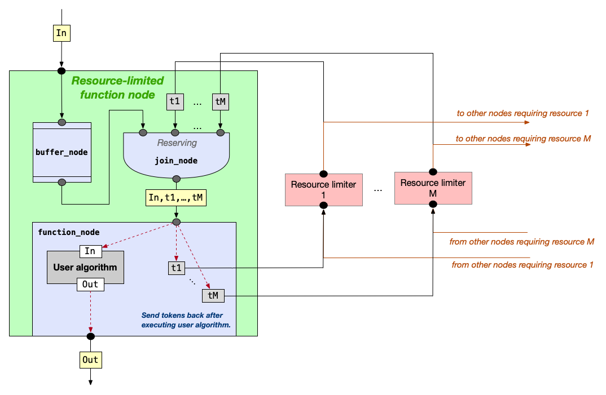

# Resource-limited nodes (_or dining philosophers nodes_)

Flow-graph provides a facility to serialize the execution of a node to allow some code that would not otherwise be thread-safe to be executed in parallel graphs.
Various flow-graph nodes accept a constructor argument that specifies the maximum concurrency the graph can use for that particular node.
This allows one to use, in such a node, a function body that is not thread-safe, while ensuring that the graph into which the node is inserted is thread-safe.
For example, in the field of particle physics, an algorithm might reconstruct particle trajectories ("tracks") from energy deposits ("hits") left behind by those particles, and recorded by an experiment's detector.
If the algorithm is not thread-safe, a reasonable node construction could be:

``` c++
using namespace tbb;
flow::graph g;
flow::function_node<Hits, Tracks> track_maker{
  g,
  flow::serial,
  [](Hits const&) -> Tracks { ... }
};
```

where the `flow::serial` argument constrains the flow graph to execute the node body by no more than one thread at a time.

There are cases, however, when specifying a concurrency limit of `flow::serial` is insufficient to guarantee thread safety of the full graph.
For example, suppose `track_maker` needs exclusive access to some database connection, and another node `cluster_maker` also needs access to the same database:

``` c++
DB db = db_handle(...);

flow::function_node<Hits, Tracks> track_maker{
  g,
  flow::serial,
  [&db](Hits const&) -> Tracks { auto a = db.access(/* unsafe */); ... }
};
flow::function_node<Signals, Clusters> cluster_maker{
  g,
  flow::serial,
  [&db](Signals const&) -> Clusters { auto a = db.access(/* unsafe */); ... }
};
```

In the above, the invocation of `db.access()` is not thread-safe.
To avoid data races, the function bodies of `track_maker` and `cluster_maker` must not execute at the same time.
Achieving with flow graph such serialization between function bodies is nontrivial.
Some options include:

1. placing an explicit lock around the use of the database, resulting in inefficiencies in the execution of the graph,
2. creating explicit edges between `track_maker` and `cluster_maker` even though there is no obvious data dependency between them,
3. creating a token-based system that can limit access to a shared resource.

This RFC proposes an interface that pursues option 3, which we describe in the "Implementation experience" section, below.
Our proposal, however, does not mandate any implementation but suggests an API similar to:

``` c++
flow::resource_limiter_node<DB> db_resource{g, {db_handle()}};

flow::rl_function_node<Hits, Tracks> track_maker{
  g,
  std::tie(db_resource),
  [](Hits const&, DB const* db) -> Tracks { auto a = db->access(/* okay */); ... }
};
flow::rl_function_node<Signals, Clusters> cluster_maker{
  g,
  std::tie(db_resource),
  [](Signals const&, DB const* db) -> Clusters { auto a = db->access(/* okay */); ... }
};
```

where `db_resource` ensures limited access to a resource that both `track_maker` and `cluster_maker` require.
The implementation of the `DB::access()`  function did not change, but by connecting the resource-limited function nodes to the `db_resource`, the function bodies of the nodes will not be invoked concurrently.
Note that if the only reason that the bodies of `track_maker` and `cluster_maker` were thread-unsafe was their access to the limited resource indicated by `db_resource` it is no longer necessary to declare that the nodes have concurrency `flow::serial`.
It may be possible to have the node `track_maker` active at the same time, if the nature of `db_resource` were to allow two tokens to be available, and as long as each activation was given a different token.

## Proposal

Our proposal is an addition to what already exists and does not break API backwards compatibility.  The proposal consists of:
1. Introducing the equivalent of a `flow::resource_limiter_node` class template that, when connected with another node, ensures limited access to the resource it represents.
2. Adding `flow::rl_function_node` constructors that allow the specification of limited resource nodes instead of (or in addition to) a `concurrency` value.

> [!NOTE]
> Although we pattern our proposal on the `flow::function_node` class template in this proposal, the concepts discussed here apply to nearly any flow-graph node that accepts a user-provided function body.

With the proposal here, in addition to what is written above we imagine the following could be done:

``` c++
// Permit access to two GPUs
flow::resource_limiter_node<GPU> gpus{g,
                                      {GPU{ /*gpu 1*/ }, GPU{ /*gpu 2*/}};
flow::resource_limiter_node<ROOT> root{g, ROOT{...}};  // Only 1 ROOT handle available

flow::rl_function_node fn{g,
                          std::tie(gpus, root), // Edges implicitly created to the required resource nodes
                          [](Hits const&, GPU const*, ROOT const*) -> Tracks {
                             // User has access to resource handles as arguments to function body
                             ...
                          }                             
                         };

```

The constructor signature for the node is similar to the regular `flow::function_node` constructor signatures, except that instead of a concurrency value, a `std::tuple` is supplied of resource limiters.
The function body takes an argument for the input data (i.e. `Hits`) and (optionally) an argument corresponding to each limited resource.
The function body is invoked only when the `rl_function_node` can obtain exclusive access to one of the resource handles provided by each resource-limiter node (and when a `Hits` message has been sent to it).
Note that because two GPU handles can be accessed, it is possible to parallelize other work with a GPU as only each *invocation* of the user body requires sole access to a GPU handle.

### `flow::resource_limiter_node` class template

The `flow::resource_limiter_node` class template heuristically looks like:

```c++
template <typename Handle = default_resource_handle>
class resource_limiter_node : tbb::flow::buffer_node<Handle const*> {
public:
  using token_type = Handle const*;

  /// \brief Constructs a resource_limiter with n_handles of type Handle.
  resource_limiter_node(tbb::flow::graph& g, unsigned int n_handles = 1) :
    tbb::flow::buffer_node<token_type>{g}, handles_(n_handles)
  {}
  /// \brief Constructs a resource_limiter with explicitly provided handles.
  resource_limiter_node(tbb::flow::graph& g, std::vector<Handle>&& handles) :
    tbb::flow::buffer_node<token_type>{g}, handles_(std::move(handles))
  {}

  /// \brief Activate the resource_limiter by placing one token to each handle
  /// it manages into its buffer.
  ///
  /// This function must be called before the flow graph is started.  It
  /// is not automatically called by the constructor because the
  /// resource_limiter may be placed into a container (e.g. a vector) that
  /// can grow after the resource_limiter is constructed.  If the
  /// resource_limiter is activated before it is placed into its final
  /// location, then the locations of the tokens in the buffer can become
  /// invalid, resulting in memory errors when the flow graph is executed.
  void activate()
  {
    // Place tokens into the buffer.
    for (auto const& handle : handles_) {
      tbb::flow::buffer_node<token_type>::try_put(&handle);
    }
  }

private:
  std::vector<Handle> handles_;
};
```

where `Handle` represents the type of a resource handle for which tokens can be passed throughout the graph.
With this implementation, the token is simply a pointer to a handle owned by the resource limiter.

#### C++20 support

When compiling with a C++ standard of at least C++20, the `resource_limiter` `Handle` template parameter can be constrained to model a resource-handle concept.

### Resource handles

#### User-defined resource handles

An example of a user-defined resource handle is the `DB` handle discussed above.
A handle, in principle, can have an arbitrary structure with unlimited interface, so long as ownership of the handle ultimately reside with the `resource_limiter_node`.

#### `default_resource_handle`

For `rl_function_node` function bodies that do not need to access details of the resource, a default policy can be provided:

```c++
flow::resource_limiter_node r{g};
```

This can be useful if a third-party library supports substantial thread-unsafe interface and there is no obvious API that should be attached to the handle.

### `flow::rl_function_node` constructors

We imagine the following constructors could exist

```c++
// 1. Already discussed above
flow::rl_function_node fn1{g,
                           std::tie(gpus, root),
                           [](Hits const&, GPU const*, ROOT const*) -> Tracks { ... }};

// 2. No access required to a limited resource (equivalent to flow::function_node)
flow::rl_function_node fn2{g, tbb::flow::unlimited, [](Hits const&) -> Tracks { ... }};

// 3. Access required to a limited resource, and the user body must be serialized
flow::rl_function_node fn3{g,
                           std::make_tuple(tbb::flow::serial, std::ref(db_limiter)),
                           [](Hit const&, DB const*) -> Tracks{ ... }};
```

Constructor 1 has already been discussed.
Constructor 2 would be equivalent (in signature and behavior) to what is already provided by `flow::function_node`.
Constructor 3 would be the rarer situation where: 

- the (e.g.) `db_resource` itself may have more than one resource handle, thus permitting some parallelism for that resource
- the implementation of `fn3`'s user body may need to be serialized for reasons unrelated to the DB resource

## Implementation experience

The image below depicts a system implemented within the https://github.com/knoepfel/meld-serial repository.



### Performance results

## Open Questions

1. For function bodies that are serialized, the current implementation imposes serialization on the `flow::function_node` after the join of the tokens and the data.
   This means that data may accumulate at the `flow::function_node`'s input-port buffer, thus reserving the resource token for longer than is desired.
   It would be better for the tokens to be returned if the function body is already being executed by another thread.
2. With the implementation presented here, a live-lock situation may occur for nodes that require access to several limited resources.
   This is discussed in the performance results, where the "histo-generating" node does not execute until both the "histogramming" and "generating" nodes have completed their executions for all events.
