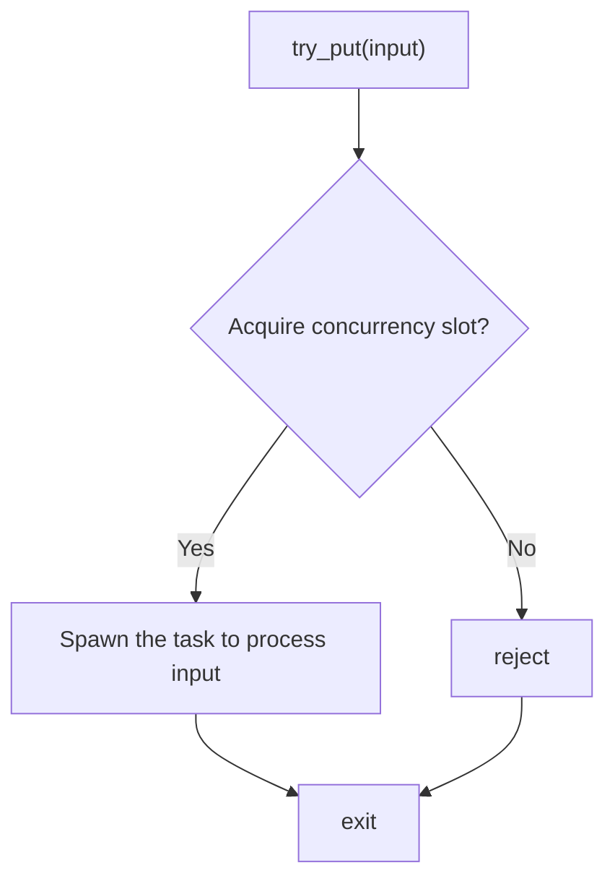
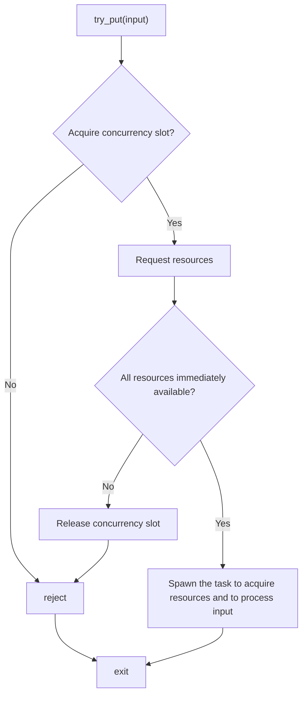
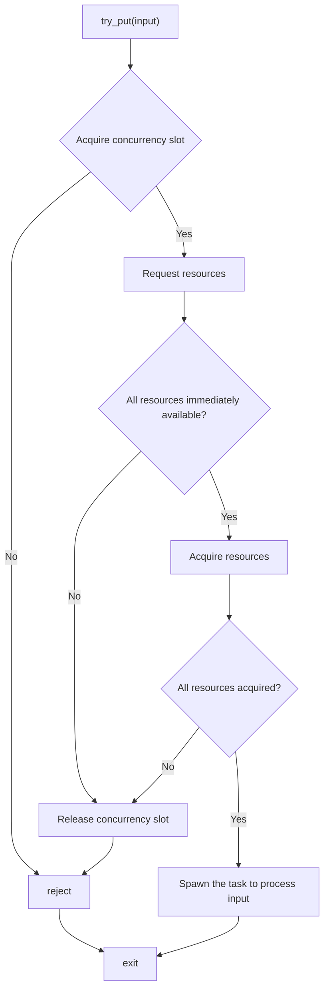
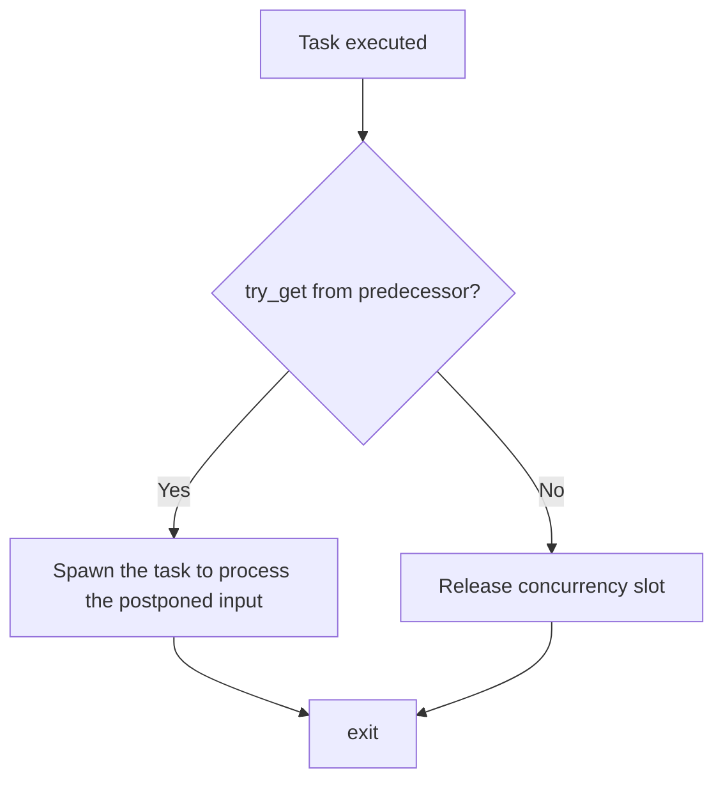
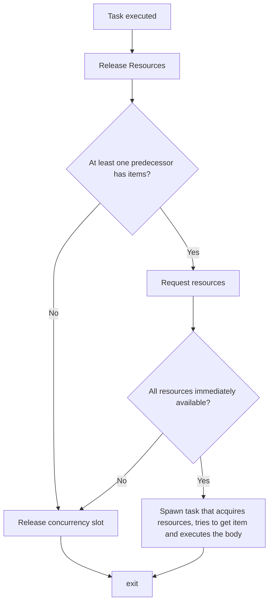
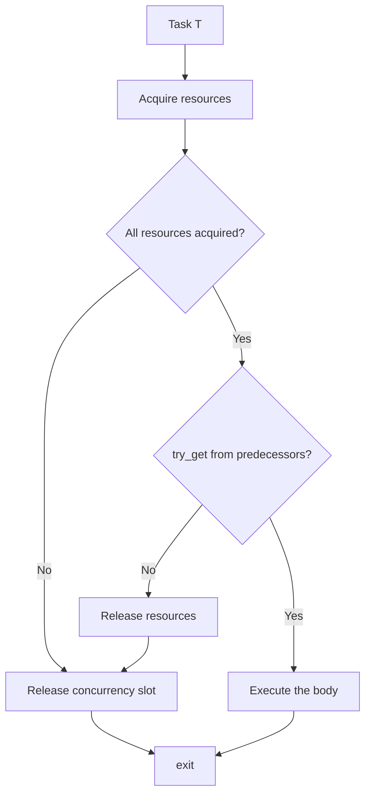
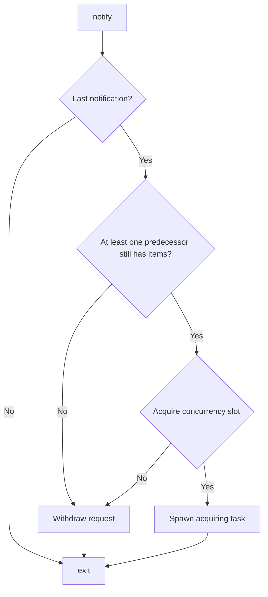
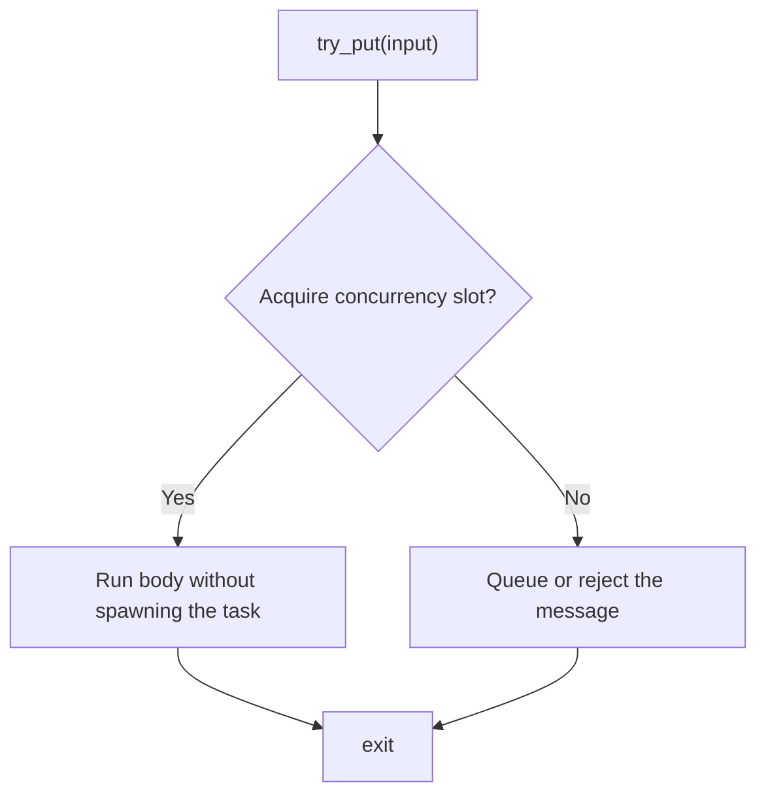
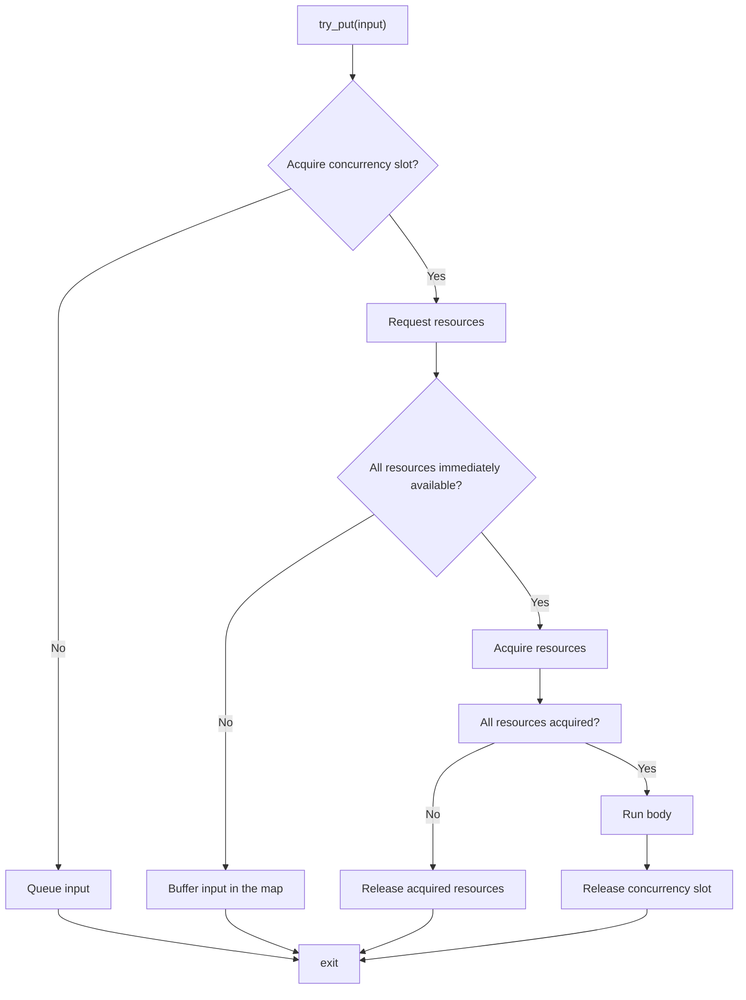

# Resource Limiting as a Functional Node Policy

Note: this document is a sub-RFC for the [Resource-limited Nodes RFC](./README.md). 

## Introduction

The preview `flow::resource_limiter` and `flow::resource_limited_node` brought new functionality to manage
access to the resources shared between multiple nodes in different parts of the Flow Graph.

In fact, `flow::resource_limited_node` represents a `multifunction_node` with a `queueing`-like policy that
inserts a resource-acquisition phase between acquiring the concurrency slot and executing the body.

Exposing this functionality through a special node type is limiting. The same resource-limiting behavior is
useful for other functional nodes in the Flow Graph (`function_node`, `multifunction_node`, `continue_node`,
and potentially `async_node`).

This RFC proposes to treat resource limiting as a new *policy* of the node, alongside the existing `queueing`,
`rejecting`, and `lightweight` policies. Adding it as a policy requires composability with other capabilities
already provided by these nodes, such as:

1. `rejecting` alternative, since the current `resource_limited_node` is `queueing`-like.
2. `lightweight` policy.
3. Node priorities.
4. Deduction guides.

These aspects are also investigated as part of this proposal.

## Composability Analysis

### Resource-Limiting and Acceptance Policies

Current Flow Graph functional nodes (`function_node`, `multifunction_node`, and `async_node`) may use one of two
policies that define input message acceptance: `queueing` or `rejecting`.

The oneTBB documentation defines `queueing` as a policy meaning that input messages that cannot be processed
right away by the node are kept by the node to be processed when possible.

`rejecting` policy means that input messages that cannot be processed right away are not accepted by the node, and it is the responsibility of a predecessor to handle them. For example, a buffering node can be placed before the
functional node to store the rejected items.

In practice, for current production nodes, this policy only regulates the relationship with regard to the concurrency limit.
Once the input message arrives at the functional node (e.g., `try_put` is called), the first step is to acquire the concurrency slot.
If the slot is successfully acquired, the task to execute the body is spawned, regardless of the acceptance policy.

If the slot cannot be acquired (meaning the total number of tasks for this node exceeds the concurrency limit):
* For `queueing` policy - the message is stored in the internal FIFO queue.
* For `rejecting` policy - the message is rejected by the node and should be stored in the predecessor.

Once another execution of the node body finishes, the calling thread does not unconditionally release the concurrency slot:
* For `queueing` policy - it tries to pop the item from the internal queue.
* For `rejecting` policy - it tries to pop the item from the predecessor.

If the postponed item was retrieved, the task to process it is spawned. Otherwise, the concurrency slot is released.

An important difference between the two acceptance policies that is worth mentioning is that for `queueing`, once the item is placed
in the queue, it will be retrieved by the same node. For `rejecting`, this is not guaranteed. For example, if we have a single buffer
with two `rejecting` successors and both of them reject the item, only one of them will retrieve it once its concurrency is available.

As mentioned above, the current implementation of `resource_limited_node` is `queueing`-like. This means that the concurrency slot
of this node is operated the same way as for a `queueing` functional node. Once the slot is acquired, the node requests the required resources
from the providers. If all the resources are immediately available (i.e., they have notified the node back), it spawns the task that will try to
acquire the resources and execute the body. If some of the resources are not immediately available, the spawn is delayed until the last
notification is received. Until that moment, the concurrency slot is taken and the input message is stored in the internal requests map.

The elements are retrieved from this map and processed in the order defined by the `resource_limiter`. In the current implementation, the
arrival timestamp matters - the elements that have arrived earlier are served earlier. Hence, to some degree, the `resource_limited_node`
may be called queueing, but the elements are stored not only in the internal queue but also in the internal map. The FIFO processing order
should, however, be preserved by the `resource_limiter`.

One of the open questions for the initial RFC was the necessity to provide a `rejecting` or `rejecting`-like alternative. If we imagine
how this alternative node could behave, the policy would follow the definition - if the item cannot be processed right now (i.e.,
there is no concurrency available, or some of the required resources are not available) - reject the input.

The first operation that should be defined is `try_put`. Without resource limiting, the flow diagram of `try_put` is shown below:



There are several approaches to inserting the resource acquisition stage between acquiring the concurrency slot and spawning the task to process
the input.

The first one is to request the required resources and, if all of them are immediately available, spawn the task that will acquire the
resources:



The issue with that approach is that the spawned task will acquire the resources first. Some of the resources may be unavailable and
therefore the task would not be able to execute the body on the input message. Following the `rejecting` policy definition, the item
should be rejected in this case and passed to the predecessor. However, it is too late: the item was already buffered by the task, and `try_put` has
exited, returning `true`.

The second approach is a modification of the first one to close this gap - we can try to acquire all the resources after requesting them
and spawn the task only if all of them are available and were acquired:



This approach is truly `rejecting`, but there are two issues:

1. The actual resource acquisition is performed on the predecessor side, while calling `successor.try_put_task`, not as part of the special task
   associated with the node.
2. The resources are kept acquired until the spawned processing task is scheduled for execution, which creates significant unnecessary consumption
   of shared resources.

Another angle is what happens after the task that has completed processing some input finishes and handles the
postponed requests from the predecessor.

For the current functional node, the flow is shown in the diagram:



When the resource-limiting enters the stage, we need to ensure we have all three things to run the body - concurrency, resources, and the input from the predecessor.
The concurrency slot is already acquired by the caller. Resources are also acquired, but the resource-limiting protocol suggests releasing them back to `resource_limiter`
to allow other consumers that made their request earlier to make progress and avoid starvation. The item should be acquired from the predecessor, but it should be acquired
last, since there is currently no mechanism in the Flow Graph to take the item from the predecessor and put it back to the same predecessor if it is not currently needed.
The only existing thing is the `reserving` protocol, but it is not used by the `rejecting` node, only by the `join_node` with `reserving` policy.

A possible flowchart for re-acquiring the resources is shown below:



The acquiring task:



The issue with such an approach is that the input item becomes a kind of resource that may or may not be granted. Other shared resources
provided by the limiters would be acquired anyway and then released if the input item is gone.

At the notification step, both the concurrency slot and the input message become kinds of resources that may not be granted:



The acquiring task is similar to the one shown above.

Given that the implementation of a truly `rejecting` resource-limited node is complicated, requires tradeoffs where the resources would be held while the
service tasks are scheduled, and significantly increases the time spent by the predecessor to put the item to the node, the current document proposes
to have the `resource_limited` policy as a third message acceptance policy, not an alternative. The new policy would behave like the
current `queueing`-like implementation of `resource_limited_node` - truly `queueing` for the concurrency slot and, with regard to shared resources, following
the order in which the `resource_limiter` serves the consumers.

### Resource-Limiting and Lightweight Policy

`lightweight` policy for functional nodes was designed to optimize out task scheduling if the node body is small and the concurrency slot is available.
Compared to the regular functional node, each `try_put` to the lightweight node avoids spawning the task that executes the body and executes it inline:



Support for `lightweight` policy is, on one hand, straightforward - we just acquire resources and execute the body inline:



But the most important question is how worthwhile the inline optimization really is in that case. On the one hand, we reduce the timeframe between notification
and acquire stages, potentially increasing the chance to get the resource. On the other hand, even if the node body is small, the combination of the node body
with the request and acquire stages for all resources may not be that small and may be worth spawning a task.

The current proposal keeps the `lightweight` alternative an open question and does not propose a concrete API.

### Resource-Limiting and Node Priorities

Current implementation of `resource_limited_node` does not support node priorities. The implementation of `resource_limiter` uses the request timestamps while
distributing access to shared resources to avoid consumer starvation. 

If `resource_limited` becomes a policy for functional nodes, it should be composable with node priorities that can be set while constructing the node.

For resource-limited nodes, adding the priority parameter involves not only assigning the priority to the service tasks associated with the node. It also
requires corresponding changes in `resource_limiter`, since it should serve requests with higher priority first, even if they were received later.

The proposal is to add information about the priority to the request id that is passed while requesting or acquiring the resources. The priority of the
node becomes the priority of the request. Since the node priority is assigned only while constructing the node and cannot change, there is no need to update
the priority of the request.

The current implementation of the request id holds the timestamp (STL chrono `time_point`) and the unique integer indicating the number of the request from a particular
consumer. The request `a` is served before the request `b` if:

* The timestamp of `a` is less than the timestamp of `b` (`a` came earlier than `b`).
* In case the timestamps are equal, the unique integer of `a` is less than the unique integer of `b`.

It is proposed to extend the request id by adding a priority parameter and checking it first. The updated logic for the request `a` to be served before the request
`b`:

* If the priority of request `a` is greater than the priority of `b` (the node that sent `a` has higher priority than the node that sent `b`).
* In case the priorities are equal, if the timestamp of `a` is less than the timestamp of `b` (`a` came earlier than `b`).
* In case the timestamps are equal, if the unique integer of `a` is less than the unique integer of `b`.

As mentioned above, additionally, all the service tasks spawned by the `resource_limited` functional node should be assigned a priority to ensure the prioritized
scheduling.

### Resource-Limiting and Deduction Guides

Deduction guides for `function_node` and `continue_node` allow the user to omit passing the template arguments explicitly and to deduce them from the passed function object.

For example,

```cpp
tbb::flow::graph g;
tbb::flow::function_node f(g, tbb::flow::unlimited, [](int i) { return std::size_t(0); });
```

The type of `f` will be automatically deduced to `function_node<int, std::size_t, queueing>` since the lambda takes the `int` argument and returns `std::size_t`. No
explicit policy is passed to the constructor, so the deduction guide will prefer the default `queueing` one.

The intended constructor for resource-limited `function_node` will mirror the existing `resource_limited_node` one:

```cpp
template <typename Input, typename Output>
class function_node<Input, Output, resource_limited> {
public:
    template <typename Body, typename ResourceProvider, typename... ResourceProviders>
    function_node(graph& g,
                  std::size_t concurrency,
                  std::tuple<ResourceProvider&, ResourceProviders&...> resource_providers,
                  Body body
                  );
};
```

The usage example is:

```cpp
tbb::flow::graph g;
tbb::flow::resource_limiter<int> int_provider(1);
tbb::flow::resource_limiter<float> float_provider(2.0);

tbb::flow::function_node<int, std::size_t> f(g,
    tbb::flow::unlimited,
    std::tie(int_provider, float_provider),
    [](int input, int& int_resource, float& float_resource) {
        return std::size_t(0);
    });
```

The proposed deduction guide is (pseudo-wording):

```cpp
template <typename Body, typename ResourceProvider, typename... ResourceProviders>
function_node(graph& g,
              std::size_t concurrency,
              std::tuple<ResourceProvider&, ResourceProviders&...> resource_providers,
              Body body)
    -> function_node<input_t<Body>, output_t<Body>>;
```

Where `input_t<Body>` is the decayed type of the first function argument of `Body`, `output_t<Body>` is the
return type of `Body` when called with `input_t<Body>` and the resource handle arguments (semantically equivalent to
`std::invoke_result_t<Body, input_t<Body>, typename ResourceProvider::resource_handle_type&, typename ResourceProviders::resource_handle_type&...>`).

The deduction guide only participates in overload resolution if the `body` is invocable with the arguments specified above.

Since the current implementation of `multifunction_node` does not provide any deduction guides, it is proposed to provide one only for `resource_limited` `function_node`
and `continue_node`.

### Resource-Limiting and Async Node

`async_node` allows offloading computations to the associated async activity (e.g., an external thread), and allows the activity to return the output to the graph using the
node `gateway`. For example:

```cpp

using node_type = tbb::flow::async_node<int, int>;
using gateway_type = typename node_type::gateway_type;

struct async_activity {
    std::thread m_service_thread;

    struct request {
        using output_type = int;

        int input;
        gateway_type& gateway;
    };

    void put(request r);
    request get();
    output_type process(request r);

    bool is_stopped();

    void service_thread_body() {
        while (!is_stopped()) {
            request r = get();

            auto result = process(r);

            r.geteway.try_put(result);
            gateway.release_wait();
        }
    }
};

async_activity activity;
tbb::flow::graph g;

tbb::flow::async_node<int, int> node(g, unlimited,
    [&](int input, gateway_type& gateway) {
        gateway.reserve_wait();
        activity.put(async_activity::request{input, gateway});
    });
```

The async activity is represented by the thread that takes requests from a queue using the `get()` function. Requests are submitted to the async activity using the `put()` function.
The requests are processed and the result is returned to the Flow Graph using the `gateway`.

The body of the `async_node` just submits the request to the async activity. Once the result is returned through the gateway, it is broadcast to the successors of
the node.

`resource_limited` policy is potentially applicable to `async_node`. Computations that are offloaded to the async activity may also use the shared resources and request
access to them.

However, if we simply extend the `async_node` similarly to `function_node`, the resources will be provided only to the body of the node (request submission part).
The resources will be released once the `async_node` body finishes. Therefore, passing references to resource handles to the async activity results in
undefined behavior.

The `async_node` may, for example, hold the resources until the corresponding result is returned to the graph through the gateway. But in this case, the resources
will be acquired while the request is submitted, scheduled, processed, and returned to the graph, which may be a significant timeframe.

Another option is to provide a special API in the `gateway` to acquire the assigned resources. But in this case, the async activity should define what to do
if the request is denied and handle further notifications.

The more correct approach seems not to treat `async_node` as a resource consumer in such scenarios, because, in fact, the async activity consumes the resources
and defines where to start and finish the acquisition timeframe. Therefore, the correct approach would be to define the relationship between the async activity
and `resource_limiter`, for example, by making the resource-limiting protocol public, allowing users to define async activities (not only the nodes) as resource consumers.

The current proposal limits the applicability of the `resource_limited` policy to `function_node` and `multifunction_node`, without extending it to `async_node`.

### Resource-Limiting and Dependency Flow Graph

Another functional node is `continue_node`, which is used to build the dependency flow graphs. Unlike `function_node` and `multifunction_node`,
`continue_node` does not have a concurrency limit and does not accept the `queueing` or `rejecting` policy. It executes its body once it has received
a `continue_msg` from each of its known predecessors.

Since there is no concurrency slot for `continue_node`, the resource-limiting protocol is reduced - once the node is triggered (all the predecessors
have signaled), it requests the required resources and executes the body once access to all of them is granted. If some of the resources are not immediately
available, the execution is delayed until the last notification is received, similarly to `function_node` and `multifunction_node`. Until that moment, the
triggered request is stored in the internal requests map. The order in which the shared resources are served, as well as the node priority support, follow the
same rules as described in the sections above.

Therefore, the `resource_limited` policy is applicable to `continue_node`, and the current proposal extends it to this node type.

## Concrete Proposal

The concrete proposal is the following:

1. Define `resource_limited` Function Node Policy.
2. Extend `tbb::flow::function_node`, `tbb::flow::multifunction_node`, and `tbb::flow::continue_node` with the `resource_limited` policy.
   `resource_limited` becomes a standalone policy type that cannot be combined with other policies (`queueing`, `rejecting`, or `lightweight`).
3. Add corresponding constructors and constructor constraints for these nodes.
4. Add deduction guides for `resource_limited` `function_node` and `continue_node`.
5. Implement node priority support for `resource_limited` nodes as described above.

The updated synopsis is defined below:

```cpp
namespace oneapi {
    namespace tbb {
        namespace flow {
            // Node policies
            class queueing              {}; // Existing class
            class rejecting             {}; // Existing class
            class lightweight           {}; // Existing class
            class queueing_lightweight  {}; // Existing class
            class rejecting_lightweight {}; // Existing class
            class resource_limited      {}; // New class

            template <typename Input, typename Output = continue_msg, typename Policy = queueing>
            class function_node : public graph_node, public receiver<Input>, public sender<Output>
            {
            public:
                // (1) Existing constructor: only the constraints are added
                template <typename Body>
                function_node(graph& g, size_t concurrency, Body body, Policy = Policy(),
                                node_priority_t priority = no_priority);

                // (2) Existing constructor: only the constraints are added
                template <typename Body>
                function_node(graph g, size_t concurrency, Body body, node_priority_t priority);

                // (3) New constructor with constraints
                template <typename Body, typename Provider, typename... Providers>
                function_node(graph& g, size_t concurrency, std::tuple<Provider&, Providers&...> resource_providers,
                              Body body, node_priority_t priority = no_priority);
                // (4) Existing constructor: effects are updated
                function_node(const function_node& src);

                ~function_node(); // Unchanged

                bool try_put(const Input& v); // Existing function: effects are updated
                bool try_get(Output& v); // Unchanged
            }; // class function_node
            
            template <typename Input, typename OutputTuple, typename Policy = queueing>
            class multifunction_node : public graph_node, public receiver<Input>
            {
            public:
                // (1) Existing constructor: only the constraints are added
                template <typename Body>
                multifunction_node(graph& g, size_t concurrency, Body body, Policy = Policy(),
                                    node_priority_t priority = no_priority);

                // (2) Existing constructor: only the constraints are added
                template <typename Body>
                multifunction_node(graph& g, size_t concurrency, Body body, node_priority_t priority);

                // (3) New constructor with constraints
                template <typename Body, typename Provider, typename... Providers>
                multifunction_node(graph& g, size_t concurrency, std::tuple<Provider&, Providers&...> resource_providers,
                                   Body body, node_priority_t priority = no_priority);

                // (4) Existing constructor: effects are updated
                multifunction_node(const multifunction_node& src);

                ~multifunction_node(); // Unchanged

                bool try_put(const Input& v); // Existing function: effects are updated

                using output_ports_type = /*unspecified*/;
                output_ports_type& output_ports(); // Unchanged
            }; // class multifunction_node

            template <typename Output, typename Policy = no_policy>
            class continue_node : public graph_node, public receiver<continue_msg>, public sender<Output>
            {
            public:
                // (1) Existing constructor: only the constraints are added
                template <typename Body>
                continue_node(graph& g, Body body, node_priority_t priority = no_priority);

                // (2) Existing constructor: only the constraints are added
                template <typename Body>
                continue_node(graph& g, Body body, Policy, node_priority_t priority = no_priority);

                // (3) Existing constructor: only the constraints are added
                template <typename Body>
                continue_node(graph& g, int number_of_predecessors, Body body, node_priority_t priority = no_priority);

                // (4) Existing constructor: only the constraints are added
                template <typename Body>
                continue_node(graph& g, int number_of_predecessors, Body body, Policy, node_priority_t priority = no_priority);

                // (5) New constructor with constraints
                template <typename Body, typename Provider, typename... Providers>
                continue_node(graph& g, std::tuple<Provider&, Providers&...> resource_providers, Body body,
                              node_priority_t priority = no_priority);

                // (6) New constructor with constraints
                template <typename Body, typename Provider, typename... Providers>
                continue_node(graph& g, int number_of_predecessors, std::tuple<Provider&, Providers&...> resource_providers,
                              Body body, node_priority_t priority = no_priority);

                // (7) Existing constructor: effects are updated
                continue_node(const continue_node& src);

                ~continue_node(); // Unchanged

                bool try_put(const input_type& v); // Existing function: effects are updated
                bool try_get(output_type& v); // Unchanged
            }; // class continue_node

            // Deduction guides
            // function_node
            // (1) Existing guide
            template <typename Body, typename Policy>
            function_node(graph&, size_t, Body, Policy, node_priority_t = no_priority)
                -> function_node<std::decay_t<input_t<Body>>, output_t<Body>, Policy>;

            // (2) Existing guide
            template <typename Body>
            function_node(graph&, size_t, Body, node_priority_t = no_priority)
                -> function_node<std::decay_t<input_t<Body>>, output_t<Body>>;

            // (3) New guide
            template <typename Body, typename Provider, typename... Providers>
            function_node(graph&, size_t, std::tuple<Provider&, Providers&...>, node_priority_t = no_priority)
                -> function_node<std::decay_t<first_input_t<Body>>, output_t<Body, Provider, Providers...>, resource_limited>;

            // continue_node
            // (1) Existing guide
            template <typename Body, typename Policy>
            continue_node(graph&, Body, Policy, node_priority_t = no_priority)
                -> continue_node<continue_output_t<std::invoke_result_t<Body, continue_msg>>, Policy>;

            // (2) Existing guide
            template <typename Body>
            continue_node(graph&, Body, node_priority_t = no_priority)
                -> continue_node<continue_output_t<std::invoke_result_t<Body, continue_msg>>>;

            // (3) Existing guide
            template <typename Body, typename Policy>
            continue_node(graph&, int, Body, Policy, node_priority_t = no_priority)
                -> continue_node<continue_output_t<std::invoke_result_t<Body, continue_msg>>, Policy>;

            // (4) Existing guide
            template <typename Body>
            continue_node(graph&, int, Body, node_priority_t = no_priority)
                -> continue_node<continue_output_t<std::invoke_result_t<Body, continue_msg>>>;

            // (5) New guide
            template <typename Body, typename Provider, typename... Providers>
            continue_node(graph&, std::tuple<Provider&, Providers&...>, node_priority_t = no_priority)
                -> continue_node<continue_output_t<std::invoke_result_t<Body, continue_msg,
                                                                        typename Provider::resource_handle_type,
                                                                        typename Providers::resource_handle_type...>>,
                                 resource_limited>;

            // (6) New guide
            template <typename Body, typename Provider, typename... Providers>
            continue_node(graph&, int, std::tuple<Provider&, Providers&...>, node_priority_t = no_priority)
                -> continue_node<continue_output_t<std::invoke_result_t<Body, continue_msg,
                                                                        typename Provider::resource_handle_type,
                                                                        typename Providers::resource_handle_type...>>,
                                 resource_limited>;
            } // namespace flow
    } // namespace tbb
} // namespace oneapi
```

Three new named requirements should be added in addition to the existing ones:
1. `ResourceLimitedFunctionNodeBody`
2. `ResourceLimitedMultifunctionNodeBody`
3. `ResourceLimitedContinueNodeBody`

Alternatively, the extensions may be defined as part of the existing named requirements.

The type satisfies `ResourceLimitedFunctionNodeBody` if:

1. It is copy constructible (similar to `FunctionNodeBody`).
2. It is destructible (similar to `FunctionNodeBody`).
3. It can be invoked with the following pseudo-signature: `Output operator()(const Input& v, Handle1& h1, ..., HandleN& hN)`.

The type satisfies `ResourceLimitedMultifunctionNodeBody` if:

1. It is copy constructible (similar to `MultifunctionNodeBody`).
2. It is destructible (similar to `MultifunctionNodeBody`).
3. It can be invoked with the following pseudo-signature: `void operator()(const Input&, OutputPortsType& ports, Handle1& h1, ..., HandleN& hN)`.

The type satisfies `ResourceLimitedContinueNodeBody` if:

1. It is copy constructible (similar to `ContinueNodeBody`).
2. It is destructible (similar to `ContinueNodeBody`).
3. It can be invoked with the following pseudo-signature: `Output operator()(const continue_msg& v, Handle1& h1, ..., HandleN& hN)`.

In all three invoke pseudo-signatures above, `Handle1`, ..., `HandleN` must be the same as `resource_limiter::resource_handle_type` for each
corresponding `resource_limiter` passed to the node during construction.

All the following existing constructors:

1. Constructors `(1) - (2)` in `function_node`.
2. Constructors `(1) - (2)` in `multifunction_node`.
3. Constructors `(1) - (4)` in `continue_node`,

should be constrained not to participate in overload resolution if `Policy` is `resource_limited`. Requirements on body types for these constructors
remain unchanged.

The new constructors `(3)` in `function_node` and `multifunction_node`, and `(5) - (6)` in `continue_node`:

1. Should only participate in overload resolution if `Policy` is `resource_limited`.
2. All provider types in the tuple must be specializations of `resource_limiter`. This should not strictly be a constraint and may be documented as ill-formed.
3. The constructed node consumes the resources provided by each element in `resource_providers`.

For copy constructors `(4)` (`function_node` and `multifunction_node`) and `(7)` (`continue_node`), the additional effect is that the copy consumes the same
set of resources as the source.

The additional effect for the `try_put` functions of all three nodes is that the user-provided body is executed once access to all the required resources is granted.

Existing deduction guides `(1)` for `function_node` and `(1), (3)` for `continue_node` (deduction guides accepting the `Policy` argument) should be constrained
not to participate in overload resolution if `Policy` is `resource_limited`.

New deduction guides `(3)` for `function_node` and `(5) - (6)` for `continue_node` may be constrained to participate only in overload resolution if the body
can be executed with the corresponding resource handle arguments from the tuple provided to the constructor.

## Open Questions

1. Should the `lightweight` policy be composable with `resource_limited`, given that the optimization
   is applied rarely (only when the concurrency slot and all resources are immediately available), and that
   acquiring all resources combined with running the body may not qualify as a "small body" that is worth
   inlining? See [separate section](#resource-limiting-and-lightweight-policy) for more details.
2. Is the motivation in this proposal strong enough not to provide a `rejecting` alternative to
   `resource_limited` functional nodes, or should this capability be pursued later? See
   [separate section](#resource-limiting-and-acceptance-policies) for more details.
3. Is making the resource-limiting protocol public sufficient to cover the use cases involving limited
   resources and `async_node`? Should any improvements for `async_node` be made? See
   [separate section](#resource-limiting-and-async-node) for more details.
4. Should the three new named body requirements be added as standalone named requirements, or
   expressed as extensions of the existing ones?
5. Should node priorities be supported in the way described in the current proposal? See
   [separate section](#resource-limiting-and-node-priorities) for more details.
6. (Optional) `try_put_and_wait` support should be implemented for `resource_limited` node types.
