# Global Control Parameter for Worker Fast Leave Behavior

## Introduction

In oneTBB 2021.13.0, PR https://github.com/uxlfoundation/oneTBB/pull/1352 introduced a change to
worker thread behavior that causes them to spin after completing work before leaving an arena
(delayed leave). While this optimization improves performance for workloads with frequent parallel
phases by keeping workers readily available, it can cause performance regressions for workloads
that interleave short parallel phases with single-threaded work.

The root cause is that spinning worker threads increase CPU load even when yielding, which can
reduce clock speeds due to thermal and power management. This is particularly problematic in
scenarios where single-threaded code constitutes a significant portion of the workload.

Issue https://github.com/uxlfoundation/oneTBB/issues/1876 reports this regression with a
reproducible example demonstrating ~8% slowdown in wall-clock time. The reporter notes that while
the `parallel_phase` API provides per-arena control over this behavior, a simpler global mechanism
would be preferable for many use cases.

### Motivation

- **Performance restoration**: Applications experiencing performance regressions from the delayed
  leave behavior need a simple way to restore previous behavior without modifying code throughout
  the application.
- **Simplified control**: While the `parallel_phase` API provides fine-grained per-arena control,
  many applications would benefit from a single global switch that affects all arenas.
- **Backward compatibility**: The solution should allow applications to opt into fast leave
  behavior without requiring changes to existing `task_arena` construction or parallel algorithm
  calls.

### Related Work

The `parallel_phase` API (RFC:
[parallel_phase_for_task_arena](https://github.com/uxlfoundation/oneTBB/tree/master/rfcs/experimental/parallel_phase_for_task_arena))
provides per-arena control over worker retention through `task_arena::leave_policy` and
`start_parallel_phase`/`end_parallel_phase` functions. This proposal complements that feature by
providing a global override mechanism.

## Proposal

This proposal introduces a new `global_control` parameter called `leave_policy` that, when set to "fast",
would override the delayed leave behavior and cause workers to leave arenas immediately after
completing work. However, active parallel phases would always retain workers regardless of the
global setting, meaning the global parameter itself could be overridden by parallel phase control.

### New Public API

The proposal adds a new enumeration value to the existing `global_control::parameter` enum:

#### Header

```cpp
#include <oneapi/tbb/global_control.h>
```

#### Syntax

```cpp
namespace oneapi {
namespace tbb {

class global_control {
public:
    enum parameter {
        max_allowed_parallelism,
        thread_stack_size,
        terminate_on_exception,
        scheduler_handle,  // not a public parameter
#if TBB_PREVIEW_PARALLEL_PHASE
        leave_policy,      // NEW: Controls worker fast leave behavior
#endif
        parameter_max
    };

    global_control(parameter p, size_t value);
    ~global_control();

    static size_t active_value(parameter p);
};

}}
```

#### Semantics

The `leave_policy` parameter would control whether worker threads leave arenas immediately after
completing work:

| Value | Behavior |
|-------|----------|
| `task_arena::leave_policy::automatic` (default) | Workers follow the default system-specific policy (may spin before leaving) |
| `task_arena::leave_policy::fast` | Workers leave immediately (fast leave enabled) |

When multiple `global_control` objects exist for `leave_policy`, their logical disjunction would be
used (consistent with the `terminate_on_exception` parameter). This means if any
`global_control(leave_policy, task_arena::leave_policy::fast)` is active, fast leave would be enabled globally.

### Proposed Implementation Strategy

The proposed implementation would modify the `thread_leave_manager` to check the
`global_control::leave_policy` parameter. When a worker thread queries whether it should remain in an
arena, the method would first read the current state as usual. If the current state indicates
the default behavior and the global control changes it, the method would treat `global_control::leave_policy`
as if it were the specified per-arena setting, causing the worker to behave accordingly.

```mermaid
%%{init: {"layout": "elk"}}%%
flowchart TD
    Start([🚀 No work available in arena:<br/>worker needs to decide whether to leave])
    Start --> ReadState[📖 Read current arena state]
    ReadState --> CheckFastLeave{{"⚡ state = FAST_LEAVE or<br/>ONE_TIME_FAST_LEAVE?"}}

    CheckFastLeave -->|"✅ Yes"| LeaveImmediately([🚪 **Worker leaves**<br/>**arena immediately**])
    CheckFastLeave -->|"❌ No"| CheckDelayed

    CheckDelayed -->|"❌ No<br/>&lpar;PARALLEL_PHASE&rpar;"| SpinBeforeLeave([🔄 **Worker spins**<br/>**before leaving arena**])
    CheckDelayed -->|"✅ Yes"| CheckGlobal

    subgraph PROPOSED ["🆕 **PROPOSED: global_control integration**"]
        direction TB
        CheckDelayed{{"🔍 state = DELAYED_LEAVE?"}}
        CheckGlobal{{"🌐 global_control::<br/>active_value&lpar;leave_policy&rpar; = task_arena::leave_policy::fast?"}}
    end

    CheckGlobal -->|"✅ Yes"| LeaveImmediately
    CheckGlobal -->|"❌ No"| SpinBeforeLeave

    style Start            fill:whitesmoke,stroke:darkslategray,stroke-width:3px,color:darkslategray,font-weight:bold
    style ReadState        fill:lavender,stroke:steelblue,stroke-width:2px,color:steelblue
    style CheckFastLeave   fill:papayawhip,stroke:orangered,stroke-width:2px,color:firebrick
    style LeaveImmediately fill:darkseagreen,stroke:forestgreen,stroke-width:3px,color:darkgreen,font-weight:bold
    style SpinBeforeLeave  fill:lightcoral,stroke:firebrick,stroke-width:3px,color:darkred,font-weight:bold
    style CheckDelayed     fill:lemonchiffon,stroke:goldenrod,stroke-width:2px,color:coral
    style CheckGlobal      fill:peachpuff,stroke:darkorange,stroke-width:3px,color:orangered,font-weight:bold
    style PROPOSED         fill:lightyellow,stroke:darkorange,stroke-width:4px,stroke-dasharray:5 5

    linkStyle 0 stroke:steelblue,stroke-width:2px
    linkStyle 1 stroke:orangered,stroke-width:2px
    linkStyle 2 stroke:forestgreen,stroke-width:3px
    linkStyle 3 stroke:goldenrod,stroke-width:2px
    linkStyle 4 stroke:firebrick,stroke-width:3px
    linkStyle 5 stroke:darkorange,stroke-width:3px
    linkStyle 6 stroke:forestgreen,stroke-width:3px
    linkStyle 7 stroke:firebrick,stroke-width:3px
```



This approach would:
1. Preserve the existing state machine logic for per-arena control
2. Only affect arenas in `DELAYED_LEAVE` state
3. Not interfere with explicit `FAST_LEAVE` or `PARALLEL_PHASE` states
4. Allow the global setting to be overridden by per-arena parallel phase API

### Interaction with Parallel Phase API

The proposed `leave_policy` parameter would interact with the `parallel_phase` API as follows:

| Arena State | `leave_policy` Value | Effective Behavior |
|-------------|-------------------|-------------------|
| `DELAYED_LEAVE` | `task_arena::leave_policy::automatic` | Workers spin before leaving |
| `DELAYED_LEAVE` | `task_arena::leave_policy::fast` | **Workers leave immediately** |
| `FAST_LEAVE` | any | Workers leave immediately |
| `PARALLEL_PHASE` | any | Workers spin before leaving |
| `ONE_TIME_FAST_LEAVE` | any | Workers leave immediately |

This design ensures that:
1. Explicit per-arena `leave_policy::fast` always results in fast leave
2. Active parallel phases always retain workers regardless of global setting
3. The global `leave_policy` parameter only overrides the default `DELAYED_LEAVE` behavior

### Specification Extension

This API would be introduced under the `TBB_PREVIEW_PARALLEL_PHASE` macro, consistent with the
related parallel phase feature.

#### oneTBB Documentation Update (Preview State)

While the feature is in preview state, the
[parallel phase API reference](https://github.com/uxlfoundation/oneTBB/blob/master/doc/main/reference/parallel_phase_for_task_arena.rst)
would need to be extended with documentation for the `global_control::leave_policy` parameter:
- Add a new section "Global Control Integration" describing the `leave_policy` parameter
- Update the Synopsis to include the `global_control` header and `leave_policy` parameter
- Add a description of the parameter semantics and selection rule (logical disjunction)
- Document the interaction between `global_control::leave_policy` and per-arena `leave_policy`
- Add usage examples showing how to combine global fast leave with parallel phases
- Include a note explaining that `global_control::leave_policy` provides application-wide control
  while `task_arena::leave_policy` and `parallel_phase` provide per-arena control

#### oneAPI Specification Update

Once this feature is stabilized and moved from preview to supported status, the oneAPI
specification would need to be updated. Specifically, the
[global_control class documentation](https://github.com/uxlfoundation/oneAPI-spec/blob/main/source/elements/oneTBB/source/task_scheduler/scheduling_controls/global_control_cls.rst)
would need to be extended with
- a new entry in the `parameter` enumeration
- documentation of the interaction with `task_arena::leave_policy` and the `parallel_phase` API
- usage guidance for when this parameter is appropriate versus per-arena control mechanisms

### Thread Safety

The implementation would use the existing thread-safe `control_storage` infrastructure:
- `global_control` construction/destruction would be thread-safe
- `active_value()` queries would be thread-safe
- The worker retention check in `thread_leave_manager` would use relaxed memory ordering consistent
  with existing state machine operations

To minimize overhead, the implementation should use `control_storage::active_value_unsafe()` which
avoids locking. Aligned 64-bit operations are atomic on supported platforms, and while no ordering
is guaranteed, a briefly stale value would only delay the global setting's effect without
compromising correctness. This approach is consistent with how `max_allowed_parallelism`,
`thread_stack_size`, and `scheduler_handle` are read by `threading_control`.

### Performance Impact

The proposed implementation would have minimal performance impact:

| Scenario | Impact |
|----------|--------|
| Execution | One additional branch in the `thread_leave_manager` worker retention check |
| Memory overhead | One additional `control_storage` object per process |

The additional branch would only be taken when the arena is in `DELAYED_LEAVE` state, which is the
common case for arenas with `leave_policy::automatic` on non-hybrid CPUs.

### Backward Compatibility

- **API Compatibility**: No existing APIs would be modified; a new enum value would be added
- **ABI Compatibility**: The internal `control_storage` object array size would change, requiring
  library rebuild but no changes to existing binaries
- **Behavioral Compatibility**: Default behavior (leave_policy=automatic) would match current behavior

### Usage Examples

#### Basic Usage

```cpp
#define TBB_PREVIEW_PARALLEL_PHASE 1
#include <oneapi/tbb/global_control.h>
#include <oneapi/tbb/parallel_for.h>

int main() {
    // Enable fast leave globally for the duration of this scope
    tbb::global_control gc(tbb::global_control::leave_policy, tbb::task_arena::leave_policy::fast);

    for (int i = 0; i < 1000; ++i) {
        // Single-threaded work benefits from reduced CPU load
        do_serial_work();

        // Parallel work - workers leave immediately after completion
        tbb::parallel_for(0, 1000000, [](int j) {
            do_parallel_work(j);
        });
    }
}
```

#### Scoped Fast Leave

```cpp
void process_interactive_workload() {
    // Enable fast leave only during interactive phase
    tbb::global_control gc(tbb::global_control::leave_policy, tbb::task_arena::leave_policy::fast);

    while (user_is_interacting()) {
        render_frame();  // Mix of serial and parallel work
    }
}
// Fast leave automatically disabled when gc goes out of scope

void process_batch_workload() {
    // Default delayed leave behavior for batch processing
    tbb::parallel_for(/* ... */);
}
```

#### Combining with Parallel Phase API

```cpp
tbb::task_arena arena;
tbb::global_control gc(tbb::global_control::leave_policy, tbb::task_arena::leave_policy::fast);

// Global leave_policy is active, but parallel_phase overrides it
arena.start_parallel_phase();

arena.execute([&] {
    tbb::parallel_for(/* ...  */);
});

// Some serial computation

// More parallel work without worker re-acquisition overhead
arena.execute([&] {
    tbb::parallel_sort(/* ...  */);
});

arena.end_parallel_phase();
// After parallel_phase ends, workers leave immediately due to global leave_policy
```

### Testing Strategy

The following test scenarios would be required:

1. **Functional tests**:
   - Verify `active_value(leave_policy)` returns correct values
   - Verify workers leave immediately when leave_policy=fast
   - Verify default behavior preserved when leave_policy=automatic

2. **Interaction tests**:
   - Test interaction with `leave_policy::fast` arenas
   - Test interaction with `leave_policy::automatic` arenas
   - Test interaction with parallel phase API
   - Test with multiple concurrent arenas

3. **Performance tests**:
   - Benchmark workloads similar to the one in issue https://github.com/uxlfoundation/oneTBB/issues/1876
   - Verify no regression with leave_policy=automatic

## Alternatives Considered

### Alternative 1: Environment Variable

An environment variable (e.g., `TBB_LEAVE_POLICY=FAST`) could control the behavior at startup.

**Pros:**
- No code changes required
- Can be set externally

**Cons:**
- Cannot be changed at runtime
- Less discoverable than API
- Inconsistent with other oneTBB configuration mechanisms

### Alternative 2: Default to Fast Leave

The default behavior could be changed to fast leave, making delayed leave opt-in.

**Pros:**
- Addresses the regression for all affected users automatically
- Simpler mental model

**Cons:**
- Breaking change for users who benefit from delayed leave
- Will cause performance regression for other workloads

## Open Questions

1. **Naming**: Should it convey "default override" semantics?

2. **Selection Rule**

   | | **Logical Disjunction** (current proposal) | **Last-Set Wins** | **Default at Arena Creation** | **First-Registered Wins** | **Min / Max** |
   |---|---|---|---|---|---|
   | **Description** | Any active `fast` instance enables globally | Most recently created instance decides | Sets default for newly created arenas; no mid-flight change for running arenas | First registered instance controls; later instances ignored | Min or max ordering across all instances |
   | **Precedent** | `terminate_on_exception` | None | `thread_stack_size` | None | `max_allowed_parallelism` (uses minimum) |
   | **Dynamically affects existing arenas?** | Yes | Yes | No | Yes | Yes |
   | **Behavior when `global_control` is destroyed** | Effect removed | Effect removed | "Sticks" to arena | Reverts to default; later instances have no retroactive effect | Effect removed |
   | **Concurrent multi-instance behavior** | Predictable | Unpredictable | Predictable | Predictable | Predictable |

3. **Interaction Priority**: Should explicit `leave_policy::automatic` arenas respect the global
   setting, or should only truly "default" arenas be affected?

4. **Feature Macro Dependency**: Should this feature require `TBB_PREVIEW_PARALLEL_PHASE` or have
   its own independent macro?
