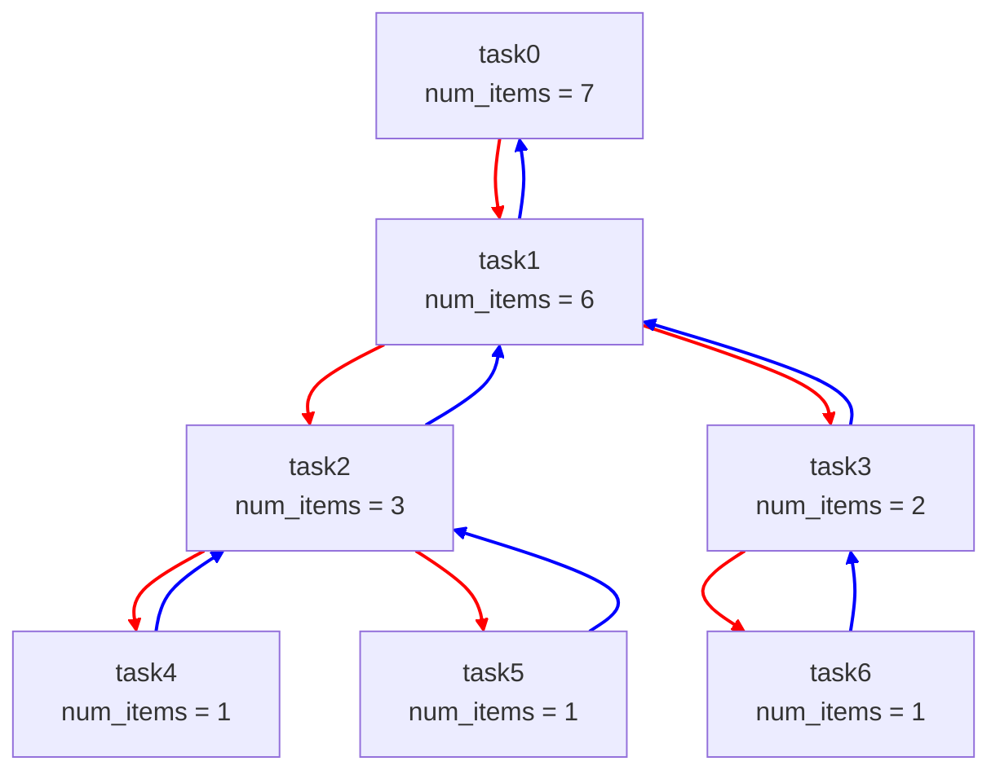
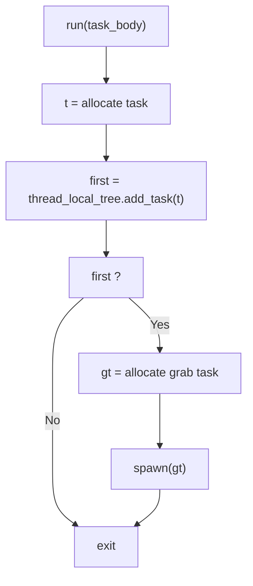
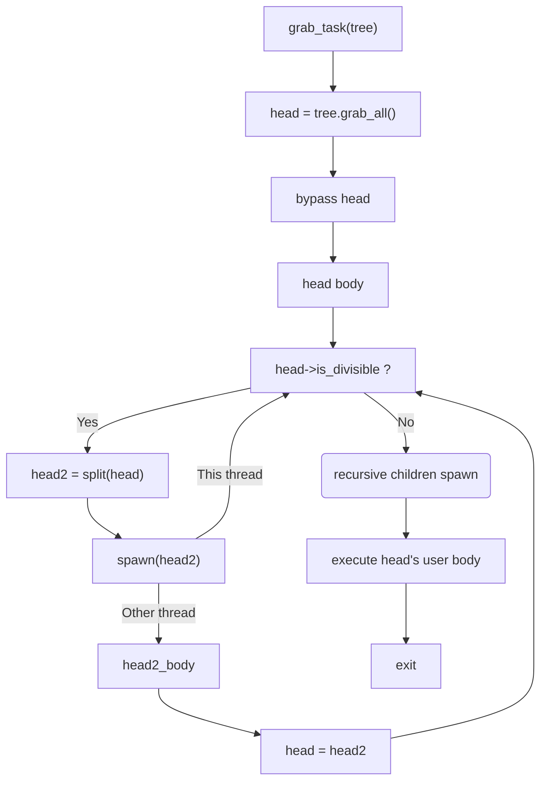
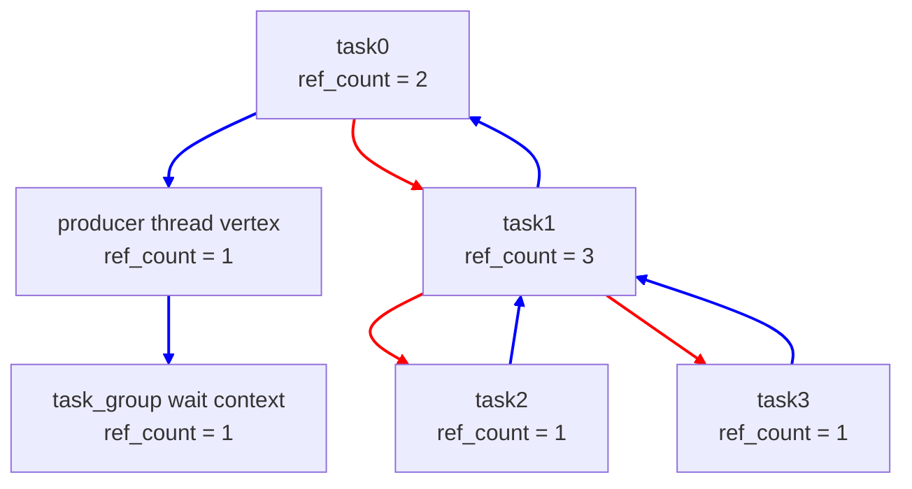
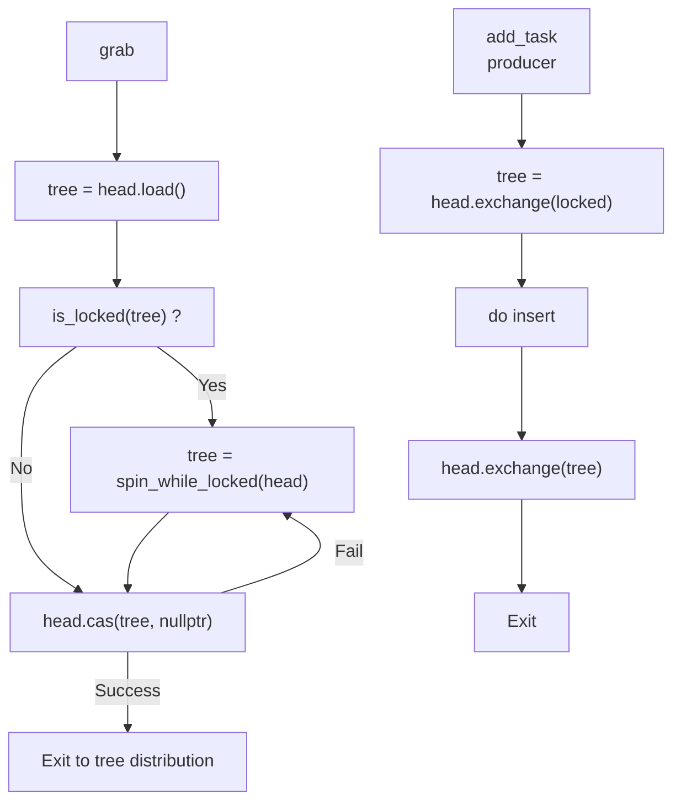
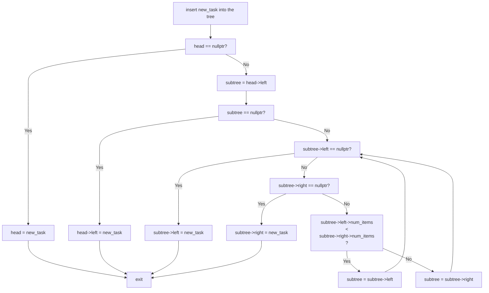
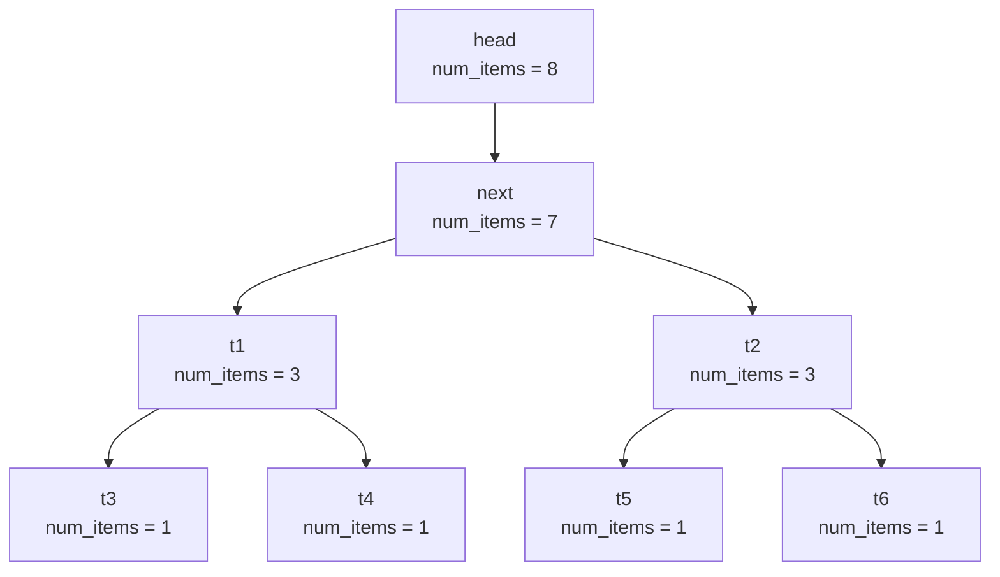
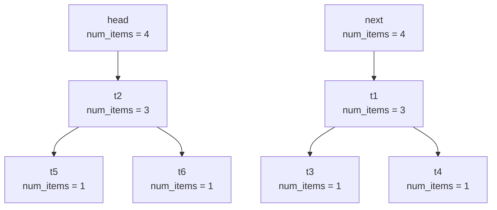

# Task Aggregation

This proposal outlines a possible solution to producer-consumer inefficiencies in the current ``task_group`` API.

## Table of Contents

* 1 [Introduction](#introduction)
* 2 [Proposed Design](#proposed-design)
  * 2.1 [Resolving the Single Task Source Bottleneck](#resolving-the-single-task-source-bottleneck)
  * 2.2 [Resolving the Reference Counting Bottleneck](#resolving-the-reference-counting-bottleneck)
  * 2.3 [Allocator Bottleneck](#allocator-bottleneck)
  * 2.4 [Grabbing Thread Slowdown](#grabbing-thread-slowdown)
* 3 [Performance Analysis](#performance-analysis)
* 4 [Possible APIs](#possible-apis)
* 5 [Open Questions](#open-questions)
* 6 [Task Tree Operations in Detail](#task-tree-operations-in-detail)
  * 6.1 [Synchronization Between Grabber and Producer](#synchronization-between-grabber-and-producer)
  * 6.2 [Adding a Task to the Tree](#adding-a-task-to-the-tree)
  * 6.3 [Splitting the Tree](#splitting-the-tree)
* 7 [Alternative Approaches Considered](#alternative-approaches-considered)

## Introduction

Consider an application that uses ``tbb::task_group`` with a single-producer/multiple-consumers pattern: one producer thread generates work items, and 
multiple consumer threads process them in parallel.

```cpp

void produce() {
    tbb::task_group tg;

    auto work_item = get_work_item();

    while (work_item != end_of_work) {
        tg.run(process(work_item)); // Can be executed by any worker
    }

    tg.wait();
}
```

The ``get_work_item()`` function generates work items, e.g., by reading from an input file or stream. When no more work remains, it
returns ``end_of_work``. 

Because the number of work items is unknown in advance, algorithms such as ``tbb::parallel_for`` or ``tbb::parallel_for_each`` can be inefficient:
they require buffering to create an input sequence, delaying computation of the earliest items.

``tbb::task_group`` is semantically appropriate because it submits available work immediately for execution.

In current implementation, ``tbb::task_group::run`` creates a task for the given callable and pushes it into the producer thread's local task pool.

When worker (consumer) threads join the task arena, they search for tasks to process. Because the producer's local task pool is the sole task source,
worker threads steal tasks from it.

After completing a stolen task, workers become idle and steal again from the same producer's pool.
When many consumers contend for a single producer's pool, stealing becomes a bottleneck, leading to performance
penalties and poor scalability.

Another bottleneck is the ``tbb::task_group``'s reference counter used to register tasks in the group. The counter
increments when a task is created and decrements when the task completes.

To improve scalability, oneTBB 2022.1.0 introduced per-thread reference counters: each thread that creates
tasks registers its thread-local counter as a leaf in the group's counter.

Tasks created by a thread hold references in the thread-local counter, which in turn holds a single reference in the group's counter.

However, in the scenario above, all tasks are created by the producer thread, so all reference converge into a single producer's counter.

## Proposed Design

### Resolving the Single Task Source Bottleneck

This document proposes a task distribution mechanism that combines the existing ``task_group`` spawning model with an aggregator.

For simplicity, we refer to this API as *aggregating-task-group* providing ``run(task_body)`` and ``wait()`` methods,
analogous to ``tbb::task_group``.

Tasks in an *aggregating-task-group* form a binary task tree: the first and second layers contain a single task, and the N-th layer contains up to $2^N$ tasks.

Each tree node contains three pointers:
* Pointer to the left child (next layer)
* Pointer to the right child (next layer)
* Pointer to the parent (previous layer)

Additionally, each node stores the number of items in its subtree.



The binary task tree supports three basic actions:
* Add a task to the tree
* Split the tree into halves
* Grab all items in the tree

Detailed description of these operations appear in [Task Tree Operations in Detail](#task-tree-operations-in-detail) section.

Each *aggregating-task-group* instance maintains a thread-local atomic pointer to its binary tree, initially empty.

Each ``run()`` appends a task to the calling thread's tree and if the tree was empty, it also spawns a service *grab-task*
that references the tree.



When a worker executes the stolen *grab-task*, it grabs all items from the producer's tree.

Because the producer's tree is left empty, subsequent ``run`` calls append tasks and spawn new *grab-task*s.

After grabbing the tree, the *grab-task* bypasses the head node.

The head checks the tree's item count and, if it exceeds the specified grainsize, splits the tree into halves.
It then spawns the head of the second half, while the current task (now the head of the first half) re-executes,
recursively splitting until the grainsize is reached.

Once the grainsize is reached, the head spawns its children recursively and executes the user body.



Revisit the producer-consumer example using *aggregating-task-group* instead of ``tbb::task_group``.

When the *aggregating-task-group* is created, the producer's task tree is empty.

The producer appended 500 tasks into the task tree before the consumer thread 1 came and grabbed them.
Thread 1 splits the tree into two halves (250 tasks each) and spawns the head of the second half into
its local pool.

Thread 2 steals that task, splits the subtree into two halves (125 each), and spawns the second half to its own local pool.

Thread 3 steals the task spawned by Thread 2, and since it is no longer divisible, it spawns the entire subtree into its local pool.

Thread 2 will similarly spawn the other half when its task re-executes.

Thread 1 splits again, enabling another steal (e.g., by Thread 4).

Thus, instead of the producer spawning 500 tasks into a single source, four threads each spawn 125 tasks, creating four
independent work sources that improve stealing scalability.

This model can also be interpreted as follows. Suppose the producer will generate *N* input items, where *N* is unknown in advance.
Execution with *aggregating-task-group* resembles buffering a batch of inputs, running an asynchronous parallel-for over the batch, then buffering again.

Processing *N* items may result in *M* parallel-for invocations over $K_0$, $K_1$, ..., $K_M$ iterations, where $\sum_{i=0}^{M} K_i = N $

### Resolving the Reference Counting Bottleneck

As noted earlier, ``tbb::task_group`` suffers a reference-counting bottleneck in the single-producer/multiple-consumers case.

Because all tasks are created by a single thread, its ``thread_reference_vertex`` holds one reference in the group's
``wait_context``, while each task holds a reference in the producer's ``thread_reference_vertex``.

As tasks are stolen and executed by consumers, the producer's ``thread_reference_vertex`` counter is decremented concurrently
by many threads, causing contention and performance loss.

In *aggregating-task-group*, it is addressed by adding per-task reference counters. References are held for:
1. The task itself
2. Its left child (if any)
3. Its right child (if any)

Before spawning, the *grab-task* holds a reference in a producer's ``thread_reference_vertex``. After execution and grab,
it replaces itself in the waiting tree with the head of the grabbed tree.

Each task's lifetime extends until its reference count reaches zero.



In a diagram, red arrows denote left/right child links in the task tree and are not involved in a reference counting.
Blue arrows denote parent links in the waiting tree.

When a tree is split, only the red links change; the waiting tree remains unchanged.

After a task executes its body, it releases its self-reference. When its count reaches zero, the task is deallocated and
releases its parent's reference in the waiting tree.

This approach distributes reference counting across tasks and avoids a single-counter bottleneck.

### Allocator Bottleneck

Another bottleneck that appears in a single-producer/multiple-consumer scenario is an allocation bottleneck. 

In ``tbb::task_group`` (and most TBB algorithms), tasks are allocated from per-thread small-object pools. Only the owner thread allocates from its pool, while multiple threads can release memory to it.

Because all tasks are created by a single producer's pool, multiple stealers release memory into that same pool during execution. The producer's pool becomes another system bottleneck.

This document does not yet propose a concrete solution for this bottleneck.

### Grabbing Thread Slowdown

We also consider slowing down the grabbing thread when the desired tree's item count is below the recommended threshold.
In that case, the grabbing thread can sleep intermittently and re-check the tree size. After waking, if the tree size
exceeds the threshold, does not grow further, or a fixed number of sleeps is exceeded, the thread grabs
the tree and begins division.

## Performance Analysis

Consider the following benchmark to evaluate the proposed approach.
The producer requests parallel computation over *N* input items. It splits the input into *NumChunks* and evaluates three approaches:
1. ``tbb::parallel_for`` over *N* inputs using ``simple_partitioner`` with grainsize *NumChunks*. Although *N* is unknown in real single-producer/multiple-consumers scenarios (making this approach impractical), it serves as an upper-bound "gold" baseline for the benchmark.
2. Submit *NumChunks* tasks to a regular ``tbb::task_group``.
3. Submit *NumChunks* tasks to *aggregating-task-group*.

Experiments were run on a 256-CPU, dual-NUMA machine.

The chart below compares ``tbb::task_group`` and *aggregating-task-group* against ``parallel_for``.

<image src="assets/perf_comp_parallel_for.png">

The table and chart report slowdowns relative to ``parallel_for``.

For small task counts, ``tbb::task_group`` matches ``parallel_for``; beyond a threshold, its slowdown grows dramatically. 

*aggregating-task-group* also slows relative to ``parallel_for``, but performs up to 10x better than a regular ``task_group``.

The next chart shows scalability for all three approaches at the largest chunk count.

<image src="assets/perf_scalability.png">

*aggregating-task-group* scales significantly better than regular ``task_group``.

## Possible APIs

It is not advisable to replace ``tbb::task_group`` with the proposed aggregation algorithm wholesale, as that could introduce
unnecessary overhead in scenarios where tasks are submitted by multiple threads (e.g., divide-and-conquer).

This document does not yet propose a concrete API. The following options can be considered:
1. A separate ``task_group``-like API with the same member functions.
2. Integration into ``tbb::task_group``, e.g., an additional ``run()`` overload with a policy parameter or a separate member function.
3. A separate API (e.g., ``tbb::parallel_while(generator, predicate, body))``), equivalent to
``while(input = generator(), predicate(input)) { body(input); }``, where the generator and the predicate
run on the calling thread while the loop bodies execute in parallel.

## Open Questions

* Should task aggregation be exposed as part of the public TBB API?
* Which public API surface is most appropriate? See [Possible APIs section](#possible-apis).
* Which configuration parameters and heuristics are appropriate (e.g., tree division grainsize, grabbing-thread slowdown, etc.)?
* Solutions for the producer's [allocator bottleneck](#allocator-bottleneck) should be considered.

## Task Tree Operations in Detail

### Synchronization Between Grabber and Producer

Because the task tree is thread-local and only one *grab-task* is spawned per non-empty tree, synchronization is needed only
between the producer (which adds tasks) and the grabber (which collects tasks for distribution).

Synchronization can be implemented with a single atomic pointer to the tree head and a spin-lock built on that atomic.
The algorithm reserves a sentinel ``locked`` value of type ``tree_task*``.

The producer locks its thread-local tree by exchanging the atomic value to ``locked``. After inserting a new leaf into the tree, the producer
exchanges ``locked`` back to the head pointer.

The grabber reads the atomic head; if it is ``locked``, it spins until unlocked. Once unlocked, it attempts to CAS to set the head to ``nullptr``.
If CAS fails (the producer re-locked the tree), the grabber spins and retries.



### Adding a Task to the Tree

Consider an empty binary task tree. The first added task becomes the head. The second task is inserted as the head's left child.
The right child of the head is always ``nullptr`` to maintain the structure described above.

From the third task onward, the algorithm inserts into the subtree (left or right) with fewer items.



### Splitting the Tree

As noted above, each node maintains pointer to left/right children and to its parent.

This document proposes requiring the grainsize to be $>= 4$ to simplify splitting.

Splitting occurs only after a grab; thus, the splitting thread exclusively owns the tree, and no synchronization is needed.

Only the first two layers of the tree are needed for splitting. Let's call them ``head`` and ``next``.

Splitting is done by setting ``head->left = next->right``, then ``next->right = nullptr``, and update counters accordingly. 
Parent pointers are not modified so the waiting tree remains intact for reference counting.

Before splitting



After splitting



## Alternative Approaches Considered

An alternative considered was aggregating tasks in a producer-side singly-linked list instead of a tree.
This simplifies synchronization between the grabber and producer using a single atomic: producer uses CAS; grabber uses exchange.

However, after grabbing a list, the efficient options are limited: crop a prefix, spawn a service task to process the tail, then spawn tasks from the cropped prefix.
This requires traversing the cropped tasks twice, because the tail's service task must be spawned first to be stolen first.

A binary task tree provides significantly better distribution (akin to ``parallel_for``'s work splitting).
