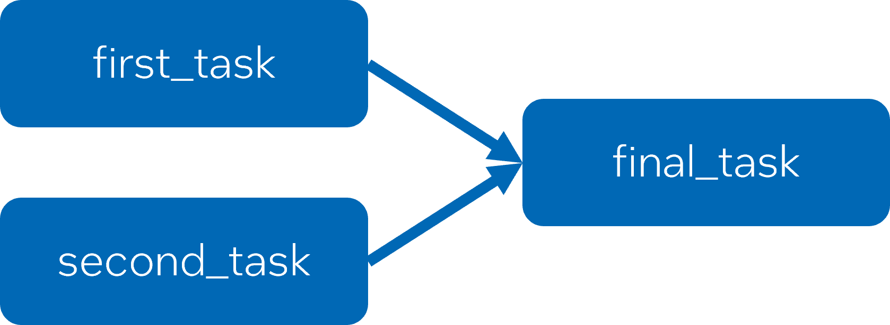
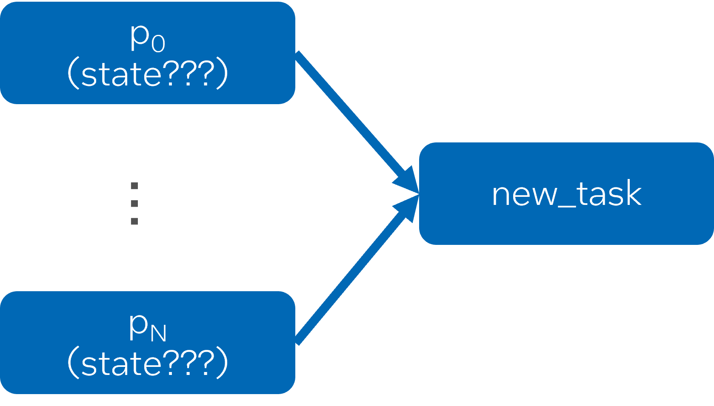

# Extend ``task_group`` for Dynamic Task Dependencies

## Introduction

In 2021, with the transition from TBB 2020 to the first release of oneTBB, 
the lowest-level tasking interface changed significantly and was no longer
promoted as a user-facing feature. Instead, we encouraged
using the `task_group` or the flow graph APIs to express patterns
previously handled by the lowest-level tasking API. This approach has been
sufficient for many cases. However, there is one use case which is not
straightforward to express by the revised API: Dynamic task graphs which are
not trees. This proposal expands `tbb::task_group` to support additional use cases.

The class definition from section
[scheduler.task_group](https://oneapi-spec.uxlfoundation.org/specifications/oneapi/latest/elements/onetbb/source/task_scheduler/task_group/task_group_cls)
of the oneAPI Threading Building Blocks (oneTBB) Specification 1.3-rev-1 for
`tbb::task_group` is shown below. Note the existing `defer` function, since this
function and its return type, `task_handle`, are the foundation of the proposed extensions:

    class task_group {
    public:
        task_group();
        task_group(task_group_context& context);

        ~task_group();

        template<typename Func>
        void run(Func&& f);

        template<typename Func>
        task_handle defer(Func&& f);

        void run(task_handle&& h);

        template<typename Func>
        task_group_status run_and_wait(const Func& f);

        task_group_status run_and_wait(task_handle&& h);

        task_group_status wait();
        void cancel();
    };

## Proposal

The following list summarizes the three primary extensions that are under
consideration. The sections that follow provide background and further
clarification on the proposed extensions.

1. **Extend semantics and useful lifetime of `task_handle`.** We propose `task_handle`
to represent tasks for the purpose of adding dependencies. It requires extending its
useful lifetime and semantics to include tasks that have been
submitted, are currently executing, or have been completed.
2. **Add functions to set task dependencies.** In the current `task_group`, tasks can
only be waited on as a group, with no direct way to define before-after
relationships between individual tasks.
3. **Add a function to move successors from an executing task to a new task.**
This functionality is necessary for recursively generated task graphs. It enables
safe modifification of dependencies for an already submitted task.

### Extend the Semantics and Useful Lifetime of task_handle

Dynamic tasks graphs order the execution of tasks via dependencies on the
completion of other tasks. They are considered dynamic because task creation,
specification of dependencies, submission for scheduling, and task execution
may happen concurrently and in various orders. Different
use cases have different requirements on when tasks are created
and when dependencies are specified.

For the sake of discussion, let’s define four points in a task’s lifetime:

1. **Created:** is allocated but is not yet known to the scheduling
algorithm, and therefore cannot begin executing.
2. **Submitted:** is known to the scheduling algorithm and may be
scheduled for execution whenever its incoming dependencies (predecessor tasks)
are complete.
3. **Executing:** has started executing its body but is not yet complete.
4. **Completed:** fully executed to completion.

In the current `task_group` specification, the `task_group::defer` function
already allows separate task creation and submission.
`task_group::defer` returns a `tbb::task_handle` that represents a created
task. A created task remains created until it is submitted through
`task_group::run` or `task_group::run_and_wait`. The current
`task_group` specification treats accessing a `task_handle` after it is submitted
via one of the run functions as undefined behavior. Therefore, a
`task_handle` represents a created task only. Furthermore, since `task_group`
does not support task dependencies, any task that is run can be immediately
scheduled for execution without considering dependencies.

The first extension is to expand the semantics and usable lifetime of
`task_handle` so that it remains valid after it is passed to run. This allows
it to represent tasks in any state, including submitted, executing, and completed
tasks. Similarly, a submitted `task_handle` may represent a task
with predecessors that must complete before it can execute. In that case,
passing a `task_handle` to `task_group::run` or `task_group::run_and_wait` only makes
it available for dependency tracking and does not make it immediately eligible for
execution.

### Add Functions to Set Dependencies.

The next logical extension is to add a mechanism for specifying dependencies
between tasks. In the most conservative view, it should only be allowed to add
additional predecessors (in-dependencies) to tasks in the created state.
After a task starts is completed, adding more predecessors is irrelevant,
since it’s too late to delay the start of the task’s execution.

It might be logical to add additional predecessors to a task that is
currently executing if it is suspended until these additional dependencies complete.
However, this proposal does not include support for the suspension model.

For a task in the submitted state, there can be a race between
adding a new predecessor and the scheduler deciding to execute the task once its
current predecessors are complete. We will revisit the discussion of
adding predecessors to submitted tasks in the next section when discussing
recursively grown task graphs.

After resolving the question about when a predecessors, the next question is,
what can be added as a predecessor task? The simplest answer is to have no limitations.
It means, any valid `task_handle` can act as a predecessor. In many cases, you may
only know what work must be completed before a task can start, but you may not know
work's state.

We therefore think predecessors may be in any state when they are added, 
as shown below:

There are a number of possible options to spell a function for adding
a single predecessor. Additionally, we may also want a function to allow
adding multiple predecessors in a single call.

Given two `task_handle` objects, `h1` and `h2`, some possible options 
for adding `h1` as a predecessor (ind-dependence) of `h2` include:

- `h2.add_predecessor(h1)`
- `h2 = defer( { … }, h1)`
- `make_edge(h1, h2)`

The proposal is to include the first option. Similarly, there could be
a version of this function that accepts multiple predecessors
at once:

- `h.add_predecessors(h1, ..., hn)`

This initial proposal does not include this function, but it can be added later.

In the general case, it is undefined behavior to add a new predecessor
to a task in the submitted, executing, or completed states.

### Add a Function for Recursively Grown Graphs

A very common use case for oneTBB tasks is parallel recursive decomposition. 
An example of this is the implementation of `tbb::parallel_for` that 
performs a parallel recursive decomposition of a range. Currently,
the oneTBB algorithms, such as tbb::parallel_for, are implemented using the non-public,
low-level tasking API, rather than `tbb::task_group`. This low-level tasking API
puts the responsibility for dependence tracking and memory
management of tasks on developers. While it allows the oneTBB development team to build highly optimized
algorithms, a simpler set of interfaces are can be provided for the 
users. Recursive parallel algorithms are one of the primary cases that we want 
our task_group extension to cover.

The key capability required for recursive decomposition is the ability to 
create work while executing a task and insert this newly created work before 
the (perhaps already submitted) successors of the currently executing task. 
A simple example is a merge sort. As shown in the figure
below, the top-level algorithm breaks a collection into two pieces and 
creates three tasks:

1. A task to sort the left half.
2. A task to sort the right half.
3. A task to merge the halves once they are sorted. 

In a recursive merge sort, each of the sort tasks recursively takes the same 
approach to sort its portions of the collection. The top-level task (and 
subsequent recursively generated tasks) must be able to create new tasks 
and then update the graph for their outer merge task to wait for the 
newly created subtasks to complete.

A key point of this recursive parallel algorithm is the requirement to change 
the predecessors of the merge tasks. However, the merge tasks are already 
submitted when their predecessors are modified. As mentioned in the previous 
section, updating the predecessors of a submitted task can be
risky due to the potential for a race condition. However, in this case,
it is safe to add additional predecessors to the merge task. 
This is because the merge task cannot start execution until all of its current predecessors 
complete. Those predecessors are the tasks responsible for modifying the predecessors. 

Therefore, the proposal is a limited extension that allows transferring 
all the successors of a currently executing task to become the successors 
of a different created task. This function can only access the successors
of the currently executing task, and those tasks are prevented from executing 
by a dependence on the current task itself, so we can ensure that we can safely 
update the incoming dependencies for those tasks without worrying about
potential race conditions. 

One possible spelling for this function would be `transfer_successors_to(h)`, 
Where `h` is a `task_handle` to a created task, and the 
`transfer_successors_to` function must be called from within a task. Calling
this function from outside a task or passing anything other than a `task_handle`
representing a task in the created state is undefined behavior.

### Proposed Changes for ``task_handle``

    namespace oneapi {
    namespace tbb {
        class task_handle {
        public:

            // existing functions
            task_handle();
            task_handle(task_handle&& src);
            ~task_handle();
            task_handle& operator=(task_handle&& th);
            explicit operator bool() const noexcept;

            // proposed additions
            void add_predecessor(task_handle& th);
            void add_successor(task_handle& th);
        };

        void transfer_successors_to(task_handle& th);
    }
    }

#### void task_handle::add_predecessor(task_handle& th);

Adds `th` as a predecessor that must complete before the task represented by
`*this` can start executing.

#### void task_handle::add_successor(task_handle& th);

Adds `th` as a successor that cannot start executing until the task represented by 
`*this` is complete.

#### void transfer_successors_to(task_handle& th);

Transfers all of the successors from the currently executing task to the task 
represented by `th`.

### Examples

##### Simple Three-Nodes Task Graph

The example below shows a simple graph with three nodes. 
`final_task` must wait for  `first_task` and `second_task` 
to complete.

    tbb::task_group tg;

    tbb::task_handle first_task = tg.defer([&] { /* task body */ });
    tbb::task_handle second_task = tg.defer([&] { /* task body */ });
    tbb::task_handle final_task = tg.defer([&] { /* task body */ });

    final_task.add_predecessor(first_task);
    final_task.add_predecessor(second_task);
    // optionally: final_task.add_predecessors(first_task, second_task);

    // order of submission is not important
    tg.run(final_task);
    tg.run(first_task);
    tg.run(second_task);

    tg.wait();

The dependency graph for this example is:

#### Predecessors in Unknown States

The example below shows a graph where the dependencies are determined 
dynamically. The state of the predecessors may be unknown – they may 
be created, submitted, executing or completed. Although not shown,
let's assume that the user's `users::find_predecessors` function 
returns, based on application logic, the tasks that must complete 
before the new work can start.

    void add_another_task(tbb::task_group& tg, int work_id) {
        tbb::task_handle new_task = tg.defer([=] { do_work(work_id); });

        for (tbb::task_handle& p : users::find_predecessors(work_id)) {
            new_task.add_predecessor(p);
        }

        tg.run(new_task);
    }

While the graph, as shown below, is simple, 
the completion status of the predecessors is unknown. Therefore, 
for ease of use, `task_handle` should be usable as a dependency 
regardless of state of the task it represents. Any predecessor 
that is already completed when it is added as a predecessor will 
not delay the start of the dependent task. Otherwise, the end users 
will need to track these states explicitly.

#### Recursive Decomposition

This example is a version of merge-sort (with many of the details left out). 
Assume an initial task executes the function shown
below as its body, and the function implements that task, and also serves 
as the body for the recursively decomposed pieces. The beginning and
end of the sequence are represented by `b` and `e`, and much of the
(unimportant) details of the implementation of merge-sort is hidden 
behind the functions `users::do_serial_sort`, `users::create_left_range`,
`users::create_right_range`, and `users::do_merge`.  

    template<typename T>
    void merge_sort(tbb::task_group& tg, T b, T e) {
        if (users::range_is_too_small(b, e)) {
            // base-case when range is small
            users::do_serial_sort(b, e);
        } else {
            // calculate left and right ranges
            T lb, le, rb, re;
            users::create_left_range(lb, le, b, e);
            users::create_right_range(rb, re, b, e);

            // create the three tasks
            tbb::task_handle sortleft =
                tg.defer([lb, le, &tg] {
                    merge_sort(tg, lb, le);
                });
            tbb::task_handle sortright =
                tg.defer([rb, re, &tg] {
                    merge_sort(tg, rb, re);
                });
            tbb::task_handle merge =
            tg.defer([rb, re, &tg] {
                    users::do_merge(tg, lb, le, rb, re);
                });

            // add predecessors for new merge task
            merge.add_predecessors(sortleft, sortright);

            // insert new subgraph between currently executing
            // task and its successors
            tbb::transfer_successors_to(merge);

            tg.run(sortleft);
            tg.run(sortright);
            tg.run(merge);
        }
    }

The task tree for this example matches the one shown earlier for merge-sort. 

## Open Questions in Design

Some open questions that remain:

- Are the suggested APIs sufficient?
- Are there additional use cases that should be considered that we missed in our analysis?
- Are there other parts of the pre-oneTBB tasking API that developers have struggled to find a good alternative for?
