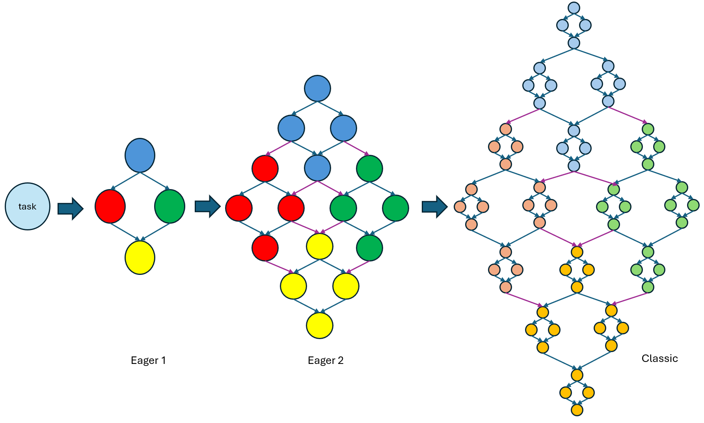

# API and semantics details for task group dynamic dependencies

*Note:* This document is a sub-RFC of the [umbrella RFC for task group dynamic dependencies](README.md). 

## Introduction

This document contains a concrete API and semantics proposal for ``task_group`` extensions defined in the parent RFC.
The following cases are covered:
* ``task_group`` extensions allowing handling the tasks in various states: created, submitted, executing and completed.
  Existing API only allows having a non-empty ``task_handle`` object handling the created task and an empty one that does not
  handle any tasks.
* API for setting the dependencies between tasks in various states.
* API for transferring the dependencies from the executing task to the task in various states.

## Semantic extension for handling tasks in various states

The parent proposal for extending the task group with APIs for setting dynamic dependencies defines the following states of the task in the ``task_group``:
* Created 
* Submitted
* Executing
* Completed

Practically, the task is in `created` state when the ``task_group::defer`` was called and the task was registered in the ``task_group``, but one of the submission methods (such as ``task_group::run``) was not yet called. 

The task state is changed to `submitted` when one of the submission methods was called and the task may be scheduled for the execution if all the
dependent tasks are completed.

The state is changed to `executing` when all of the dependent tasks are completed and some thread takes the task for execution is executing the
corresponding task body.

Once the thread finishes executing the task body, the state of the task is changed to `completed`.

The parent RFC proposes to extend possible tasks states that can be handled by ``task_handle`` object to be tasks in any states defined above. Such a change
requires changing the semantics of the task submission methods (such as ``task_group::run`` and others) while working with various states handled by ``task_handle``. 

Unlike this approach, this document proposes keeping the ``task_handle`` as a unique-owning handle that owns the task in created state or does not owns the task.
For handling the task in other states, it is proposed to add a new weak-owning handle ``task_tracker`` that can handles the task in any state.

``task_tracker`` object can be obtained by constructing from the ``task_handle`` object owning the created task. ``task_handle`` cannot be constructed using the
``task_tracker`` argument.

```cpp
tbb::task_group tg;

tbb::task_handle handle = tg.defer([] {/*...*/}); // task is in created state, handle owns the task
tbb::task_tracker tracker = handle; // create the tracker for the task owned by the handle

tg.run(std::move(handle)); // task is in submitted state, handle is left in an empty state

// tracker is non empty and can be used to set dependencies
```

In this case, no semantic changes are needed for the submission methods, because the ``task_handle`` semantics is not changed.

Alternative approaches for handling tasks in different states are described in the [separate section](#alternative-approaches).

## Semantics for setting dependencies between tasks

Lets consider creating a predecessor-successor dependency between the task tracked or owned by ``predecessor``
and the task handled by ``successor_task_handle`` -
``task_group::make_edge(predecessor_task_handle, successor_task_handle)``. 

As it was stated in the parent RFC document, we would like to allow adding predecessors in any state described above and to limit the successor to be a task in created state since it can be too late to add predecessors to
the task in executing or completed state.

The second limitation is handled by limiting the successor argument to be only ``task_handle``.

Lets consider the different states of the task tracked or handled by ``predecessor``. 

If the predecessor task is in any state except the completed one (created/scheduled/running), the API registers the successor task
in the list of successors on the predecessor side and increase the corresponding reference counter on the successor side to ensure it
would not be executed before the predecessor task. The successor task can only start executing once the associated reference counter is equal to 0.

If the predecessor task is in `completed` state, the API has no effect in terms of modifying the list of successors and reference counters since no additional
dependencies are required and the successor task can be executed if all other dependent tasks are executed as well.

If the predecessor task state has changed while registering the task as a predecessor for any task, the API should react accordingly to make sure
adding dependencies and increasing the corresponding reference counters are not done for completed tasks.

Implementation-wise, this API requires adding a list of successors into the predecessor task and adding the new vertex instance that corresponds
to the successor task. This vertex would contain the reference counter and a pointer to the successor task itself. Each element in the task successor list
is a pointer to the vertex instance of the successor task.

The vertex instance is created once the first task is registered as a predecessor and is reused by any other predecessors. 

Once the predecessor task is completed, it should go through the list of successor vertices and decrement the reference counter. Once the successor's
reference counter is equal to 0, the successor task can be scheduled for execution.

API-wise, the function that decreases the reference counter may also return the pointer to the task. If the reference counter is not equal to 0, the
returned pointer is ``nullptr``. Otherwise, the successor task pointer is returned. It is required to allow bypassing one of the successor tasks
if the body of the predecessor task did not return other task that should be bypassed.

This implementation approach is illustrated in the picture below:


## Semantics for transferring successors from the currently executing task to the other task

Lets consider the use-case where the successors of the task ``current`` are transferred to the task ``target`` owned or tracked by the ``target_handler``. 
In this case, the API ``tbb::task_group::current_task::transfer_successors_to(target_handler)`` should be called from the body of ``current``.

As it was mentioned in the parent RFC, if ``transfer_successors_to`` is called outside of task belonging to the same ``task_group``, the behavior is
undefined.

Current proposal limits the applicability of this API and allows only transferring from the executing task to the created task.
Transferring to tasks in `scheduled`, `executing` or `completed` states are described in a [separate section](#transferring-successors-to-the-task-in-any-state)
and can be added in the future.

The call to `transfer_successors_to` should merge together the successors list of ``current`` and ``target`` and set ``target`` to have the merged
successors list. If should be thread-safe to add new successors to ``current`` by using the ``make_edge`` API.


It is clear that while transferring from ``current`` to ``target`` the successors list of ``target`` should contain both previous successors of ``target``
and the successors of ``current``.

Interesting aspect is what should be done with the successors list of ``current``.

The first option is to consider ``current`` and ``target`` a separate tasks even after the transferring the successors from one to another.

In this case, after the transfer, the task ``current`` will have an empty successors list, and ``target`` will have a merged successors list:


After the transfer, the successors of ``current`` and ``target`` are tracked separately and adding new successors to one of them would only
affect the successors list of one task:


Alternative approach is to keep tracking ``current`` and ``target`` together after transferring. This requires introducing a special state
of ``task_tracker` - a kind of `proxy` state. If the executing task calls `transfer_successors_to` from the body, all trackers, initially created
to track this task are changing the state to `proxy`.

Tracker to the ``current`` and ``target`` are sharing the single merged list of successors if ``current`` tracker is in `proxy` state.


Any changes in the successors list operated on ``current`` or ``target`` will modify the same list of successors - adding or transferring will modify the
state of both "real" and proxy tasks:


Racing use-case should be considered for each approach - when new successors are added to task ``A`` while it is transferring it's successors to ``B``.

There are two options how the actual modifications of the ``A`` successors list can be linearized - the new successor can be added before actual transferring
the entire list to ``B`` or after that. 

If the successors of ``A`` and ``B`` are tracked separately (the first option described), if the new successor was added before the transfer, the new successor
would be transferred to ``B`` together with the entire list.

If the transferring was done before adding the successor - the new successor would be added to ``A`` only and would not appear in the successors list of ``B``.

Hence, the deterministic predecessor-successor relationships cannot be guaranteed in this case, because of the logical race between ``make_edge`` and ``transfer_successors_to``.

If the successors of ``A`` and ``B`` are tracked together (the second option described) in both linearization case the newly added successor will appear in both
successors list of ``B`` ("real" task) and ``A`` (task in `proxy` state).

As it is stated in [one of the advanced examples topic](#combination-of-eager-and-classic-approaches), there are real-life scenarios where the combined tracking
should be implemented. Generally, these are examples where one thread is setting a predecessor-successor dependency between a task that can be in the running state
(using a `task_tracker` to such a task). Other thread can execute the tracked task and can replace it in the task graph with the subtree by calling `transfer_successors_to`. 

Hence, the merged successors tracking approach is proposed by this document.

## Functionality removed from the proposal

### Adding successors to the currently executing task

Initially, it was proposed to allow adding successor tasks to the currently executing task:

```cpp
namespace oneapi {
namespace tbb {
class task_group {
public:
    struct current_task {
        static void add_successor(task_handle& successor);
    };
};
} // namespace tbb
} // namespace oneapi
```

The usage of such a function is the following:

```cpp
tbb::task_group tg;

tg.run_and_wait([&tg] {
    tbb::task_handle succ1 = tg.defer(...);
    tbb::task_handle succ2 = tg.defer(...);

    tbb::task_group::current_task::add_successor(succ1);
    tbb::task_group::current_task::add_successor(succ2);

    tg.run(std::move(succ1));
    tg.run(std::move(succ2));

    // Run current task's computations
    run_computations();
});
```

The `add_successor` functionality was removed from the proposal because the scenario above can be covered by changing the ordering of operations and
run successors for execution (or even bypass one of them) after running the computations:

```cpp
tbb::task_group tg;

tg.run_and_wait([&tg] -> tbb::task_handle {
    tbb::task_handle succ1 = tg.defer(...);
    tbb::task_handle succ2 = tg.defer(...);

    // Run current task's computations
    run_computations();

    tg.run(std::move(succ1)); // run
    return std::move(succ2); // bypass
})
```

### Functions for tracking the task progress

The earlier version of this proposal included special member functions for ``task_tracker`` class allowing to get the information about the current state
of the tracked task:

```cpp
namespace oneapi {
namespace tbb {
class task_tracker {
public:
    bool was_submitted() const;
    bool is_completed() const;
};
} // namespace tbb
} // namespace oneapi
```

``was_submitted`` returns ``true`` if the tracked task was submitted for execution using one of the APIs in ``task_group`` or ``task_arena`` (e.g. ``task_group::run``).
``is_completed`` returns ``true`` if the execution of the tracked task is completed by some TBB thread.

These APIs were removed from the proposal because of the following reasons:
* Lack of use-cases for these functions. All of the considered examples could be implemented without using these functions.
* Unclear semantics for these function when the tracked task is executing ``task_group::current_task::transfer_successors_to``. Consider a task ``A`` that transfers
  it's successors to the task ``B`` and exits the body. On the one hand, task ``A`` was already submitted and completed and both described functions should return ``true``.
  On the other hand, the task ``A`` replaces itself in the task graph with the task ``B`` and it may be expected that the tracker would now track ``B`` (similarly to how
  `make_edge` is done - new edges added to ``A`` after transferring are added to ``B``).

## Potential future enhancements

### ``empty_task`` API

Since it is only allowed to transfer successors to a single task only, for some use-cases (see [N-body example](#n-bodies-problem) as a reference) it
is needed to create a single synchronization-only empty task to combine separate end-tasks in the subgraph and transfer successors to this task:

```cpp
// N-body rectangle split
tbb::task_handle left_lower_rectangle_task = tg.defer(...);
tbb::task_handle right_upper_rectangle_task = tg.defer(...);
tbb::task_handle left_upper_rectangle_task = tg.defer(...);
tbb::task_handle right_lower_rectangle_task = tg.defer(...);

tbb::task_handle empty_sync_task = tg.defer([] {});

tbb::task_group::make_edge(left_lower_rectangle_task, left_upper_rectangle_task);
tbb::task_group::make_edge(left_lower_rectangle_task, right_lower_rectangle_task);
tbb::task_group::make_edge(right_upper_rectangle_task, left_upper_rectangle_task);
tbb::task_group::make_edge(right_upper_rectangle_task, right_lower_rectangle_task);

tbb::task_group::make_edge(left_upper_rectangle_task, empty_sync_task);
tbb::task_group::make_edge(right_lower_rectangle_task, empty_sync_task);

tbb::task_group::current_task::transfer_successors_to(empty_sync_task);
```

In the current TBB implementation, ``empty_sync_task`` would be spawned (or bypassed) and executed anyway that can add some overhead for scheduling.

Possible extension is to add some special API for `task_group` to provide an `empty_task` of a special type that would not be scheduled for execution
and skipped when the dependent tasks are completed:

```cpp
auto empty_sync_task = tg.get_empty_task();

...

tbb::task_group::make_edge(left_upper_rectangle_task, empty_sync_task);
tbb::task_group::make_edge(right_upper_rectangle_task, empty_sync_task);

// empty_sync_task would not be spawned and only used for dependency tracking
```

### Transferring successors to the task in any state

Current proposal limits the functionality of `transfer_successors_to` by accepting only a task in created state as a recipient. It is done by allowing
only `task_handle` as an argument to `transfer_successors_to`.

Currently considered use-cases did not shown the necessity to transfer the successors to the task in any state, but if such a use case appear in the future,
the semantics of `transfer_successors_to` can be extended by providing the new overload:

```cpp
namespace oneapi {
namespace tbb {

class task_group {
public:
    struct current_task {
        static void transfer_successors_to(task_tracker& task);
    };
};

} // namespace tbb
} // namespace oneapi
```

Implementation-wise, it means that merged successors tracking should not only be applied to two tasks ("sender" of the successors and the recipient), but to
the set of tasks, since one task can transfer it's successors to the running task that also performing `transfer_successors_to` and so on.

### Using a ``task_tracker`` as a successor

Current proposal only allows the tasks in created state as a successors. It is implemented by allowing only
the ``task_handle`` as a second argument for ``make_edge``:

```cpp
namespace oneapi {
namespace tbb {
class task_group {
    static void make_edge(task_handle& pred, task_handle& succ);
    static void make_edge(task_tracker& pred, task_handle& succ);
};
} // namespace tbb
} // namespace oneapi
```

Two enhancements for this API can be considered:
* Allow ``task_tracker`` tracking the task in created state to be used as a successor.
* Allow ``task_tracker`` tracking the task `T` in submitted state to be used as a successor if other non-submitted
  predecessors of ``T`` prevent it from being scheduled for execution.

These enhancements require the following APIs to be added:

```cpp
namespace oneapi {
namespace tbb {
class task_group {
    static void make_edge(task_handle& pred, task_tracker& succ);
    static void make_edge(task_tracker& pred, task_tracker& succ);
};
} // namespace tbb
} // namespace oneapi
```

If the ``task_tracker`` tracking the task that is scheduled for execution, executing or completed, is used
as a second argument, the behavior of APIs above is undefined.

## Advanced examples

This section describes the applicability of the proposal to the advanced scenarios that were not considered as part of the parent RFC.

### Recursive Fibonacci

The Recursive Fibonacci is an example of parallel computation of N-th Fibonacci number. Computation of each *N*-th Fibonacci number is done by computing *N-1*-th number and *N-2*-th number
in parallel and computing a sum of these numbers after completing the computations. 


Possible implementation of this example is part of [oneTBB migration examples](https://github.com/uxlfoundation/oneTBB/tree/master/examples/migration).

The example can be easily implement also using the proposed API. Each task computing *N*-th Fibonacci number should create two subtasks `subtask1` and `subtask2` for computations of *N-1*-th and *N-2*-th numbers
respectfully, and the `merge_sum` task for calculating the sum of `subtask1` and `subtask2` results.

Since `merge_sum` needs to be executed only after the computations of `subtask1` and `subtask2` are completed, there should be a predecessor-successor dependency between `subtask1` and `merge_sum` and
between `subtask2` and `merge_sum`.

To preserve the predecessor-successor relations of the entire task graph, currently executing task should transfer it's successors to `merge_sum` to replace itself in the graph with this task.

```cpp
int serial_fibonacci(int n) {
    return n == 0 ? 0 : n + serial_fibonacci(n - 1);
}

constexpr int serial_fibonacci_cutoff = 100;

void recursive_fibonacci_number(tbb::task_group& tg, int n, int* result_placeholder) {
    if (n <= serial_fibonacci_cutoff) {
        *result_placeholder = serial_fibonacci(n);
    } else {
        int* subtask1_placeholder = new int(0);
        int* subtask2_placeholder = new int(0);

        tbb::task_handle subtask1 = tg.defer([&tg, n, subtask1_placeholder] {
            recursive_fibonacci_number(tg, n - 1, subtask1_placeholder);
        });

        tbb::task_handle subtask2 = tg.defer([&tg, n, subtask2_placeholder] {
            recursive_fibonacci_number(tg, n - 2, subtask2_placeholder);
        });

        tbb::task_handle merge_sum = tg.defer([=] {
            *result_placeholder = *subtask1_placeholder + *subtask2_placeholder;
            delete subtask1_placeholder;
            delete subtask2_placeholder;
        });

        tbb::task_group::make_edge(subtask1, merge_sum);
        tbb::task_group::make_edge(subtask2, merge_sum);

        tbb::task_group::current_task::transfer_successors_to(merge_sum);

        tg.run(std::move(subtask1));
        tg.run(std::move(subtask2));
        tg.run(std::move(merge_sum));
    }
}

int fibonacci_number(int n) {
    tbb::task_group tg;
    int result = 0;
    tg.run_and_wait([&tg, &result, n] {
        recursive_fibonacci_number(tg, n, &result);
    });
    return result;
}

```

### N-bodies problem

Parallel N-bodies simulation is an example simulating a set of N planetary bodies drifting in space. The algorithm is computing successive positions of each body
for successive moments in time. It first computes the gravitational force acting on each body as the sum of forces exerted on it by all of the other bodies, and
adjusts the velocity of each body according to the computed force. 

Given the fact that each *i*th body is acting on the *j*th body with force of the same magnitude as *j*th body acting on *i*th, but with the reversed direction, we can
consider the initial problem as traversing the triangle shown below and calculating the force for each point in it.


For effective parallel computations, we can follow the algorithm explained in
[Parallel Programming with Cilk I](https://dspace.mit.edu/bitstream/handle/1721.1/122680/6-172-fall-2010/contents/projects/MIT6_172F10_proj4_1.pdf) paper.

For parallelizing the computation on the triangle shown above, the algorithm splits it into two smaller triangles and one rectangle as it shown on the picture below:


As it described in the paper, parallel computations can only be done on non-intersecting *i* and *j* indices. Hence, computations on two yellow triangles can
be done in parallel and the computations of the blue rectangle can be only started after computations on them.

Each sub-triangle can be divided using the same splitting algorithm for triangles.

Computations on the rectangles can also be parallelized if we split each rectangle as it shown in the picture below:


Computations on black sub-rectangles can be done in parallel as well as the gray ones. 

This problem can also be implemented using the proposed algorithm. Let's consider the triangle split first.
Each task that is doing the computation on the triangle creates two subtasks `triangle_subtask1` and `triangle_subtask2` to
do computations on the sub-triangles, and a subtask `rectangle_subtask` to do computation on the sub-rectangle.

As it was mentioned above, only the sub-triangles can be computed in parallel, so a predecessor-successor relationship
should be set between `triangle_subtask1` and `rectangle_subtask` and between `triangle_subtask2` and `rectangle_subtask`
to execute the rectangle split only after doing computations on sub-triangles.

Then each task that is doing the split should replace itself with the `rectangle_subtask` by transferring the successors
to this subtask:


Sub-tasks computing the triangle split are following the same logic. 

Each task computing the rectangle, creates 2 subtasks `left_lower_subtask` and `right_upper_subtask` to do computations
on the black sub-rectangles on the picture above, and 2 subtasks `left_upper_subtask` and `right_lower_subtask` to do
computations on the gray sub-rectangles.

To ensure that the black and gray sub-rectangles are not computed in parallel, a predecessor-successor relationship should
be set between each pair of black and gray sub-tasks.

Similarly to the triangle split, the current task should also replace itself in the task graph with another task that
synchronize the work. Since current API only allows transferring the successors to the single task, an empty task should be
created as a synchronization point and the successors of the current task should be transferred to this task:


```cpp
class Body;
void calculate_force(double& fx, double& fy, Body& body1, Body& body2);
void add_force(Body* body, double fx, double fy);

constexpr int threshold = 16;

void serial_calculate_and_update_forces(int i0, int i1, int j0, int j1,
                                        Body* bodies0)
{
    for (int i = i0; i < i1; ++i) {
        for (int j = j0; j < j1; ++j) {
            // update the force vector on bodies[i] exerted by bodies[j]
            // and, symmetrically, the force vector on bodies[j] exerted
            // by bodies[i]
            if (i == j) continue;

            double fx, fy;
            calculate_force(&fx, &fy, bodies[i], bodies[j]);
            add_force(&bodies[i], fx, fy);
            add_force(&bodies[i], -fx, -fy);
        }
    }
}

// traverse the rectangle i0 <= i <= i1, j0 <= j <= J1
void n_body_rectangle(tbb::task_group& tg,
                      int i0, int i1, int j0, int j1,
                      Body* bodies)
{
    int di = i1 - i0;
    int dj = j1 - j0;
    if (di <= threshold || dj <= threshold) {
        serial_calculate_and_update_forces(i0, i1, j0, j1, bodies);
    } else {
        int im = i0 + dj / 2;
        int jm = j0 + dj / 2;

        tbb::task_handle left_lower_subtask = tg.defer([&tg, =] {
            n_body_rectangle(tg, i0, im, j0, jm, bodies);
        });

        tbb::task_handle right_upper_subtask = tg.defer([&tg, =] {
            n_body_rectangle(tg, im, i1, jm, j1, bodies);
        });

        tbb::task_handle left_upper_subtask = tg.defer([&tg, =] {
            n_body_rectangle(tg, i0, im, jm, j1, bodies);
        });

        tbb::task_handle right_lower_subtask = tg.defer([&tg, =] {
            n_body_rectangle(tg, im, i1, j0, jm, bodies);
        });

        tbb::task_handle sync = tg.defer([] {});

        tbb::task_group::make_edge(left_lower_subtask, left_upper_subtask);
        tbb::task_group::make_edge(left_lower_subtask, right_lower_subtask);
        tbb::task_group::make_edge(right_upper_subtask, left_upper_subtask);
        tbb::task_group::make_edge(right_upper_subtask, right_lower_subtask);
        
        tbb::task_group::make_edge(left_upper_subtask, sync);
        tbb::task_group::make_edge(right_lower_subtask, sync);

        tbb::task_group::current_task::transfer_successors_to(sync);

        tg.run(std::move(left_lower_subtask));
        tg.run(std::move(right_upper_subtask));
        tg.run(std::move(left_upper_subtask));
        tg.run(std::move(right_lower_subtask));
        tg.run(std::move(sync));
    }
}

// traverse the triangle n0 <= i <= j <= n1
void n_body_triangle(tbb::task_group& tg, int n0, int n1, Body* bodies) {
    int dn = n1 - n0;
    // If dn == 1, do nothing since a single body has no
    // interaction with itself
    if (dn != 1) {
        int nm = n0 + dn / 2;
        tbb::task_handle triangle_subtask1 = tg.defer([&tg, =] {
            n_body_triangle(tg, n0, nm, bodies);
        });

        tbb::task_handle triangle_subtask2 = tg.defer([&tg, =] {
            n_body_triangle(tg, nm, n1, bodies);
        });

        tbb::task_handle rectangle_subtask = tg.defer([&tg, =] {
            n_body_rectangle(tg, n0, nm, nm, n1, bodies);
        });

        tbb::task_group::make_edge(triangle_subtask1, rectangle_subtask);
        tbb::task_group::make_edge(triangle_subtask2, rectangle_subtask);

        tbb::task_group::current_task::transfer_successors_to(rectangle_subtask);

        tg.run(std::move(triangle_subtask1));
        tg.run(std::move(triangle_subtask2));
        tg.run(std::move(rectangle_subtask));
    }
}

void calculate_forces(int n_bodies, Body* bodies) {
    tbb::task_group tg;
    tg.run_and_wait([&tg, n_bodies, bodies] {
        n_body_triangle(tg, 0, n_bodies, bodies);
    });
}
```

### Wavefront

Wavefront is a scientific programming pattern in which data elements are distributed on multidimensional grids. Elements should be computed in order
because of dependencies between them.

Let's consider a 2 dimensional wavefront example where the computation starts on the upper left corner of the grid:


Computations of each element *(i,j)* in the grid can start when two dependent sub-elements are completed:
* North dependency - computation of the element *(i, j - 1)* if present
* West dependency - computation of the element *(i - 1, j)* if present

Hence all antidiagonal elements in the grid can be computed in parallel due to lack of dependencies between them (showed as cells with the
same colour on the picture).

#### Non-recursive approach

The easiest approach to implement the wavefront is to create all tasks for computations on the cells and set all of the dependencies between them
before running the computation.


```cpp
void compute_cell(int i, int j);

void non_recursive_wavefront(int in, int jn) {
    tbb::task_group tg;

    std::vector<std::vector<tbb::task_handle>> cell_tasks;

    cell_tasks.reserve(in);

    for (int i = 0; i < in; ++i) {
        cell_tasks[i].reserve(jn);

        for (int j = 0; j < jn; ++j) {
            cell_tasks[i].emplace_back(tg.defer([=] { compute_cell(i, j); }));

            // north dependency
            if (j != 0) { tbb::task_group::make_edge(cell_tasks[i, j - 1], cell_tasks[i][j]); }

            // west dependency
            if (i != 0) { tbb::task_group::make_edge(cell_tasks[i - 1][j], cell_tasks[i][j]); }
        }
    }

    // Run the graph
    for (int i = 0; i < in; ++i) {
        for (int j = 0; j < jn; ++j) {
            tg.run(std::move(cell_tasks[i][j]));
        }
    }
}
```

#### Classic recursive approach

Another approach is to implement a wavefront as a divide-and-conquer pattern with recursive splitting of the grid.

In this case, the initial task would split the grid into 4 subtasks, each of which splits each of the sub-area into 4 subtasks, etc:


In the "classic" recursive approach, each task creates 4 subtasks `north_subtask`, `west_subtask`, `east_subtask` and `south_subtask` and
sets the following predecessor-successor dependencies:
* Between `north_subtask` and `west_subtask`,
* Between `north_subtask` and `east_subtask`,
* Between `west_subtask` and `south_subtask`,
* Between `east_subtask` and `south_subtask`.

To support the structure of the task graph, currently executing task should replace itself with `south_subtask` by transferring the successors.

```cpp
void compute_cell(int i, int j);

void serial_wavefront(int i0, int in, int j0, int jn) {
    for (int i = i0; i < in; ++i) {
        for (int j = j0; j < jn; ++j) {
            compute_cell(i, j);
        }
    }
}

constexpr int threshold = 4;

void classic_recursive_wavefront_task(tbb::task_group& tg, int i0, int in, int j0, int jn) {
    int di = in - i0;
    int dj = jn - j0;

    if (di <= threshold || dj <= threshold) {
        serial_wavefront(i0, in, j0, jn);
    } else {
        int im = i0 + di / 2;
        int jm = j0 + dj / 2;

        tbb::task_handle north_subtask = tg.defer([&tg, =] {
            classic_recursive_wavefront_task(tg, i0, im, j0, jm);
        });

        tbb::task_handle west_subtask = tg.defer([&tg, =] {
            classic_recursive_wavefront_task(tg, i0, im, jm, jn);
        });

        tbb::task_handle east_subtask = tg.defer([&tg, =] {
            classic_recursive_wavefront_task(tg, im, in, j0, jn);
        });

        tbb::task_handle south_subtask = tg.defer([&tg, =] {
            classic_recursive_wavefront_task(tg, im, in, jm, jn);
        });

        tbb::task_group::make_edge(north_subtask, west_subtask);
        tbb::task_group::make_edge(north_subtask, east_subtask);
        tbb::task_group::make_edge(west_subtask, south_subtask);
        tbb::task_group::make_edge(east_subtask, south_subtask);

        tbb::task_group::current_task::transfer_successors_to(south_subtask);

        tg.run(std::move(north_subtask));
        tg.run(std::move(west_subtask));
        tg.run(std::move(east_subtask));
        tg.run(std::move(south_subtask));
    }
}

void classic_recursive_wavefront(int in, int jn) {
    tbb::task_group tg;
    tg.run_and_wait([&tg, =] {
        classic_recursive_wavefront_task(tg, 0, in, 0, jn);
    });
}
```

The task graph for the classic approach is illustrated in the picture below:


#### Eager recursive approach

The main downside of the classic approach is setting an extra dependencies between tasks that are not actually depend on each other.

E.g. in the task graph above, the task `21` would start executing only after the task `14` is completed, but algorithm-wise it only depends
on the task `12` and should not wait until `14` to complete.

The improved approach is described in the [Cache-Oblivious Wavefront](https://people.csail.mit.edu/yuantang/Docs/PPoPP15-yuantang.pdf) paper as eager recursion.

In such a recursion each dividing task knows that it's dependent tasks would split as well and notifies them about the sub-tasks required to make only the real
dependencies between tasks.

Let's consider a wavefront calculations on the square grid ``[0, n)`` on ``x`` and ``y`` dimensions.

Similarly to the classic algorithm, the eager one splits the calculated area into 4 sub-areas by creating 4
subtasks - ``north_subtask``, ``wast_subtask``, ``east_subtask`` and ``south_subtask``.

The algorithm  also sets the same dependencies as a classic one:
* ``west_subtask`` and ``east_subtask`` are successors of ``north_subtask``
* ``south_subtask`` is a successor of ``west_subtask`` and ``east_subtask``.

During the first division, no extra actions needed since the task that splits calculation of the
whole grid ``[0, n))`` can't have successors.

But during the second division - when the north, west, east and south are executed, each task needs to notify it's
successors about the subtasks to make dependencies.

Let's look into the second division in details. Initially, we have 4 subtasks created during the first division:


The north subtask is executed first because dependencies prevents west, east and south tasks from executing.
Similarly to the previous step, it creates the north, east, west and south subtasks:


The second step is to notify the successors about the subtasks:
* ``W`` should be notified about west and south subtasks (``NW`` and ``NS``),
* ``E`` should be notified about east and south subtasks (``NE`` and ``NS``).

Notifying the successor is made by creating ``task_tracker`` objects tracking the corresponding tasks and storing them
in the container visible for the successors.

North subtask ``NN`` can start execution and division after completing the split of the previous level and notifying
the successors.

Since ``N`` task is completed, ``W`` and ``E`` can start executing. ``W`` would also split itself into subtasks and
notify ``S`` about the successors:


Additionally, ``W`` should add dependencies between it's subtasks ``WN`` and ``WE`` and the subtasks of ``N`` created
on the previous step (``NW`` and ``NS``):


It is important to mention that at the moment of making additional edges, ``NW`` and ``NS`` are at least
in `submitted` state and even can be completed. 

That highlights the importance of ability to make edges between tasks in any state and a task in created state.

``E`` and ``S`` tasks are following the same logic as described above. That results in the following task graph:


The splitting continues until the desired depth.

The following code shows how it can be implemented using the API proposed:

```cpp
void compute_cell(std::size_t x, std::size_t y);

void serial_wavefront(std::size_t x0, std::size_t xn, std::size_t y0, std::size_t yn) {
    for (std::size_t x = x0; x < xn; ++x) {
        for (std::size_t y = y0; y < yn; ++y) {
            compute_cell(x, y);
        }
    }
}

class eager_wavefront_task {
public:
    static void prepare_predecessors_container(std::size_t num_divisions) {
        // Reserve element in the vector for each level of division
        predecessors_container.resize(num_divisions);

        int num_subtasks = 4; // number of subtasks on the first level

        for (std::size_t i = 0; i < num_divisions; ++i) {
            predecessors_container[i].reserve(num_subtasks);
            num_subtasks *= 4;
        }
    }

    static tbb::task_tracker find_predecessor(std::size_t n_division, std::size_t x_index, std::size_t y_index) {
        // Number of elements in the grid on each level of division
        // On the first level - 4 subtasks total (2 on each dimension)
        // on the second level - 16 subtasks total (4 on each dimension), etc.
        std::size_t n_grid = (2 << n_division);

        auto it = predecessors[n_division].find(x_index * n_grid + y_index);
        return it != predecessors[n_division].end() ? it->second : tbb::task_tracker{};
    }

    static void publish_predecessor(std::size_t n_division, std::size_t x_index, std::size_t y_index,
                                    tbb::task_tracker&& pred)
    {
        std::size_t n_grid = (2 << n_division>>);

        [[maybe_unused]] auto it = predecessors[n_division].emplace(x_index * n_grid + y_index, std::move(pred));
        assert(it != predecessors[n_division].end());
    }

    eager_wavefront_task(tbb::task_group& tg, std::size_t x_index, std::size_t y_index,
                         std::size_t x0, std::size_t xn, std::size_t y0, std::size_t yn,
                         std::size_t n_div)
        : m_tg(tg), m_x_index(x_index), m_y_index(y_index)
        , m_x0(x0), m_xn(xn), m_y0(y0), m_yn(yn)
        , m_n_division(n_div)
    {}

    void operator()() const {
        std::size_t x_size = m_xn - m_x0;
        std::size_t y_size = m_yn - m_y0;

        // Do serial wavefront if the grainsize reached
        if (i_size <= wavefront_grainsize) {
            assert(j_size <= wavefront_grainsize);
            serial_wavefront(m_i0, m_in, m_j0, m_jn);
        } else {
            std::size_t x_mid = m_x0 + x_size / 2;
            std::size_t y_mid = m_y0 + y_size / 2;

            // Calculate indices of subtasks in the next level grid
            std::size_t north_x_index = m_x_index + m_x_index * 2;
            std::size_t north_y_index = m_y_index + m_y_index * 2;

            std::size_t west_x_index = north_x_index;
            std::size_t west_y_index = north_y_index + 1;

            std::size_t east_x_index = north_x_index + 1;
            std::size_t east_y_index = north_y_index;

            std::size_t south_x_index = east_x_index;
            std::size_t south_y_index = west_y_index;

            // Create subtasks
            tbb::task_handle north_subtask = tg.defer(eager_wavefront_task(m_tg,
                /*indices in the next level grid = */north_x_index, north_y_index,
                /*area to process = */m_x0, x_mid, m_y0, y_mid,
                /*n_division = */m_n_division + 1));

            tbb::task_handle west_subtask = tg.defer(eager_wavefront_task(m_tg,
                /*indices in the next level grid = */west_x_index, west_y_index,
                /*area to process = */m_x0, x_mid, y_mid, m_yn,
                /*n_division = */m_n_division + 1));

            tbb::task_handle east_subtask = tg.defer(eager_wavefront_task(m_tg,
                /*indices in the next level grid = */east_x_index, east_y_index,
                /*area to process = */x_mid, m_xn, m_y0, y_mid,
                /*n_division = */m_n_division + 1));

            tbb::task_handle south_subtask = tg.defer(eager_wavefront_task(m_tg,
                /*indices in the next level grid = */south_x_index, south_y_index,
                /*area to process = */x_mid, m_xn, y_mid, m_yn,
                /*n_division = */m_n_division + 1));

            // Make dependencies between subtasks
            tbb::task_group::make_edge(north_subtask, west_subtask);
            tbb::task_group::make_edge(north_subtask, east_subtask);
            tbb::task_group::make_edge(west_subtask, south_subtask);
            tbb::task_group::make_edge(east_subtask, south_subtask);

            // Add extra dependencies with predecessor's subtasks
            tbb::task_tracker west_predecessor_east_subtask;
            tbb::task_tracker west_predecessor_south_subtask;
            tbb::task_tracker north_predecessor_west_subtask;
            tbb::task_tracker north_predecessor_south_subtask;

            if (north_x_index != 0) {
                west_predecessor_east_subtask = find_predecessor(m_n_division + 1, north_x_index - 1, north_y_index);
            }
            if (west_x_index != 0) {
                west_predecessor_south_subtask = find_predecessor(m_n_division + 1, west_x_index - 1, west_y_index);
            }
            if (north_y_index != 0) {
                north_predecessor_west_subtask = find_predecessor(m_n_division + 1, north_x_index, north_y_index - 1);
            }
            if (east_y_index != 0) {
                north_predecessor_south_subtask = find_predecessor(m_n_division + 1, east_x_index, east_y_index - 1);
            }

            if (west_predecessor_east_subtask) {
                tbb::task_group::make_edge(west_predecessor_east_subtask, north_subtask);
            }
            if (west_predecessor_south_subtask) {
                tbb::task_group::make_edge(west_predecessor_south_subtask, west_subtask);
            }
            if (north_predecessor_west_subtask) {
                tbb::task_group::make_edge(north_predecessor_west_subtask, north_subtask);
            }
            if (north_predecessor_south_subtask) {
                tbb::task_group::make_edge(north_predecessor_south_subtask, east_subtask);
            }

            // Save trackers to subtasks for future publishing
            tbb::task_tracker north_subtask_tracker = north_subtask;
            tbb::task_tracker west_subtask_tracker = west_subtask;
            tbb::task_tracker east_subtask_tracker = east_subtask;
            tbb::task_tracker south_subtask_tracker = south_subtask;

            // Run subtasks
            tg.run(std::move(north_subtask));
            tg.run(std::move(west_subtask));
            tg.run(std::move(east_subtask));
            tg.run(std::move(south_subtask));

            // Publish subtasks for successors
            publish_predecessor(m_n_division + 1, north_x_index, north_y_index, std::move(north_subtask_tracker));
            publish_predecessor(m_n_division + 1, west_x_index, west_y_index, std::move(west_subtask_tracker));
            publish_predecessor(m_n_division + 1, east_x_index, east_y_index, std::move(east_subtask_tracker));
            publish_predecessor(m_n_division + 1, south_x_index, south_y_index, std::move(south_subtask_tracker));
        }
    }

private:
    static constexpr std::size_t wavefront_grainsize = 5;

    // Each element e[i] in the vector represents a map of additional predecessors on the i-th level of division
    // Each element in the hash table maps linearized index in the grid (x_index * n + y_index) with the
    // tracker to the corresponding task
    using predecessors_container_type = std::vector<std::unordered_map<std::size_t, tbb::task_tracker>>;

    static predecessors_container_type predecessors;

    tbb::task_group& m_tg;

    // Indices in the grid of current level of division
    // On the first division level indices are [0, 2) on x and y
    // On the second division level indices are [0, 4) on x and y, etc.
    std::size_t m_x_index;
    std::size_t m_y_index;

    // Begin and end indices of the globally computed area
    std::size_t m_x0;
    std::size_t m_xn;
    std::size_t m_y0;
    std::size_t m_yn;

    // Division number
    std::size_t m_n_division;
}; // class eager_wavefront_task

void eager_wavefront(std::size_t n) {
    tbb::task_group tg;

    std::size_t num_divisions = log2(n / eager_wavefront_task::wavefront_grainsize) + 1;
    eager_wavefront_task::prepare_predecessors_container(num_divisions);

    tg.run_and_wait(eager_wavefront_task(tg,
        /*x_index = */0, /*y_index = */0,
        /*area to process = */0, n, 0, n,
        /*n_division = */0));
}
```

#### Combination of eager and classic approaches

If we consider a combination of two approaches described above:
1. First and second-level eager splits
2. Classic split of each subtask created during the second-level split

The split algorithm is illustrated in the picture below:



As it is described in the eager wavefront algorithm section above, on the "Eager 2" stage, the dependencies between
blue and red subtasks are created using the `task_tracker` to the blue subtasks. The blue subtasks can be executed
during making this dependency (purple arrows on the picture).

During the classic split, each subtask of "Eager 2" replaces itself in the task graph with the south classic subtask
using transferring the successors.

Because the red subtasks on "Eager 2" knows only a tracker to the original blue subtasks (before transferring
the successors) and because blue subtasks can be executed before the edge between blue and red subtasks are created,
red subtask can use a ``task_tracker`` to the originally created blue task *after* this task replaces itself in the
graph with the "Classic" subtask (by transferring it's successors).

Hence, to create a correct edge on "Eager 2" level, all of the edges added to ``task_tracker`` that is associated
with the task that transferred it's successors, should be added to the task that receives the successors.
To maintain such a behavior, the "merged successors tracking" approach, described in the
[section above](#semantics-for-transferring-successors-from-the-currently-executing-task-to-the-other-task)
should be implemented.

## API proposal summary

```cpp
namespace oneapi {
namespace tbb {

// Existing API
class task_handle;

// New APIs
class task_tracker {
public:
    task_tracker();

    task_tracker(const task_tracker& other);
    task_tracker(task_tracker&& other);

    task_tracker(const task_handle& handle);

    ~task_tracker();

    task_tracker& operator=(const task_tracker& other);
    task_tracker& operator=(task_tracker&& other);

    task_tracker& operator=(const task_handle& handle);

    explicit operator bool() const noexcept;
}; // class task_tracker

bool operator==(const task_tracker& t, std::nullptr_t) noexcept;
bool operator==(std::nullptr_t, const task_tracker& t) noexcept;

bool operator!=(const task_tracker& t, std::nullptr_t) noexcept;
bool operator!=(std::nullptr_t, const task_tracker& t) noexcept;

bool operator==(const task_tracker& t, const task_tracker& rhs) noexcept;
bool operator!=(const task_tracker& t, const task_tracker& rhs) noexcept;

class task_group {
    static void make_edge(task_handle& pred, task_handle& succ);
    static void make_edge(task_tracker& pred, task_handle& succ);

    struct current_task {
        static void transfer_successors_to(task_handle& h);
    };
}; // class task_group

} // namespace tbb
} // namespace oneapi
```

### ``task_tracker`` class

#### Construction, destruction and assignment

``task_tracker()``

Creates an empty ``task_tracker`` object that does not track any task.

``task_tracker(const task_tracker& other)``

Copies ``other`` to ``*this``. After this, ``*this`` and ``other`` track the same task.

``task_tracker(task_tracker&& other)``

Moves ``other`` to ``*this``. After this, ``*this`` tracks the task previously tracked by ``other``.
Other is left in empty state.

``task_tracker(const task_handle& handle)``

Creates ``task_tracker`` object that tracks the task owned by ``handle``. 

``~task_tracker()``

Destroys the ``task_tracker`` object.

``task_tracker& operator=(const task_tracker& other)``

Replaces the task tracked by ``*this`` to be a task tracked by ``other``.
After this, ``*this`` and ``other`` track the same task.

Returns a reference to ``*this``.

``task_tracker& operator=(task_tracker&& other)``

Replaces the task tracked by ``*this`` to be a task tracked by ``other``.
After this, ``*this`` tracks the task previously tracked by ``other``.
Other is left in empty state.

Returns a reference to ``*this``.

``task_tracker& operator=(const task_handle& handle)``

Replaces the task tracked by ``*this`` to be a task owned by ``handle``.

Returns a reference to ``*this``.

#### Observers

``explicit operator bool() const noexcept``

Checks if `this`` tracks any task object.

Returns ``true`` if ``*this`` is a non-empty tracker, ``false`` otherwise.

#### Comparison operators

``bool operator==(const task_tracker& t, std::nullptr_t) noexcept``

Returns ``true`` if ``t`` is a non-empty tracker, ``false`` otherwise.

``bool operator==(std::nullptr_t, const task_tracker& t) noexcept``

Equivalent to ``t == nullptr``.

``bool operator!=(const task_tracker& t, std::nullptr_t) noexcept``

Equivalent to ``!(t == nullptr)``.

``bool operator!=(std::nullptr_t, const task_tracker& t) noexcept``

Equivalent to ``!(t == nullptr)``.

``bool operator==(const task_tracker& lhs, const task_tracker& rhs) noexcept``

Returns ``true`` if ``lhs`` tracks the same task as ``rhs``, ``false`` otherwise.

``bool operator!=(const task_tracker& lhs, const task_tracker& rhs) noexcept``

Equivalent to ``!(lhs == rhs)``.

### Member functions of ``task_group`` class

``static void task_group::make_edge(task_handle& pred, task_handle& succ)``

Registers the task owned by ``pred`` to be a predecessor that must complete before the task owned
by ``succ`` can start executing.

The behavior is undefined in the following cases:
* ``pred`` is an empty ``task_handle``, or ``succ`` is an empty ``task_handle``,
* If that task handled by ``pred`` and the task handled by ``succ`` belongs to different ``task_group``s.

It is safe to add multiple predecessors to the same successor and add the same predecessor for multiple successor tasks.

It is safe to add successors to the task that currently transfers it's successors to another task and
to the task to which the successors are transferred.

``static void task_group::make_edge(task_tracker& pred, task_handle& succ)``

Registers the task tracked by ``pred`` to be a predecessor that must complete before the task owned
by ``succ`` can start executing.

The behavior is undefined in the following cases:
* ``pred`` is an empty ``task_tracker``, or ``succ`` is an empty ``task_handle``,
* If that task tracked by ``pred`` and the task handled by ``succ`` belongs to different ``task_group``s.

It is safe to add multiple predecessors to the same successor and add the same predecessor for multiple successor tasks.

It is safe to add successors to the task that currently transfers it's successors to another task and
to the task to which the successors are transferred.

### Member functions of ``task_group::current_task``

``static void transfer_successors_to(task_handle& h)``

Transfers all of the successors of the currently executing task to the task handled by ``h``.

The behavior is undefined in any of the following cases:
* ``h`` is an empty ``task_handle``,
* The function is called outside of the ``task_group`` task body,
* The currently executed task and the task handled by ``h`` belongs to different ``task_group``s.

It is safe to transfer successors to the task while adding the successors to ``h`` or while other threads
are adding successors to the currently executed task.

It is guaranteed that in any case the successors added to the current task would appear as a successors of ``h`` even if
they are added after calling the ``transfer_successors_to``.

## Alternative approaches 

The alternative approaches are to keep only the ``task_handle`` as the only way to track the task, set the
dependencies and submit the task for execution.

### ``task_handle`` as a unique owner

The first option is to keep the ``task_handle`` to be a unique owner of the task in various states and to allow
to use non-empty handle for setting or transferring the dependencies.

Since the current API allows submitting the ``task_handle`` for execution only as rvalue, having any usage of ``task_handle`` object after submitting for execution 
(e.g. using ``task_group::run(std::move(task_handle))``) looks misleading even if some guarantees are provided for the referred handle object.

To handle this, it would be needed to extend all functions that take the task handled by the ``task_handle``
with the new overload taking an non-const lvalue reference and provide the following guarantees:
* Overloads accepting rvalue reference to ``task_handle`` take a non-empty handle and leave the handle in an empty state in the end (current behavior is preserved).
* New overloads accepting lvalue references to ``task_handle`` also take a non-empty handle object but does not leave it in an empty state after submission. Hence, the ``task_handle`` can be
  used after execution of the method to represent a task in submitted, executing or completed state and to set the dependencies on such tasks.
  Using such a task handle once again as an argument to the submission function results in undefined behavior.

Extension for all of the submission functions would be required:
* ``task_group::run`` and ``task_group::run_and_wait``
* ``task_arena::enqueue`` and ``this_task_arena::enqueue``

Also, the submission functions would work only with the handles of the tasks in created states.
Submitting the ``task_handle`` handling tasks in any other state results in undefined behavior.

When the ``task_group`` preview extensions are enabled, returning a non-empty ``task_handle`` handling a task
in the state other than created results in undefined behavior.

### ``task_handle`` as a shared owner

Another approach is to have ``task_handle`` to be a shared owner on the task allowing multiple instances of
``task_handle`` to co-own the task. But since the task can only be submitted for execution once, using a
``task_handle`` as an argument to one of the submission functions would invalidate all copies or set them
in the "weak" state that allows only to set dependencies between tasks.

Exit criteria & open questions:
* Are concrete names of APIs good enough and reflects the purpose of the methods?
* The performance targets for this feature should be defined
* API improvements and enhancements should be considered (may be a criteria for moving the feature to `supported`):
  * Should comparison functions between ``task_tracker`` and ``task_handle`` be defined?
  * Should ``task_tracker`` tracking the task in created or submitted state (not always) be allowed as a
    successor in ``make_edge``? See [separate section](#using-a-task_tracker-as-a-successor) for more details.
  * Should ``empty_task`` helper API be provided to optimize creating and spawning the empty sync-only tasks. See
    [separate section](#empty_task-api) for more details.
