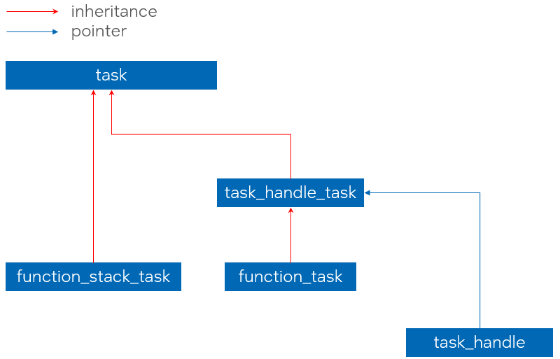
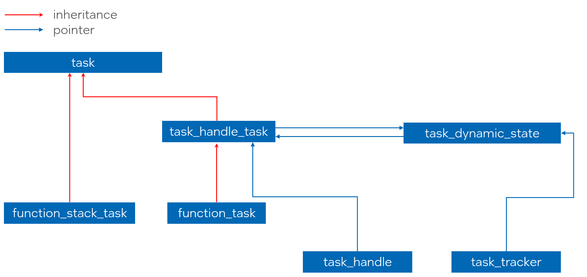
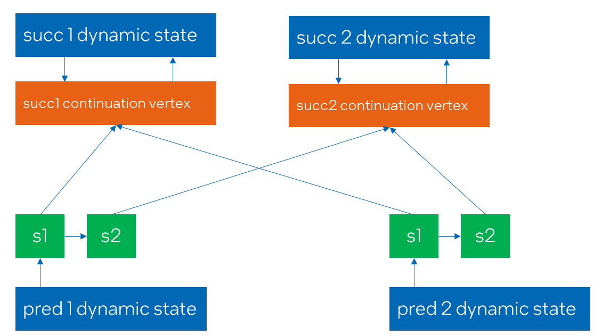
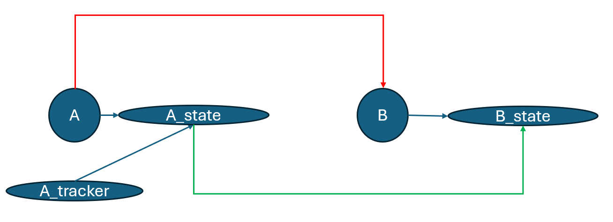

# Implementation details for task group dynamic dependencies feature

*Note:* This document describes an implementation details for the [task group dynamic dependencies RFC](extended_semantics.md)

## Introduction

The [task group dynamic dependencies RFC](extended_semantics.md) describes a design for setting predecessor-
successor dependencies between tasks in various states (`make_edge` API) and replacing the currently executing
task with another task in the task graph (`transfer_successors_to` API).

The task in `created` state is expressed by `task_handle` object on the user side.
The task in other states (`created`, `submitted`, `executing` or `completed`) - by `task_tracker` object.

Similarly to `task_handle`, the `task_tracker` may be in two states - `empty`, meaning it does not
track any tasks, and `non-empty`. The only way to get a `non-empty` `task_tracker` is to construct or
assign it from a non-empty `task_handle`:

```cpp
tbb::task_group tg;
tbb::task_handle th = tg.defer(...); // task is in created state
tbb::task_tracker tt = th;
tg.run(std::move(th));
// th is empty
// tt is non-empty
// the task is in on of the submitted->executing->completed states
```

While creating a predecessor-successor dependency between tasks, the task in any state is allowed as
a predecessor and only a task in created state is allowed as successor. It is exposed by the following APIs:

```cpp
namespace oneapi {
namespace tbb {
class task_group {
public:
    static void make_edge(task_handle& pred, task_handle& succ);
    static void make_edge(task_tracker& pred, task_handle& succ);
};
}
}
```

The first overload is intended to create a predecessor-successor dependency between two tasks in `created` state.
The second overload is to create a dependency between a predecessor in any of the states and a successor
in `created` state.

Replacing the task in the task graph by the other task is exposed by transferring the successors of this
task to another task:

```cpp
namespace oneapi {
namespace tbb {
class task_group {
public:
    struct current_task {
        static void transfer_successors_to(tbb::task_handle& rec);
    };
};
}
}
```

Only the task in the `created` state is allowed to be a recipient of successors (only `task_handle` argument
is allowed).

After doing the transferring from the task `prev_task` to the task `new_task`, the new successors that
are added using the `task_tracker` to `prev_task` should be added to the `new_task`:

```cpp

tbb::task_group tg;
tbb::task_handle prev_task = tg.defer([] {
    tbb::task_handle new_task = tg.defer(...);
    tbb::task_group::current_task::transfer_successors_to(new_task);
    tg.run(std::move(new_task));
});

tbb::task_tracker prev_task_tracker = prev_task;
tg.run(std::move(prev_task));

// assume that prev task is completed at this moment
tbb::task_handle new_successor = tg.defer(...);

// new_successor is added to new_task
tbb::task_group::make_edge(prev_task_tracker, new_successor);
```

## Implementation details

### Classes layout before implementing the proposal

Currently, there are two types of tasks that are used in the `task_group` - `function_task` and `function_stack_task`.
`function_task` is created then a non-waiting submission functions, such as `task_group::run` are used.
`function_stack_task` is created only when `task_group::run_and_wait`.

The difference between these types of tasks is that `function_task` copies the body
to itself and `function_stack_task` uses a reference to the use body instance since
it can't be destroyed before the blocking API finishes.

Due to API limitations, only the `function_stack_task` can be owned by the `task_handle`.

`function_stack_task` is inherited from the `task_handle_task` object that manages the lifetime of the task.
`task_handle_task` and `function_stack_task` are inherited from the basic `task` class.

`task_handle` class is implemented as a `unique_ptr` owning the `task_handle_task` instance.

The class layout is shown on the picture below:



### `task_dynamic_state` class

The main part of the APIs described above are implemented as part of the new
`task_dynamic_state` class. It is intended to manage the task status (in progress, completed, transferred),
current list of successors and linkage with the new task after the transferring.
It's layout would be described in details in the later sections. 

Each task in the task group that can have predecessors or successors have the `task_dynamic_state` instance associated with it.

Since `make_edge` API allows completed tasks as predecessors, it is required to prolong the lifetime of the `task_dynamic_state`
instance associated with the task even after the task completion until the last `tbb::task_tracker` object associated with the
task would be destroyed.

### `task_with_dynamic_state` class

To associate the instance of `task_dynamic_state` with the task, the current implementation adds the new class `task_with_dynamic_state`
in the schema above between `task_handle_task` and `task` classes. This class contains the atomic pointer to the `task_dynamic_state`
instance associated with the task:



```cpp
namespace oneapi {
namespace tbb {

class task_dynamic_state { /*...*/ };

class task { /*...*/ };

class task_with_dynamic_state : public task {
public:
    task_with_dynamic_state();
    ~task_with_dynamic_state();

    task_dynamic_state* get_dynamic_state();
    void complete_task();
private:
    std::atomic<task_dynamic_state*> m_state;
};

class task_handle_task : public task_with_dynamic_state { /*...*/ };
class function_task : public task_handle_task { /*...*/ };

} // namespace tbb
} // namespace oneapi
```

The main responsibility of the `task_with_dynamic_state` class is to lazily create the `task_dynamic_state` object associated
with the task and provide access to the created object.

Default constructor of the `task_with_dynamic_state` does not create a `task_dynamic_state` instance associated with the task
not to introduce additional overhead on creating the instance if the dynamic task dependencies feature is not used.

The instance is created once the `get_dynamic_state()` function is called the first time. This function is called in the following cases:
* `task_tracker` object is constructed or assigned from the `task_handle` object owning the task,
* The `make_edge(pred, succ)` function was called to make a predecessor-successor dependency between `pred` and `succ`. associated
  dynamic states are created for `pred` and `succ` tasks.
* `transfer_successors_to(new_task)` function was called from the running task, the dynamic state is created for `new_task`.

If there are several concurrent threads that are doing one of the actions above with the same task instance (e.g. concurrently adding
successors to the same predecessor for which the dynamic state was not yet created), each of threads allocates the new dynamic state object
and tries to update the atomic object in `task_with_dynamic_state` by doing the `compare_exchange_strong` operation. If it fails, meaning
another thread have created and updated the dynamic state before the current thread, the state allocated by the current thread is destroyed:

```cpp
class task_with_dynamic_state : public task {
public:
    task_dynamic_state* get_dynamic_state() {
        task_dynamic_state* current_state = m_state;

        if (current_state == nullptr) {
            // The dynamic state was not yet created
            small_object_allocator alloc;
            task_dynamic_state* new_state = alloc.new_object<task_dynamic_state>(alloc);

            if (m_state.compare_exchange_strong(current_state, new_state)) {
                // Current thread updated the state
                // Reserve a task co-ownership for dynamic state
                new_state->reserve();
                current_state = new_state;
            } else {
                // Other thread updated the state
                alloc.delete_object(new_state);
            }
        }

        return current_state;
    }
private:
    std::atomic<task_dynamic_state*> m_state;
};
```

The `new_state->reserve()` in case of successful CAS is needed to prolong the lifetime of `task_dynamic_state` until the task
is in progress. Once the task destroys, the reference counter in `task_dynamic_state` is decreased.

### `tbb::task_tracker` class implementation

`tbb::task_tracker` class implements a shared pointer to the `task_dynamic_state` object. Each copy of `task_tracker` object
associated with the task increases the reference counter stored in the dynamic state to prolong it's lifetime until all of the trackers
are alive.

Empty `tbb::task_tracker` models the empty shared pointer and does not increase or decrease any reference counters.

```cpp
namespace oneapi {
namespace tbb {

class task_tracker {
private:
    task_dynamic_state* m_state;
public:
    task_tracker() : m_state(nullptr) {}

    task_tracker(const task_tracker& other) : m_state(other.m_state) {
        if (m_state) m_state->reserve();
    }
    task_tracker& operator=(const task_tracker& other) { /*same logic*/ }

    task_tracker(task_tracker&& other) : m_state(other.m_state) {
        other.m_state = nullptr;
    }
    task_tracker& operator=(task_tracker&& other) { /*same logic*/ }

    task_tracker(const task_handle& th) : m_state(th ? th.get_dynamic_state() : nullptr) {
        if (m_state) m_state->reserve();
    }
    task_tracker& operator=(const task_handle& th) { /*same logic*/ }

    ~task_tracker() { if (m_state) m_state->release(); }
};

}
}
```

### `task_dynamic_state` in details

As it was mentioned above, `task_dynamic_state` class implements the tracking of task's state (completed or not completed),
the list of successors and the post-transfer actions. It has the following layout:

```cpp
class task_dynamic_state {
private:
    task_with_dynamic_state*           m_task;
    std::atomic<successors_list_node*> m_successors_list_head;
    std::atomic<continuation_vertex*>  m_continuation_vertex;
    std::atomic<task_dynamic_state*>   m_new_dynamic_state;
    std::atomic<std::size_t>           m_num_references;
    small_object_allocator             m_allocator;
};
```

`m_task` is a pointer to the task, with which the current dynamic state is associated.

`m_successors_list_head` is an atomic pointing to the head of the successor's list of the currently served task. It is also used
as a marker of the task completion. It would be described in details in the following sections.

`m_continuation_vertex` is an atomic pointer to eh `continuation_vertex` object associated with the currently served task. The purpose of the
`continuation_vertex` would be described in the following sections.

`m_new_dynamic_state` is an atomic pointer to the other dynamic state instance. It is used when the currently served task calls
`transfer_successors_to(new_task)` while executing. `m_new_dynamic_state` will point to `new_task`s dynamic state after doing the transfer.
It would be described in details in the section about transferring the successors.

`m_num_references` and `m_allocator` are managing the lifetime of the dynamic state.

The stored reference counter is increased when:
* `task_dynamic_state` associated with the task is created, the reference is reserved for the task object.
* `task_tracker` instance for the task is created.
* `transfer_successors_to(new_task)` is called, the dynamic state of the currently executing task reserves a reference on the
  dynamic state of `new_task`. See [lifetime issue](#dynamic-state-lifetime-issue) section for more details.

The stored reference counter is decreased when:
* The associated task is completed, before destroying the task instance
* `task_tracker` instance associated with the task is destroyed
* `task_dynamic_state` of the task that did `transfer_successors_to(new_task)` while executing is destroyed. In this case, the reference
  counter of dynamic state associated with `new_task` is decreased. See [lifetime issue](#dynamic-state-lifetime-issue) for more details.

Once the reference counter is decreased the last time (is equivalent to `0`), the `task_dynamic_state` pointer by `this` is destroyed
and deallocated using `m_allocator`.

### Create dependencies between tasks

#### `continuation_vertex` class

`continuation_vertex` is a class that represents the currently served task as a successor of other tasks.
It implements the additional reference counter that is reserved:
* For each predecessor added to the currently served task.
* For currently served task itself to ensure the task would not be submitted for execution until the corresponding task is explicitly
  submitted for execution (e.g. by calling `tg.run(std::move(successor_handle))`).

The reference counter is decreased when:
* The predecessor task completes it's execution.
* The submitting function is called with the `task_handle` owning the current task.

Once the reference counter is decremented to `0`, the currently served task can be submitted for execution.

The `continuation_vertex` instance is created lazily in the similar way as it was described for `task_dynamic_state` and `task_with_dynamic_state`.

`task_dynamic_state` contains an atomic pointer to the `continuation_vertex`. Once the first predecessor is added to the currently served task,
the vertex is created. Multiple concurrent threads are synchronized with each other by doing the CAS operation on the atomic to publish the
vertex created by the thread.

The relationship between successors and predecessor is shown in the picture below:



It shown 4 tasks `pred1`, `pred2`, `succ1` and `succ2`, where `pred1` and `pred2` are predecessors for both `succ1` and `succ2`.

Green rectangles represents the successors list of `pred1` and `pred2`. Each node in this list contains a pointer to the `continuation_vertex` of
the successor. 

When the edge between `pred1` and `succ1` is created, the `continuation_vertex` for `succ1` is created with the reference counter value `2` (one
reference for `pred1` and one reference for `task_handle` owning the `succ1`). Once the edge between `pred2` and `succ1` is created, the same
`continuation_vertex` is reused, but the reference counter value is increased to become `3`. 

The same logic applies for `pred1`, `pred2` and `succ2`.

Once the explicit submission function is called for `task_handle`s owning `succ1` and `succ2`, the corresponding reference counters in
the `continuation_vertex` instances are decreased (each having the value `2` corresponding to predecessors only).

When the task `pred1` completes execution, it traverses it's successors list and decreasing the reference counter stored in the vertex
of `succ1` and `succ2`.

When `pred2` traverse it's successors list, it decreases the reference counters in `succ1` and `succ2`. Both of them are equal to `0` now and hence
`succ1` and `succ2` can be submitted for execution. One of them can be bypassed from `pred2` and one of them would be spawned. It would be described 
in the separate section below.

Once the reference counter in `continuation_vertex` is decremented to be `0`, the `continuation_vertex` object is destroyed.

Having the `continuation_vertex` assigned to the task (`m_continuation_vertex` not equal to `nullptr` in `task_dynamic_state`) also used as
a marker that the currently served task have dependencies and cannot be unconditionally submitted for execution once the `task_handle` owning this task
was received in one of the submit functions (e.g. `task_group::run`).

#### The successors list

Successors of the task are organized in the forward list stored in the `task_dynamic_state`. Each element in the list is an object of
`successors_list_node` class representing a simple forward list node containing a pointer to `continuation_vertex` of the successor:

```cpp
class successors_list_node {
private:
    successors_list_node*  m_new_successor;
    continuation_vertex*   m_continuation_vertex;
    small_object_allocator m_allocator;
};
```

`task_dynamic_state` contains an atomic pointer to the `successors_list_node` representing a head of the forward list. New elements are inserted
into the head of the list.

Successors list in `task_dynamic_state` can have two possible states:
* "Alive" state (value of `m_successors_list_head` not equal to `~std::uintptr_t(0)`, including `nullptr`). Indicates that the currently served task
  is not completed and successors were not transferred. Having an "alive" successors list means new successors can be added into the current
  `task_dynamic_state`.
* "Dead" state (value of `m_successors_list_head` equivalent to `~std::uintptr_t(0)`). Indicates two possible scenarios:
    * Currently served task is completed. Adding new successors to the currently served task does not make any sense.
    * Currently served task has transferred it's successors to the other task. In this case adding the new successor to the current dynamic state
      should be redirected to the dynamic state of the task, receiving the successors. In this case also `m_new_dynamic_state` should point to
      the receiving state.

#### Adding successors to the list

This section describes the algorithm of adding new successor into the successors list. The `make_edge` API allows both adding multiple successors
concurrently to the same predecessor and add multiple predecessors concurrently to the same successor.

As it was mentioned above, first of all the `make_edge` API obtains dynamic states associated with predecessor and successor by calling
`get_dynamic_state()` function. If the dynamic states were not yet created, they are created. The function `internal_make_edge(pred_state, succ_state)`
receives two dynamic states - the state of predecessor and the state of successor.

The next stage of adding successor is obtaining the `continuation_vertex` associated with `succ_state`. As it was described above, if the vertex
was not yet initialized, it is initialized on this stage. `internal_make_edge` then calls the `pred_state->add_successor(cont_vertex)` function
where `cont_vertex` is a `continuation_vertex` of the successor.

As a first step, the function `add_successor` checks the state of the successors list. If the list is not alive, there are two possible scenarios -
the task is either completed or have transferred successors to the other task.

If `m_new_dynamic_state` atomic variable is set, than transferring happened and the function redirects the new successor
to the `m_new_dynamic_state` by calling `new_state->add_successor(cont_vertex)`.

If `m_new_dynamic_state` is not set, the task is completed and postponing the successor task does not make any sense.

If the successors list is alive, the `add_successor` function reserves a reference in `cont_vertex` for the predecessor, allocates the
`successors_list_node` pointing to it and calls `add_successor_node` function that operates with the node instead of the continuation vertex itself.

`add_successor_node` re-reads the state of the successors list and if it is not alive (meaning the task have completed or transferred successors during
allocation of the forward-list node), the function checks `m_new_dynamic_state` in a similar way as described above. 

If the new state is assigned, `add_successor_node` redirects the successor to the new state by calling `new_state->add_successor_node(node)`.

Otherwise, the task is completed and the successor should not be added into the list. The function releases the reference that was previously reserved
in the `cont_vertex` and removes the previously allocated node.

If the list is alive, the function tries to insert the successor node into the head of the list by doing a CAS operation on `m_successors_list_head`.

Every CAS failure (meaning the `m_successors_list_head` value is updated) may mean that:
* Other thread adds an other predecessor and updated the head of the list.
* Other thread completes the task.
* Successors of the currently served task were transferred by the other thread.

In the first case, we just need to try doing CAS again since the successor still needs to be added.
In two last cases, the same checks as described above should be performed.

The flow of `make_edge` is shown in the code snippet below:

```cpp

class successors_list_node { /*...*/ };

class task_dynamic_state {
public:
    static bool is_alive(successors_list_node* list) { return list != ~std::uintptr_t(0); }

    void add_successor_node(successors_list_node* node) {
        successors_list_node* current_head = m_successors_list_head.load();

        if (!is_alive(current_head)) {
            // The task was completed or transferring happened while allocating the node
            task_dynamic_state new_state = m_new_dynamic_state.load();
            if (new_state) {
                // transferring happened - redirect the request to the receiving node
                new_state->add_successor_node(node);
            } else {
                // The task was completed
                node->get_continuation_vertex()->release(); // release a reference
                node->finalize(); // destroy and deallocate the node
            }
        } else {
            // The task is not completed - trying to update the head of the list
            node->set_next(current_head);

            while (!m_successors_list_head.compare_exchange_strong(current_head, node)) {
                // Performing same checks as above
                if (!is_alive(current_head)) {
                    task_dynamic_state new_stat = m_new_dynamic_state.load();
                    if (new_state) {
                        new_state->add_successor_node(node);
                    } else {
                        node->get_continuation_vertex()->release();
                        node->finalize();
                    }
                    return;
                }

                // Other thread updated the list before us
                node->set_next(current_head); // rewrite next pointer and retry
            }
        }

    }

    void add_successor(continuation_vertex* successor) {
        successors_list_node* current_head = m_successors_list_head.load();

        if (is_alive(current_head)) {
            // We need to try adding successor
            successor->reserve(); // reserve a reference

            // allocate the node
            small_object_allocator alloc;
            successors_list_node* new_node = alloc.new_object<successors_list_node>(successor, alloc);
            add_successor_node(new_node);
        } else {
            // The task was completed or transferring happened
            task_dynamic_state new_state = m_new_dynamic_state.load();
            if (new_state) {
                new_state->add_successor(successor);
            }
        }
    }
private:
    std::atomic<successors_list_node*> m_successors_list_head;
    std::atomic<task_dynamic_state*> m_new_dynamic_state;
};

void internal_make_edge(task_dynamic_state* pred_state, task_dynamic_state* succ_state) {
    pred_state->add_successor(succ_state->get_continuation_vertex());
}

void make_edge(tbb::task_handle& pred, tbb::task_handle& succ) {
    internal_make_edge(pred->get_dynamic_state(), succ->get_dynamic_state());
}

void make_edge(tbb::task_tracker& pred, tbb::task_handle& succ) {
    internal_make_edge(pred->get_dynamic_state(), succ->get_dynamic_state());
}
```

#### Notifying the successors

Once the predecessor's task body is completed, it should notify all of the successors about this.

Before this feature, the `function_task` of the `task_group` runs the body and bypasses the returned task if any:

```cpp
template <typename F>
class function_task : public task_handle_task {
public:
    tbb::task* execute(d1::execution_data& ed) override {
        task* returned_task = m_func();
        finalize(ed);
        return next_task;
    }
private:
    const F m_func;
};
```

Implementation of this feature adds a notification step between calling the body and finalization:

```cpp
tbb::task* execute(d1::execution_data& ed) override {
    task* returned_task = m_func();
    task_with_dynamic_state* successor_task = this->complete_task();

    return /*returned_task or successor_task*/;
}
```

The function `complete_task` is implemented as part of `task_with_dynamic_state` class. It calls the `task_dynamic_state::complete_task()` if
the dynamic state is initialized.

The `task_dynamic_state::complete_task()` function atomically fetches the successors list and changes the stored value to `~uintptr_t(0)` that
signals to other calls to `add_successor` that the successors list is not alive and the task is completed.

The next stage is to notify all of the successors in the list about the completion of the task. It is done by calling the `release_successors_list(list)`
function.

The `complete_task` implementation is shown in the code below:

```cpp
class task_dynamic_state {
public:
    task_with_dynamic_state* complete_task() {
        task_with_dynamic_state* next_task = nullptr;

        if (is_alive(m_successors_list_head.load())) {
            successors_list_node* list = m_successors_list_head.exchange(~std::uintptr_t(0));
            release_successors_list(list);
        }
    }
private:
    std::atomic<successors_list_node*> m_successors_list_head;
    std::atomic<task_dynamic_state*>   m_new_dynamic_state;
};
```

The function `release_successors_list` traverses the list of successors, decrements a reference counter in each stored `continuation_vertex` and
destroys the node. 

If the reference counter in the `continuation_vertex` is equal to `0` after doing the decrement, it returns an associated task to allow the
predecessor task to bypass the successor task by returning it from `execute`. 

If more than one successor is ready to be submitted for execution while releasing the successors list, the task returned from the first
successor ready for execution would be bypassed. Other tasks would be spawned:

```cpp
task_with_dynamic_state* release_successors_list(successors_list_node* node) {
    task_with_dynamic_state* next_task = nullptr;

    while (node != nullptr) {
        successors_list_node* next_node = node->get_next();

        // Decrement continuation vertex ref counter, if 0, returns the successor task
        task_with_dynamic_state* successor_task = node->get_continuation_vertex()->release_bypass();

        // Remove the node from the list
        node->finalize();
        node = next_node;

        if (successor_task) {
            if (next_task == nullptr) next_task = successor_task; // First task will be bypassed
            else {
                // All other tasks are spawned
                spawn(*successor_task);
            }
        }
    }
    return next_task;
}
```

`function_task::execute` will receive the last added successor added and combine it with the task returned from the body.

If the body did not return a task, or a returned task have dependencies, the successor task is bypassed. Otherwise, the task returned by the
body is bypassed.

#### Submitting a task for execution

The implementation of submit functions accepting `task_handle` is also changing to support task with dependencies. The following functions should be
modified:

* `task_group::run(tbb::task_handle&& t)`
* `task_group::run_and_wait(tbb::task_handle&& t)`
* `task_arena::enqueue(tbb::task_handle&& t)`
* `this_task_arena::enqueue(tbb::task_handle&& t)`

Previous implementation of these functions unconditionally spawns the task owned by `task_handle`:

```cpp
class task_group {
public:
    void run(tbb::task_handle&& t) {
        // release returns task*
        spawn(*t.release());
    }
};
```

Dynamic dependencies feature allows `tbb::task_handle` to own a task that cannot be spawned because of dependencies. It needs to check if the owned task
has any dependencies (`m_continuation_vertex` for the current task is initialized) and decrements the reference counter in the vertex.

If the reference counter is now equal to `0`, the owned task can be spawned. Otherwise, it would be spawned by that last predecessor releasing it's list
of successors.

### Transferring successors to the other task

The API `tbb::task_group::current_task::transfer_successors_to(tbb::task_handle& new_task)` is implemented by setting the `m_new_dynamic_state` pointer in
the dynamic state of the currently executed task to be an address of dynamic state of `new_task`.

To determine the dynamic state associated with the currently executing task, the pointer to the currently executed task should be obtained from the task
scheduler. To achieve this, the new entry point `tbb::task* r1::current_task()` is added. 

`transfer_successors_to` implementation is shown in the code snippet below:

```cpp
class task_group {
    struct current_task {
        static void transfer_successors_to(tbb::task_handle& new_task) {
            tbb::task* curr_task = r1::current_task();
            __TBB_ASSERT(curr_task != nullptr); // transfer called outside of the task
            task_with_dynamic_state* curr_task_with_state = dynamic_cast<task_with_dynamic_state*>(curr_task);
                // no assert(curr_task_with_state != nullptr) to allow no-op transfer_successors_to from function_stack_task
            if (curr_task_with_state != nullptr) {
                curr_task_with_state->transfer_successors_to(new_task->get_dynamic_state());
            }
        }
    };
};
```

`task_with_dynamic_state->transfer_successors_to` calls `task_dynamic_state->transfer_successors_to(new_task_state)` if the dynamic state of the
current task was initialized. If the state is not initialized, there cannot be any successors associated with the current task.

`task_dynamic_state->transfer_successors_to(task_dynamic_state* new_task_state)` sets the `m_new_dynamic_state` pointer to be `new_task_state`,
fetches the successors list and adds the fetched list to `new_task_state`:

```cpp
class task_dynamic_state {
    void transfer_successors_to(task_dynamic_state* new_task_state) {
        __TBB_ASSERT(m_new_dynamic_state != nullptr);

        // register current dynamic state as a co-owner of the new state
        // to prolong it's lifetime if the recipient task completes
        // see dynamic state lifetime issue section for more details
        new_task_state->reserve();

        m_new_task_state.store(new_dynamic_state);
        successors_list_node* list = m_successors_list_head.exchange(~std::uintptr_t(0));
        new_dynamic_state->add_successors_list(list);
    }
private:
    std::atomic<successors_list_node*> m_successors_list_head;
    std::atomic<task_dynamic_state*>   m_new_task_state;
};
```

`add_successors_list` is implemented in a similar way as `add_successor` described above, but without extra checks since the recipient task state
can only be `created` and cannot change.

```cpp
void task_dynamic_state::add_successors_list(successors_list_node* list) {
    if (list != nullptr) {
        // Finding the last node in the list
        successors_list_node* last_node = list;

        while (last_node->get_next() != nullptr) last_node = last_node->get_next();

        successors_list_node* current_list_head = m_successors_list_head.load();
        last_node->set_next(current_list_head);

        while (!m_successors_list_head.compare_exchange_strong(current_list_head, list)) {
            // Other thread updated the list
            last_node->set_next(current_list_head);
        }
    }
}
```

#### Dynamic state lifetime issue

During the implementation of the `transfer_successors_to`, there was an issue found with the lifetime of `task_dynamic_state`.

Initially, the reference counter in `task_dynamic_state` was increased only when the task or the `task_tracker` were created.

Consider the following example - we have the task `A` and a `task_tracker` `A_tracker` initially assigned to track `A`. 
The dynamic state `A_state` is associated with `A`. 

While the task `A` is executing, it is transferring it's successors to task `B` (red arrow on the picture below).
`B_state` dynamic state is associated with `B`.

As it was described above, `A_state::m_new_dynamic_state` pointer is set to `B_state` (greed arrow on the picture).



After executing the task `A`, the task `B` is executed and destroyed, the `B_state` is destroyed. 

If after that, the new successor would be added to `A_tracker`, the request will be redirected to `B_state`.

But since the `B_state` was destroyed after finalizing the task `B`, it will access the memory that was already deallocated.

The solution is to prolong the lifetime of `B_state` by increasing the reference counter for each state having `B_state` as `m_new_dynamic_state`.
The reference counter is decreased when the `A_state` is destroyed.
