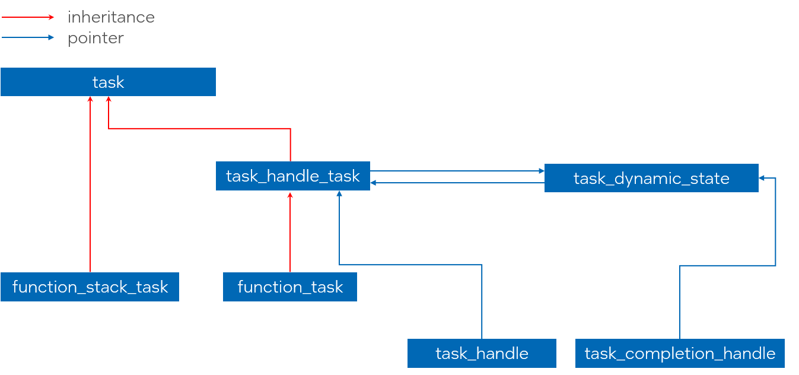
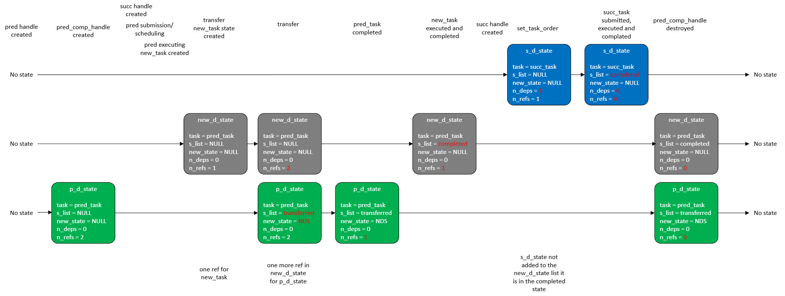

# Implementation details for task group dynamic dependencies feature

*Note:* This document describes implementation details for the [task group dynamic dependencies RFC](extended_semantics.md)

## Introduction

The [task group dynamic dependencies RFC](extended_semantics.md) describes a design for setting predecessor-
successor dependencies between tasks in various states (`make_edge` API) and replacing the currently executing
task with another task in the task graph (`transfer_successors_to` API).

A task in the `created` state is expressed by a `task_handle` object on the user side.
A task in other states (`created`, `submitted`, `executing` or `completed`) is represented by a `task_tracker` object.

Similar to `task_handle`, the `task_tracker` may be in two states - `empty`, meaning it does not
track any tasks, and `non-empty`. The only way to get a `non-empty` `task_tracker` is to construct or
assign it from a non-empty `task_handle`:

```cpp
tbb::task_group tg;
tbb::task_handle th = tg.defer(...); // task is in created state
tbb::task_tracker tt = th;
tg.run(std::move(th));
// th is empty
// tt is non-empty
// the task is in one of the submitted->executing->completed states
```

While creating a predecessor-successor dependency between tasks, any task state is allowed for
a predecessor but only a task in the `created` state is allowed as successor. It is exposed by the following APIs:

```cpp
namespace oneapi {
namespace tbb {
class task_group {
public:
    static void make_edge(task_handle& pred, task_handle& succ);
    static void make_edge(task_tracker& pred, task_handle& succ);
};
}
}
```

The first overload is intended to create a predecessor-successor dependency between two tasks in the `created` state.
The second overload is to create a dependency between a predecessor in any of the states and a successor
in the `created` state.

While executing a task, a new task can be added to the task graph and the successors of the
currently executing task can be transferred to this new task:

```cpp
namespace oneapi {
namespace tbb {
class task_group {
public:
    struct current_task {
        static void transfer_successors_to(tbb::task_handle& rec);
    };
};
}
}
```

Only a task in the `created` state is allowed to be a recipient of successors (only `task_handle` argument
is allowed).

After transferring from the task `prev_task` to `new_task`, the new successors added
using the `task_tracker` for `prev_task` should be added as successors of `new_task`:

```cpp

tbb::task_group tg;
tbb::task_handle prev_task = tg.defer([] {
    tbb::task_handle new_task = tg.defer(...);
    tbb::task_group::current_task::transfer_successors_to(new_task);
    tg.run(std::move(new_task));
});

tbb::task_tracker prev_task_tracker = prev_task;
tg.run(std::move(prev_task));

// assume that prev task is completed at this moment
tbb::task_handle new_successor = tg.defer(...);

// new_successor is added to new_task
tbb::task_group::make_edge(prev_task_tracker, new_successor);
```

## Implementation details

### Class layouts before implementing the proposal

Currently, there are two types of tasks used in the `task_group`: `function_task` and `function_stack_task`.
A `function_task` is created when non-blocking submission functions, such as `task_group::run` are used.
A `function_stack_task` is created only when `task_group::run_and_wait` is used.

The difference between these types of tasks is that `function_task` copies the body
to itself and `function_stack_task` uses a reference to the user-provided body instance since
it cannot be destroyed before the blocking API finishes.

Due to API limitations, only a `function_task` can be owned by a `task_handle`.

`function_task` inherits from `task_handle_task`, which manages the lifetime of the task.
`task_handle_task` and `function_stack_task` inherit from the basic `task` class.

The `task_handle` class is implemented as a `unique_ptr` that owns the `task_handle_task` instance.

The class layout is shown in the picture below:


### `task_dynamic_state` class

The main parts of the APIs described above are implemented as part of the new
`task_dynamic_state` class. It is intended to manage the task status (in progress, completed, transferred),
current list of successors, and linkage with the new task after transferring.
Its layout is described in detail in later sections. 

Each task in the task group that can have predecessors or successors has a `task_dynamic_state` instance associated with it.

Since the `make_edge` API allows completed tasks as predecessors, it is necessary to prolong the lifetime of the `task_dynamic_state`
instance associated with the task even after its completion, until the last `tbb::task_tracker` object associated with the
task is destroyed.

### `task_with_dynamic_state` class

To associate an instance of `task_dynamic_state` with a task, the current implementation introduces a new class `task_with_dynamic_state`
inserted between `task_handle_task` and `task` classes in the class hierarchy. This class contains an atomic pointer to the `task_dynamic_state`
instance associated with the task:



```cpp
namespace oneapi {
namespace tbb {

class task_dynamic_state { /*...*/ };

class task { /*...*/ };

class task_with_dynamic_state : public task {
public:
    task_with_dynamic_state();
    ~task_with_dynamic_state();

    task_dynamic_state* get_dynamic_state();
    void complete_task();
private:
    std::atomic<task_dynamic_state*> m_state;
};

class task_handle_task : public task_with_dynamic_state { /*...*/ };
class function_task : public task_handle_task { /*...*/ };

} // namespace tbb
} // namespace oneapi
```

The main responsibility of the `task_with_dynamic_state` class is to lazily create the `task_dynamic_state` object associated
with the task and provide access to the created object.

To avoid introducing potentially unnecessary overhead, the default constructor of `task_with_dynamic_state`
does not create a `task_dynamic_state` instance.

The instance is created the first time the `get_dynamic_state()` function is called. This function is called in the following cases:
* `task_tracker` object is constructed or assigned from the `task_handle` object owning the task,
* The `make_edge(pred, succ)` function is called to make a predecessor-successor dependency between `pred` and `succ`. Associated
  dynamic states are created for `pred` and `succ` tasks.
* `transfer_successors_to(new_task)` function is called from the running task. The dynamic state is created for `new_task`.

If several concurrent threads perform one of the actions above on the same task instance (e.g. concurrently adding
successors to the same predecessor for which the dynamic state has not yet been created), each thread allocates a new dynamic state object
and attempts to update the atomic object in `task_with_dynamic_state` using a `compare_exchange_strong` operation. If it fails, meaning
another thread has created and updated the dynamic state before the current thread, the state allocated by the current thread is destroyed:

```cpp
class task_with_dynamic_state : public task {
public:
    task_dynamic_state* get_dynamic_state() {
        task_dynamic_state* current_state = m_state;

        if (current_state == nullptr) {
            // The dynamic state was not yet created
            small_object_allocator alloc;
            task_dynamic_state* new_state = alloc.new_object<task_dynamic_state>(alloc);

            if (m_state.compare_exchange_strong(current_state, new_state)) {
                // Current thread updated the state
                // Reserve a task co-ownership for dynamic state
                new_state->reserve();
                current_state = new_state;
            } else {
                // Other thread updated the state
                alloc.delete_object(new_state);
            }
        }

        return current_state;
    }
private:
    std::atomic<task_dynamic_state*> m_state;
};
```

The `new_state->reserve()` in case of successful CAS is needed to prolong the lifetime of `task_dynamic_state` until the task
is in progress. When the task is destroyed, the reference counter in `task_dynamic_state` is decreased.

### `tbb::task_tracker` class implementation

The `tbb::task_tracker` class implements a shared pointer to the `task_dynamic_state` object. Each copy of a `task_tracker` object
associated with a task increases the reference counter stored in the dynamic state to prolong its lifetime until all associated trackers are destroyed.

An empty `tbb::task_tracker` models an empty shared pointer and does not increase or decrease any reference counters.

```cpp
namespace oneapi {
namespace tbb {

class task_tracker {
private:
    task_dynamic_state* m_state;
public:
    task_tracker() : m_state(nullptr) {}

    task_tracker(const task_tracker& other) : m_state(other.m_state) {
        if (m_state) m_state->reserve();
    }
    task_tracker& operator=(const task_tracker& other) { /*same logic*/ }

    task_tracker(task_tracker&& other) : m_state(other.m_state) {
        other.m_state = nullptr;
    }
    task_tracker& operator=(task_tracker&& other) { /*same logic*/ }

    task_tracker(const task_handle& th) : m_state(th ? th.get_dynamic_state() : nullptr) {
        if (m_state) m_state->reserve();
    }
    task_tracker& operator=(const task_handle& th) { /*same logic*/ }

    ~task_tracker() { if (m_state) m_state->release(); }
};

}
}
```

### `task_dynamic_state` in details

As mentioned above, the `task_dynamic_state` class implements tracking of a task's state (completed or not completed),
its list of successors, and the post-transfer actions. It has the following layout:

```cpp
class task_dynamic_state {
private:
    task_with_dynamic_state*           m_task;
    std::atomic<successors_list_node*> m_successors_list_head;
    std::atomic<continuation_vertex*>  m_continuation_vertex;
    std::atomic<task_dynamic_state*>   m_new_dynamic_state;
    std::atomic<std::size_t>           m_num_references;
    small_object_allocator             m_allocator;
};
```

`m_task` is a pointer to the task with which the current dynamic state is associated.

`m_successors_list_head` is an atomic pointer to the head of the successor's list of the associated task. It is also used
as a marker of the task completion. It will be described in detail in the following sections.

`m_continuation_vertex` is an atomic pointer to the  `continuation_vertex` object for the associated task. The purpose of the
`continuation_vertex` is described in the following sections.

`m_new_dynamic_state` is an atomic pointer to the other dynamic state instance. It is used when the associated task calls
`transfer_successors_to(new_task)` while executing. `m_new_dynamic_state` will point to `new_task`s dynamic state after doing the transfer.
It is described in detail in the section about transferring successors.

`m_num_references` and `m_allocator` manage the lifetime of the dynamic state.

The stored reference counter is increased when:
* `task_dynamic_state` associated with the task is created, the reference is reserved for the task object.
* a `task_tracker` instance for the task is created (both non-empty tracker created from `task_handle` and copy of the existing one).
* `transfer_successors_to(new_task)` is called, the dynamic state of the currently executing task reserves a reference on the
  dynamic state of `new_task`. See [lifetime issue](#dynamic-state-lifetime-issue) section for more details.

The stored reference counter is decreased when:
* The associated task is completed, before destroying the task instance
* a `task_tracker` instance associated with the task is destroyed
* `task_dynamic_state` of a task that did `transfer_successors_to(new_task)` while executing is destroyed. In this case, the reference
  counter of dynamic state associated with `new_task` is decreased. See [lifetime issue](#dynamic-state-lifetime-issue) for more details.

Once the reference counter is decreased for the last time (i.e., reaches `0`), the `task_dynamic_state` is destroyed
and then deallocated using `m_allocator`.

### Create dependencies between tasks

#### `continuation_vertex` class

`continuation_vertex` is a class that represents the associated task as a successor of other tasks.
It implements an additional reference counter that is reserved:
* For each predecessor added to the associated task.
* For the associated task itself to ensure the task will not be submitted for execution until it is explicitly
  submitted for execution (e.g. by calling `tg.run(std::move(successor_handle))`).

The reference counter is decreased when:
* A predecessor task completes its execution.
* The submitting function is called with the `task_handle` owning the current task.

Once the reference counter is decremented to `0`, the associated task can be submitted for execution.

The `continuation_vertex` instance is created lazily in a similar way as  described for `task_dynamic_state` and `task_with_dynamic_state`.

`task_dynamic_state` contains an atomic pointer to the `continuation_vertex`. Once the first predecessor is added to the associated task,
the vertex is created. Multiple concurrent threads are synchronized with each other by doing the CAS operation on the atomic to publish the
vertex created by the thread.

The relationship between successors and predecessor is shown in the picture below:


It shows 4 tasks `pred1`, `pred2`, `succ1` and `succ2`, where `pred1` and `pred2` are predecessors for both `succ1` and `succ2`.

Green rectangles represent the successors list of `pred1` and `pred2`. Each node in this list contains a pointer to the `continuation_vertex` of
the successor. 

When the edge between `pred1` and `succ1` is created, the `continuation_vertex` for `succ1` is created with the reference counter value `2` (one
reference for `pred1` and one reference for `task_handle` owning the `succ1`). Once the edge between `pred2` and `succ1` is created, the same
`continuation_vertex` is reused, but the reference counter value is increased to become `3`. 

The same logic applies for `pred1`, `pred2` and `succ2`.

Once the explicit submission function is called for `task_handle`s owning `succ1` and `succ2`, the corresponding reference counters in
the `continuation_vertex` instances are decreased (each having the value `2` corresponding to predecessors only).

Let's assume that `pred1` executes and completes before `pred2`.

When the task `pred1` completes execution, it traverses its successors list and decreases the reference counter stored in the vertex
of `succ1` and `succ2`.

When `pred2` traverses its successors list, it decreases the reference counters in `succ1` and `succ2`. Both of them are equal to `0` now and hence
`succ1` and `succ2` can be submitted for execution. One of them can be bypassed from `pred2` and one of them spawned. This is further described 
in a separate section below.

Once the reference counter in `continuation_vertex` is decremented to be `0`, the `continuation_vertex` object is destroyed.

Having a `continuation_vertex` assigned to the task (`m_continuation_vertex` not equal to `nullptr` in `task_dynamic_state`) also serves as
a marker that the associated task has dependencies and cannot be unconditionally submitted for execution once the `task_handle` owning this task
is received in one of the submit functions (e.g. `task_group::run`).

#### The successors list

The successors of the task are organized in a forward list stored in the `task_dynamic_state`. Each element in the list is an object of
`successors_list_node` class, representing a simple forward list node that contains a pointer to the `continuation_vertex` of the successor:

```cpp
class successors_list_node {
private:
    successors_list_node*  m_new_successor;
    continuation_vertex*   m_continuation_vertex;
    small_object_allocator m_allocator;
};
```

`task_dynamic_state` contains an atomic pointer to the `successors_list_node` representing a head of the forward list. New elements are inserted
into the head of the list.

The successors list in `task_dynamic_state` can have two possible states:
* "Alive" state (value of `m_successors_list_head` not equal to `~std::uintptr_t(0)`, including `nullptr`): indicates that the associated task
  is not completed and its successors were not transferred. Having an "alive" successors list means new successors can be added into the current
  `task_dynamic_state`.
* "Dead" state (value of `m_successors_list_head` equal to `~std::uintptr_t(0)`): indicates two possible scenarios:
    * The associated task is completed. Adding new successors to the associated task does not make any sense.
    * The associated task has transferred its successors to the other task. In this case adding the new successor to the current dynamic state
      should be redirected to the dynamic state of the task, receiving the successors. In this case also `m_new_dynamic_state` should point to
      the receiving state.

#### Adding successors to the list

This section describes the algorithm for adding a new successor to the successors list. The `make_edge` API allows both adding multiple successors
concurrently to the same predecessor and adding multiple predecessors concurrently to the same successor.

As mentioned above, the `make_edge` API first obtains the dynamic states associated with the predecessor and successor by calling the
`get_dynamic_state()` function. If the dynamic states have not yet been created, they are created. The function `internal_make_edge(pred_state, succ_state)`
receives two dynamic states - the state of predecessor and the state of successor.

The next stage in adding a successor is obtaining the `continuation_vertex` associated with `succ_state`. As it was described above, if the vertex
was not yet initialized, it is initialized on this stage. `internal_make_edge` then calls the `pred_state->add_successor(cont_vertex)` function
where `cont_vertex` is a `continuation_vertex` of the successor.

As a first step, the function `add_successor` checks the state of the successors list. If the list is not alive, there are two possible scenarios -
the task is either completed or has transferred successors to the other task.

If the `m_new_dynamic_state` atomic variable is set, than transferring has occurred and the function redirects the new successor
to the `m_new_dynamic_state` by calling `new_state->add_successor(cont_vertex)`.

If `m_new_dynamic_state` is not set, the task is completed and postponing the successor task does not make any sense.

If the successors list is alive, the `add_successor` function reserves a reference in `cont_vertex` for the predecessor, allocates the
`successors_list_node` pointing to it and calls `add_successor_node` function that operates with the node instead of the continuation vertex itself.

`add_successor_node` re-reads the state of the successors list and if it is not alive (meaning the task have completed or transferred successors during
allocation of the forward-list node), the function checks `m_new_dynamic_state` in a similar way as described above. 

If the new state is assigned, `add_successor_node` redirects the successor to the new state by calling `new_state->add_successor_node(node)`.

Otherwise, the task is completed and the successor should not be added into the list. The function releases the reference that was previously reserved
in the `cont_vertex` and removes the previously allocated node.

If the list is alive, the function tries to insert the successor node into the head of the list by doing a CAS operation on `m_successors_list_head`.

Every CAS failure (meaning the `m_successors_list_head` value is updated) may mean that:
* Other thread adds an other predecessor and updated the head of the list.
* Other thread completes the task.
* Successors of the associated task were transferred by the other thread.

In the first case, we just need to try doing CAS again since the successor still needs to be added.
In two last cases, the same checks as described above should be performed.

The flow of `make_edge` is shown in the code snippet below:

```cpp

class successors_list_node { /*...*/ };

class task_dynamic_state {
public:
    static bool is_alive(successors_list_node* list) { return list != ~std::uintptr_t(0); }

    void add_successor_node(successors_list_node* node) {
        successors_list_node* current_head = m_successors_list_head.load();

        if (!is_alive(current_head)) {
            // The task was completed or transferring happened while allocating the node
            task_dynamic_state new_state = m_new_dynamic_state.load();
            if (new_state) {
                // transferring happened - redirect the request to the receiving node
                new_state->add_successor_node(node);
            } else {
                // The task was completed
                node->get_continuation_vertex()->release(); // release a reference
                node->finalize(); // destroy and deallocate the node
            }
        } else {
            // The task is not completed - trying to update the head of the list
            node->set_next(current_head);

            while (!m_successors_list_head.compare_exchange_strong(current_head, node)) {
                // Performing same checks as above
                if (!is_alive(current_head)) {
                    task_dynamic_state new_stat = m_new_dynamic_state.load();
                    if (new_state) {
                        new_state->add_successor_node(node);
                    } else {
                        node->get_continuation_vertex()->release();
                        node->finalize();
                    }
                    return;
                }

                // Other thread updated the list before us
                node->set_next(current_head); // rewrite next pointer and retry
            }
        }

    }

    void add_successor(continuation_vertex* successor) {
        successors_list_node* current_head = m_successors_list_head.load();

        if (is_alive(current_head)) {
            // We need to try adding successor
            successor->reserve(); // reserve a reference

            // allocate the node
            small_object_allocator alloc;
            successors_list_node* new_node = alloc.new_object<successors_list_node>(successor, alloc);
            add_successor_node(new_node);
        } else {
            // The task was completed or transferring happened
            task_dynamic_state new_state = m_new_dynamic_state.load();
            if (new_state) {
                new_state->add_successor(successor);
            }
        }
    }
private:
    std::atomic<successors_list_node*> m_successors_list_head;
    std::atomic<task_dynamic_state*> m_new_dynamic_state;
};

void internal_make_edge(task_dynamic_state* pred_state, task_dynamic_state* succ_state) {
    pred_state->add_successor(succ_state->get_continuation_vertex());
}

void make_edge(tbb::task_handle& pred, tbb::task_handle& succ) {
    internal_make_edge(pred->get_dynamic_state(), succ->get_dynamic_state());
}

void make_edge(tbb::task_tracker& pred, tbb::task_handle& succ) {
    internal_make_edge(pred->get_dynamic_state(), succ->get_dynamic_state());
}
```

#### Notifying the successors

Once the predecessor's task body is completed, it should notify all the successors.

Before this feature, the `function_task` of the `task_group` ran the body and bypassed the returned task, if any:

```cpp
template <typename F>
class function_task : public task_handle_task {
public:
    tbb::task* execute(d1::execution_data& ed) override {
        task* returned_task = m_func();
        finalize(ed);
        return next_task;
    }
private:
    const F m_func;
};
```

The implementation of this feature adds a notification step between executing the body and finalization:

```cpp
tbb::task* execute(d1::execution_data& ed) override {
    task* returned_task = m_func();
    task_with_dynamic_state* successor_task = this->complete_task();

    return /*returned_task or successor_task*/;
}
```

The `complete_task` function is implemented as part of the `task_with_dynamic_state` class. It calls the `task_dynamic_state::complete_task()` if
the dynamic state is initialized.

The `task_dynamic_state::complete_task()` function atomically fetches the successors list and changes the stored value to `~uintptr_t(0)`, which
signals to other calls to `add_successor` that the successors list is not alive and the task is completed.

The next stage is to notify all of the successors in the list about the completion of the task. It is done by calling the `release_successors_list(list)`
function.

The `complete_task` implementation is shown in the code below:

```cpp
class task_dynamic_state {
public:
    task_with_dynamic_state* complete_task() {
        task_with_dynamic_state* next_task = nullptr;

        if (is_alive(m_successors_list_head.load())) {
            successors_list_node* list = m_successors_list_head.exchange(~std::uintptr_t(0));
            release_successors_list(list);
        }
    }
private:
    std::atomic<successors_list_node*> m_successors_list_head;
    std::atomic<task_dynamic_state*>   m_new_dynamic_state;
};
```

The `release_successors_list` function traverses the list of successors, decrements a reference counter in each stored `continuation_vertex` and
destroys the node. 

If the reference counter in the `continuation_vertex` is equal to `0` after doing the decrement, it returns an associated task to allow the
predecessor task to bypass the successor task by returning it from `execute`. 

If more than one successor is ready to be submitted for execution while releasing the successors list, the task returned from the first
successor ready for execution would be bypassed. Other tasks would be spawned:

```cpp
task_with_dynamic_state* release_successors_list(successors_list_node* node) {
    task_with_dynamic_state* next_task = nullptr;

    while (node != nullptr) {
        successors_list_node* next_node = node->get_next();

        // Decrement continuation vertex ref counter, if 0, returns the successor task
        task_with_dynamic_state* successor_task = node->get_continuation_vertex()->release_bypass();

        // Remove the node from the list
        node->finalize();
        node = next_node;

        if (successor_task) {
            if (next_task == nullptr) next_task = successor_task; // First task will be bypassed
            else {
                // All other tasks are spawned
                spawn(*successor_task);
            }
        }
    }
    return next_task;
}
```

`function_task::execute` will receive the last added successor and combine it with the task returned from the body.

If the body did not return a task, or a returned task have dependencies, the successor task is bypassed. Otherwise, the task returned by the
body is bypassed.

#### Submitting a task for execution

The implementation of submit functions that accept a `task_handle` is also being updated to support task with dependencies. The following functions are
modified:

* `task_group::run(tbb::task_handle&& t)`
* `task_group::run_and_wait(tbb::task_handle&& t)`
* `task_arena::enqueue(tbb::task_handle&& t)`
* `this_task_arena::enqueue(tbb::task_handle&& t)`

The previous implementation of these functions unconditionally spawned the task owned by `task_handle`:

```cpp
class task_group {
public:
    void run(tbb::task_handle&& t) {
        // release returns task*
        spawn(*t.release());
    }
};
```

The dynamic dependencies feature allows a `tbb::task_handle` to own a task that cannot be spawned due to dependencies. It needs to check whether the owned task
has any dependencies (i.e., whether `m_continuation_vertex` for the current task is initialized) and then decrement the reference counter in the vertex.

If the reference counter is now equal to `0`, the owned task can be spawned. Otherwise, it will be spawned by that last predecessor releasing its list
of successors.

### Transferring successors to the other task

The API `tbb::task_group::current_task::transfer_successors_to(tbb::task_handle& new_task)` is implemented by setting the `m_new_dynamic_state` in
the dynamic state of the currently executing task to the address of the dynamic state of `new_task`.

To determine the dynamic state associated with the currently executing task, a pointer to the task must be obtained from the task scheduler.
To achieve this, the new entry point `tbb::task* r1::current_task()` is added. 

The implementation of `transfer_successors_to` is shown in the code snippet below:

```cpp
class task_group {
    struct current_task {
        static void transfer_successors_to(tbb::task_handle& new_task) {
            tbb::task* curr_task = r1::current_task();
            __TBB_ASSERT(curr_task != nullptr); // transfer called outside of the task
            task_with_dynamic_state* curr_task_with_state = dynamic_cast<task_with_dynamic_state*>(curr_task);
                // no assert(curr_task_with_state != nullptr) to allow no-op transfer_successors_to from function_stack_task
            if (curr_task_with_state != nullptr) {
                curr_task_with_state->transfer_successors_to(new_task->get_dynamic_state());
            }
        }
    };
};
```

`task_with_dynamic_state->transfer_successors_to` calls `task_dynamic_state->transfer_successors_to(new_task_state)` if the dynamic state of the
current task was initialized. If the state is not initialized, there cannot be any successors associated with the current task.

`task_dynamic_state->transfer_successors_to(task_dynamic_state* new_task_state)` sets the `m_new_dynamic_state` pointer to `new_task_state`,
fetches the successors list, and adds it to `new_task_state`:

```cpp
class task_dynamic_state {
    void transfer_successors_to(task_dynamic_state* new_task_state) {
        __TBB_ASSERT(m_new_dynamic_state != nullptr);

        // register current dynamic state as a co-owner of the new state
        // to prolong it's lifetime if the recipient task completes
        // see dynamic state lifetime issue section for more details
        new_task_state->reserve();

        m_new_task_state.store(new_dynamic_state);
        successors_list_node* list = m_successors_list_head.exchange(~std::uintptr_t(0));
        new_dynamic_state->add_successors_list(list);
    }
private:
    std::atomic<successors_list_node*> m_successors_list_head;
    std::atomic<task_dynamic_state*>   m_new_task_state;
};
```

`add_successors_list` is implemented in a similar way as `add_successor` described above, but without extra checks since the recipient task state
can only be `created` and cannot change.

```cpp
void task_dynamic_state::add_successors_list(successors_list_node* list) {
    if (list != nullptr) {
        // Finding the last node in the list
        successors_list_node* last_node = list;

        while (last_node->get_next() != nullptr) last_node = last_node->get_next();

        successors_list_node* current_list_head = m_successors_list_head.load();
        last_node->set_next(current_list_head);

        while (!m_successors_list_head.compare_exchange_strong(current_list_head, list)) {
            // Other thread updated the list
            last_node->set_next(current_list_head);
        }
    }
}
```

#### Dynamic state lifetime issue

During the implementation of the `transfer_successors_to`, an issue was found with the lifetime of `task_dynamic_state`.

Initially, the reference counter in `task_dynamic_state` was incremented only when the task or the `task_tracker` was created.

Consider the following example: we have a task `A` and a `task_tracker` named `A_tracker`, initially assigned to track `A`. 
The dynamic state `A_state` is associated with `A`. 

While the task `A` is executing, it is transferring its successors to task `B` (red arrow on the picture below).
`B_state` dynamic state is associated with `B`.

As described above, the `A_state::m_new_dynamic_state` pointer is set to `B_state` (green arrow on the picture).


After executing the task `A`, the task `B` is executed and destroyed, the `B_state` is destroyed. 

If after that, the new successor would be added to `A_tracker`, the request will be redirected to `B_state`.

However, since `B_state` was destroyed after finalizing task `B`, accessing it would result in use of deallocated memory.

The solution is to prolong the lifetime of `B_state` by increasing the reference counter for each state having `B_state` as `m_new_dynamic_state`.
The reference counter is decreased when the `A_state` is destroyed.

### Dynamic state transition examples

Consider several examples of how the associated dynamic state changes during different states of a task.

#### Creating the edges

The first example illustrates the following code:

```cpp
tbb::task_handle pred = tg.defer(...);
tbb::task_handle succ = tg.defer(...);

tbb::task_tracker pred_tr = pred;

tbb::task_group::make_edge(pred, succ);

tg.run(std::move(pred));
tg.run_and_wait(std::move(succ));
```


Changes in the states at each step are highlighted in red.

As stated above, `task_handle` constructors do not create a `task_dynamic_state`.

The state object for the predecessor task is created while constructing the `task_tracker` and the one for
the successor task is created while calling `make_edge`.

While creating the edge, the `continuation_vertex` associated with `successor` (`CV` on the diagram) is created and stored in
`m_continuation_vertex` in the successor's dynamic state and in the predecessor's list of successors.

A reference is reserved in `CV` for the `pred` task and also for `succ_handle` to prevent `succ` from executing if another thread
completes `pred` before the `succ` is submitted for execution.

Submission, scheduling and executing the `pred` does not affect dynamic states.

Submission of `succ` releases the reference counter stored in `CV`.

Once the `pred` task is completed, it fetches it's list of successors and exchanges `m_successors_list_head` to the `dead` state.
Also, it decrements the reference counter in each node stored in the successors list (`CV` only in our example).

Since `pred` decrements the last reference counter in `CV`, the successor task is ready to be executed and is bypassed from `pred_task`.

In the diagram we assume that `succ` is submitted before `pred` completes. It is also possible that other thread completes `pred` and
releases the reference counter in `CV` before `succ` is submitted for execution. 

In this case, `succ` is not bypassed from `pred` and is only spawned while submitting `succ` handle for execution.

Once the `succ_task` is completed, it fetches the successors list (empty) and decrements the reference counter in the `succ_task` dynamic state.

Since it is the last reference counter, the dynamic state is destroyed.

`pred_task` dynamic state is destroyed when the `pred_tr` destructor releases the last reference counter.

#### Transferring and creating edges

This example describes both transferring and creating edges in the same application:

```cpp
auto pred_body = [] {
    tbb::task_handle new_task = tg.defer(...);
    tbb::task_group::current_task::transfer_successors_to(new_task);
    tg.run(std::move(new_task));
};

tbb::task_handle pred = tg.defer(pred_body);
tbb::task_tracker pred_tr = pred;
tbb::task_handle succ = tg.defer(...);

tg.run(std::move(pred));
tbb::task_group::make_edge(pred_tr, succ);
tg.run_and_wait(std::move(succ));
```

#### Linearization 1

As the first linearization option, let's consider a case where the predecessor task is scheduled, executed and completed before the edge between the predecessor
and successor tasks is created:



Similar to the example above, pred `task_handle` constructor does not create the corresponding `task_dynamic_state`; it is only created
when the `pred_tr` object is instantiated. 2 references are reserved - one for `pred_task` and one for `pred_tr`.

Creation of the `succ` `task_handle` does not create `task_dynamic_state` as well. 

Submission, scheduling and executing the `pred_task` does not change any `task_dynamic_state` objects in the application.

When `pred_task` is executed, the `new_task` `task_handle` is created and similarly to the cases above, it does not create new dynamic state object.

The dynamic state for `new_task` is created only while calling to `transfer_successors_to`. As a first step, only one reference is reserved - a reference
for the task `new_task`. 

As the next step in transferring, the `m_new_dynamic_state` in the predecessor's dynamic state is set to `new_d_state`. Then, the successors list
is marked `dead`. 

To resolve the [lifetime issue](#dynamic-state-lifetime-issue), one more reference is reserved in `new_d_state` to prolong its lifetime until `p_d_state`
is alive.

When the `pred_task` completes, it releases the reference counter in `p_d_state` since the task object itself is destroyed.

When the `new_task` is completed, the reference counter in `new_d_state` is released and the successor list's state is changed to be `dead`.

Similarly to the example above, call to `make_edge` creates a dynamic state for a successor and a corresponding continuation vertex.

Since the successors list in `p_d_state` is in the `dead` state and `m_new_dynamic_state` is set to `new_d_state`, the addition of the successor to
`p_d_state` is redirected to `new_d_state`. Its successors list is also in `dead` state, hence no changes in the successors list and in dynamic
states are made.

Since no dependencies were added, `succ_task` is scheduled. After completing the task, `s_d_state`'s successors list is set to `dead` state and
a reference counter is released. Since it is the last reference counter, `s_d_state` is destroyed.

When the `pred_tr` is destroyed, the last reference is released in both `p_d_state` and `new_d_state` and the corresponding objects are destroyed.

#### Linearization 2

As a second option, consider creating the edge before executing the predecessor task and before performing the transfer:


State transitions when the `pred` handle and tracker are created are identical to the previous case.

When `make_edge` is executed, the continuation vertex of `s_d_state` is added to the successors list of `p_d_state`.

During the transfer, this continuation vertex is moved from `p_d_state` to `new_d_state`. Other changes are identical.

When the `new_task` is completed, it fetches the successor list containing the `SCV` and releases the reference counter in the vertex.

Since the `succ` handle has not yet been submitted, the successor task is not scheduled at this point. It is only scheduled when `run_and_wait(std::move(succ))`
releases the last reference in `SCV`.
