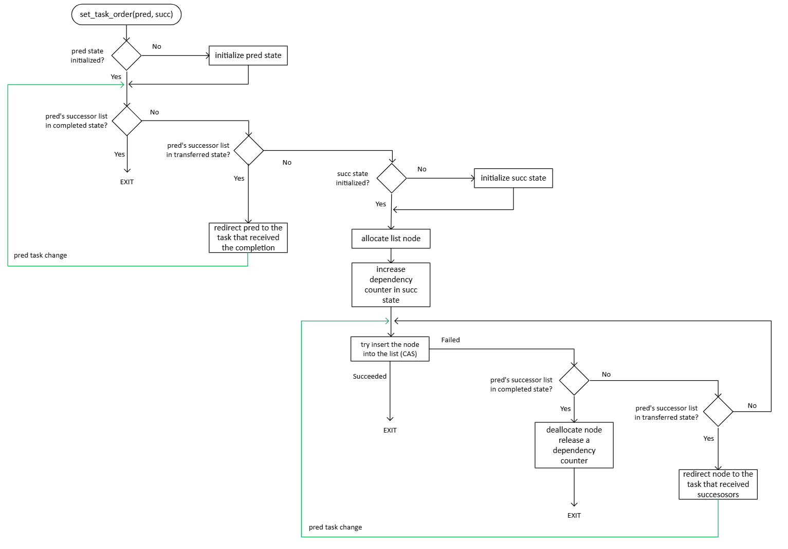
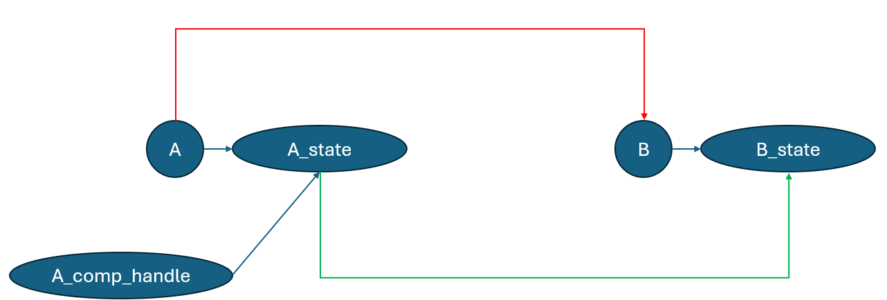
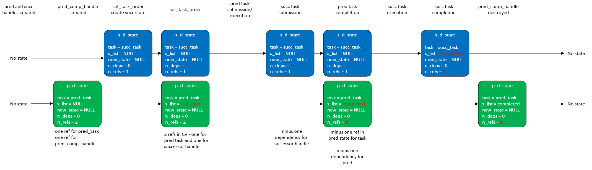
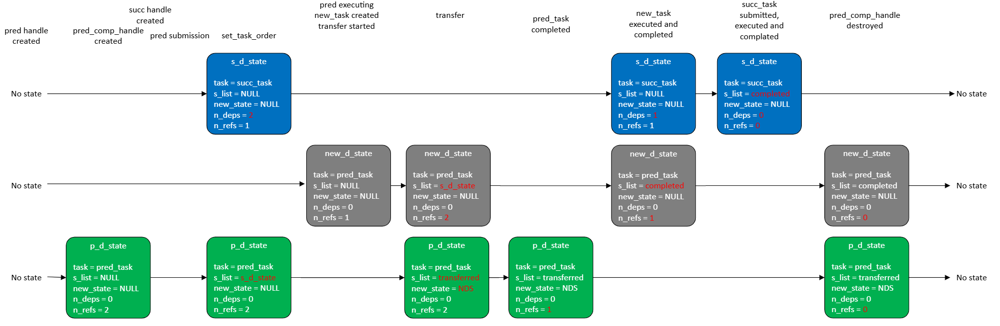

# Implementation Details for the Task Group Dynamic Dependencies Feature

*Note:* This document describes implementation details for the [Task Group Dynamic Dependencies RFC](extended_semantics.md)

## Table of contents

* 1 [Class hierarchy before implementing the proposal](#class-hierarchy-before-implementing-the-proposal)
* 2 [`task_dynamic_state` class](#task_dynamic_state-class)
* 3 [Changes in `task_handle_task` class layout](#changes-in-task_handle_task-layout)
* 4 [``tbb::task_completion_handle`` class implementation](#tbbtask_completion_handle-class-implementation)
* 5 [`task_dynamic_state` in details](#task_dynamic_state-in-details)
* 6 [Create dependencies between tasks](#create-dependencies-between-tasks)
  * 6.1 [`continuation_vertex` class](#continuation_vertex-class)
  * 6.2 [The successor list](#the-successor-list)
  * 6.3 [Adding successors to the list](#adding-successors-to-the-list)
  * 6.4 [Notifying the successors](#notifying-the-successors)
  * 6.5 [Submitting a task for execution](#submitting-a-task-for-execution)
* 7 [Transferring completion to the other task](#transferring-completion-to-the-other-task)
  * 7.1 [Dynamic state lifetime issue](#dynamic-state-lifetime-issue)
* 8 [Library ABI changes](#library-abi-changes)
* 9 [Dynamic state transition examples](#dynamic-state-transition-examples)
  * 9.1 [Ordering the tasks](#ordering-the-tasks)
  * 9.2 [Transferring and ordering](#transferring-and-ordering)
    * 9.2.1 [Linearization 1](#linearization-1)
    * 9.2.2 [Linearization 2](#linearization-2)

## Class hierarchy before implementing the proposal

Currently, there are two types of tasks used in the `task_group`: `function_task` and `function_stack_task`.
A `function_task` is created when non-blocking submission functions (such as `task_group::run`) or `task_group::defer` are used.
A `function_stack_task` is created only when `task_group::run_and_wait` is used.

The difference between these task types is that `function_task` copies the body.
In contrast, `function_stack_task` holds a reference to the user-provided body instance, as
it cannot be destroyed before the blocking API finishes.

Due to API limitations, only a `function_task` can be owned by a `task_handle`.

`function_task` inherits from `task_handle_task`, which manages the lifetime of the task.
`task_handle_task` and `function_stack_task` inherit from the basic `task` class.

The `task_handle` class is implemented as a `unique_ptr` that owns the `task_handle_task` instance.

The class layout is shown in the picture below:


## `task_dynamic_state` class

The main parts of the APIs described in the [parent RFC](extended_semantics.md) are implemented as part of the new
`task_dynamic_state` class. It is responsible for managing the task status (in progress, completed, transferred) and
the current list of successors. It also handles the linkage to a new task after a transfer.
Its layout is described in detail in later sections.

Each task in the task group that has predecessors or successors has an associated `task_dynamic_state` instance.

Since the `set_task_order` API allows completed tasks to act as predecessors, the lifetime of the associated `task_dynamic_state`
instance must be extended beyond task completion - until the last `tbb::task_completion_handle` referencing the task is destroyed.

## Changes in `task_handle_task` class layout

To associate a `task_dynamic_state` instance with a task, the current implementation adds a new atomic pointer field
to the `task_handle_task` class. 

To avoid unnecessary overhead for applications that do not use the dynamic dependencies feature,
the initial value of the pointer is `nullptr`, meaning no dynamic state is associated with the task.

The new class hierarchy is shown in the diagram below:


The new `get_dynamic_state()` function is responsible for the lazy initialization of the associated state when it is called for the first time.
This function is called in the following cases:
* A `task_completion_handle` object is constructed or assigned from a `task_handle` that owns the task,
* When `set_task_order(pred, succ)` is called to establish a predecessor-successor dependency, dynamic states
  are created for its `task_handle` arguments.
* When `transfer_this_task_completion_to(new_task)` is called from the running task, a dynamic state is created for `new_task`.

If the associated dynamic state was already initialized, `get_dynamic_state` returns it.

If multiple threads concurrently perform the actions above on the same task instance (e.g. concurrently adding
successors to the same predecessor before its dynamic state is created), each thread allocates a new dynamic state object.
It then uses an atomic CAS to update the pointer in `task_handle_task` with the address of that object. If the CAS operation fails, meaning
another thread has already stored the dynamic state, the state allocated by the current thread is destroyed.

The `task_dynamic_state` object is constructed with the reference counter set to 1 to prolong its lifetime
while the task is in progress. When the task is destroyed, the reference counter is decremented.

## `tbb::task_completion_handle` class implementation

The `tbb::task_completion_handle` class represents a task for the purpose of creating task dependencies. It can be constructed or assigned from a
`task_handle`. It is copyable and movable, with copies referring to the same `task_dynamic_state` object.

The dynamic state of a task remains valid until both the task and all associated `task_completion_handle` objects are destroyed.

A default-constructed `tbb::task_completion_handle` does not represent any task.

From the implementation perspective, `task_completion_handle` behaves like a shared pointer to `task_dynamic_state` with each copy incrementing the
reference counter of dynamic state.

It is not currently implemented as a wrapper of `std::shared_ptr<task_dynamic_state>`, because `task_handle_task` and `task_dynamic_state` contain
an atomic pointer to `task_dynamic_state` and `std::atomic<std::shared_ptr>` is a C++20 extension.

## `task_dynamic_state` in details

As mentioned above, the `task_dynamic_state` class tracks a task's state (completed or not),
its list of successors, and transfers. It has the following layout:

```cpp
class task_dynamic_state {
private:
    task_handle_task*                  m_task;
    std::atomic<successor_list_node*>  m_successor_list_head;
    std::atomic<continuation_vertex*>  m_continuation_vertex;
    std::atomic<task_dynamic_state*>   m_new_dynamic_state;
    std::atomic<std::size_t>           m_num_references;
    small_object_allocator             m_allocator;
};
```

`m_task` is a pointer to the task with which the current dynamic state is associated.

`m_successor_list_head` points to the head of the associated successor list. It also serves as a marker for task completion and
will be described in more detail in later sections.

`m_continuation_vertex` is a pointer to the  `continuation_vertex` object representing the task as a successor of other tasks.
The `continuation_vertex` class is described in the following sections.

`m_new_dynamic_state` points to another dynamic state instance. It is used when the associated task calls
`transfer_this_task_completion_to(new_task)` during execution. After the transfer, it points to the dynamic state of `new_task`.
It is described in more detail in the section about transferring the completion.

`m_num_references` and `m_allocator` manage the lifetime of the dynamic state.

The stored reference counter is increased:
* When the `task_dynamic_state` associated with a task is created, a reference is reserved for the task object.
* When a `task_completion_handle` instance is created (either from a non-empty `task_handle` or by copying an existing completion handle).
* When `transfer_this_task_completion_to(new_task)` is called, the dynamic state of the currently executing task reserves a reference to the
  dynamic state of `new_task`. See the [lifetime issue](#dynamic-state-lifetime-issue) section for more details.

The stored reference counter is decreased:
* When the associated task is completed, before the task instance is destroyed.
* When a `task_completion_handle` instance associated with the task is destroyed.
* When the `task_dynamic_state` of a task that called `transfer_this_task_completion_to(new_task)` is destroyed. In this case, the reference
  counter of the dynamic state associated with `new_task` is decreased. See the [lifetime issue](#dynamic-state-lifetime-issue) section for more details.

Once the reference counter reaches zero, the `task_dynamic_state` is destroyed and deallocated using `m_allocator`.

## Create dependencies between tasks

### `continuation_vertex` class

`continuation_vertex` is a class that represents the associated task as a successor of other tasks.
It maintains an additional reference counter, which is incremented:
* For each predecessor added to the associated task.
* For the `task_handle` that owns the associated task, to ensure it is not scheduled until explicitly
  submitted (e.g., by calling `tg.run(std::move(successor_handle))`).

The reference counter is decreased:
* When a predecessor task completes its execution.
* When the submission function is called with the `task_handle` owning the current task.

Once the reference counter reaches zero, the associated task can be scheduled.

The `continuation_vertex` instance is created lazily, similar to `task_dynamic_state`.

`task_dynamic_state` contains an atomic pointer to the `continuation_vertex`. Once the first predecessor is added to the associated task,
the vertex is created. Multiple concurrent threads synchronize using a CAS operation on the atomic pointer to publish the
vertex created by one of them.

The relationship between successors and predecessor is shown in the diagram below:


It shows 4 tasks, `pred1`, `pred2`, `succ1` and `succ2`, where `pred1` and `pred2` are predecessors of both `succ1` and `succ2`.

Green rectangles represent the successor list of `pred1` and `pred2`. Each node in this list contains a pointer to the `continuation_vertex` of
the successor. 

When the dependency between `pred1` and `succ1` is created, the `continuation_vertex` for `succ1` is initialized with a reference count of `2` - one
for `pred1` and one for the `task_handle` that owns `succ1`. When the dependency between `pred2` and `succ1` is created, the same
`continuation_vertex` is reused, and the reference count is incremented to `3`.

The same logic applies for `pred1`, `pred2`, and `succ2`.

Once the explicit submission function is called for the `task_handle`s owning `succ1` and `succ2`, the corresponding reference counters in
their `continuation_vertex` instances are decremented (each having a value of `2` corresponding to the predecessors only).

Assume that `pred1` executes and completes before `pred2`.

When `pred1` completes execution, it traverses its successor list and decrements the reference counters in the `continuation_vertex` instances
of `succ1` and `succ2`.

When `pred2` traverses its successor list, it decrements the reference counters in `succ1` and `succ2`. Once both reach zero,
`succ1` and `succ2` can be scheduled. One of them may be bypassed from `pred2`, while the other is spawned. This behavior is described 
in more detail in a later section.

Once the reference counter in `continuation_vertex` reaches zero, the `continuation_vertex` object is destroyed.

Once a `continuation_vertex` is assigned to `task_dynamic_state::m_continuation_vertex`, it also serves as a marker that the task
has dependencies and cannot be immediately scheduled when the `task_handle` is submitted via e.g. `task_group::run`.

### The successor list

The successors of the task are organized in a forward list stored in the `task_dynamic_state`. Each element in the list is a
`successor_list_node` object, representing a simple forward list node that contains a pointer to the successor's `continuation_vertex`:

```cpp
class successor_list_node {
private:
    successor_list_node*   m_next_successor;
    continuation_vertex*   m_continuation_vertex;
    small_object_allocator m_allocator;
};
```

`task_dynamic_state` contains an atomic pointer to the `successor_list_node` that represents the head of the forward list. New elements are inserted
at the head.

The successor list in `task_dynamic_state` can be in one of the three possible states:
* `alive` state (when `m_successor_list_head` is not equal to the values below; `nullptr` is `alive`): indicates that the associated task
  is not completed and its completion has not been transferred. In this case, new successors can be added to the list.
* `completed` state (`m_successor_list_head` equals `~std::uintptr_t(0)`): indicates that the associated task is completed.
  Adding new successors does not add any real dependencies. Successors can proceed for execution if their other dependencies are satisfied.
* `transferred` state (`m_successor_list_head` equals `~std::uintptr_t(0) - 1`): indicates that the completion of the associated task was transferred
  to another task. In this case, any new successor should be redirected to the dynamic state of the task that has received the successors during the transfer.
  `m_new_dynamic_state` should point to that receiving state.

### Adding successors to the list

The `set_task_order` API supports both concurrent addition of multiple successors to the same predecessor and multiple predecessors to the same successor.

The `set_task_order` API first retrieves the dynamic states of the predecessor and successor by calling `get_dynamic_state()`.
If the dynamic states do not yet exist, they are created.

The next step is to obtain the `continuation_vertex` associated with the successor's dynamic state. As described earlier, if it
has not yet been initialized, it is initialized at this point.

While registering the successor in the predecessor's dynamic state, the state of the successor list is checked. If the successor list is in the `transferred` state,
the new successor is redirected to the `m_new_dynamic_state` that received the completion during the transfer.

If the list is in the `completed` state, adding a real is not meaningful.

If the successor list is alive, a reference for the predecessor is reserved in the successors `continuation_vertex`. Then, a `successor_list_node` pointing to the created
state is allocated.

After this, the state of the successor list is re-checked.

If the completion was transferred, the previously allocated successor is redirected to the `m_new_dynamic_state`.

If the task is completed, the successor should not be added to the list. The previously reserved reference in the successor's `continuation_vertex` is released and
the `successor_list_node` is deallocated.

If the list is `alive`, the algorithm attempts to insert the successor node at the head of the list using a CAS operation on `m_successor_list_head`.

Each CAS failure (i.e., `m_successor_list_head` was updated) may indicate that:
* Another thread added a different predecessor and updated the list head.
* Another thread completed the task.
* Another thread transferred the task's completion.

In the first case, the CAS operation should simply be retried, as the successor still needs to be added.
In the latter two cases, the same checks described above should be repeated.

The sequence diagram of `set_task_order` is shown in the picture below:



### Notifying the successors

Once the body of the predecessor task is completed, it must notify all its successors.

Prior to this feature, the `function_task` in the `task_group` executed the task body and bypassed the returned task, if any.
With this feature, a notification step is added between executing the body and finalization:

```cpp
tbb::task* execute(d1::execution_data& ed) override {
    task* returned_task = m_func();
    task_handle_task* successor_task = this->complete_task();

    return /*either returned_task or successor_task*/;
}
```

The `complete_task` function is implemented in the `task_handle_task` class. If the dynamic state is initialized, it calls 
`task_dynamic_state::complete_task()`.

The `task_dynamic_state::complete_task()` function atomically retrieves the successor list and sets its value to `~uintptr_t(0)`,
signaling to other calls to `set_task_order` that the list is no longer alive and the task has completed.

The next step is to notify all successors in the list of the task's completion. This is done by traversing the list and decrementing the reference counter
in each stored `continuation_vertex` and destroying the node.

If the reference counter in a `continuation_vertex` reaches zero, the associated task is returned, allowing the
predecessor to bypass it by returning it from `execute`. 

If multiple successors are ready to be scheduled, the first ready task is bypassed, and the others are spawned:

`function_task::execute` receives the last-added successor task and combines it with the task returned from the body.

If the body does not return a task, or if the returned task has dependencies, the successor task is bypassed. Otherwise, the task returned by the
body is bypassed.

### Submitting a task for execution

The implementation of submission functions that accept a `task_handle` has also been updated to support tasks with dependencies. The following functions are
modified:

* `task_group::run(tbb::task_handle&& t)`
* `task_group::run_and_wait(tbb::task_handle&& t)`
* `task_arena::enqueue(tbb::task_handle&& t)`
* `this_task_arena::enqueue(tbb::task_handle&& t)`

Previously, these functions unconditionally spawned the task owned by `task_handle`.

The dynamic dependencies feature allows a `tbb::task_handle` to own a task that cannot be spawned due to dependencies. It must check whether the owned task
has any dependencies (i.e., whether `m_continuation_vertex` is initialized) and, if so, decrement the reference counter in the vertex.

If the dynamic state is not initialized for the task, it cannot have any dependencies and is spawned immediately.

If the reference counter reaches zero, the task is ready to be spawned. Otherwise, the task will be spawned by that last predecessor that releases its list
of successors.

## Transferring completion to the other task

The API `tbb::task_group::transfer_this_task_completion_to(tbb::task_handle& new_task)` works by setting `m_new_dynamic_state` in
the dynamic state of the currently executing task to point to the dynamic state of `new_task`.

To determine the dynamic state associated with the currently executing task, a pointer to the task must be obtained from the task scheduler.
To achieve this, the new entry point `tbb::task* r1::get_current_task()` is added. 

`transfer_this_task_completion_to` transfers the successors from the currently executing task to `new_task`.
If the dynamic state of the currently executing task is not initialized, there cannot be any successors associated with the task.

While transferring the successors, the `m_new_dynamic_state` pointer in the dynamic state is set to `new_task`'s dynamic state. The successors
are retrieved from the successor list and are appended to the `new_dynamic_state`'s successor list.

The value of successor list head pointer is exchanged to expose the `transferred` state.

Insertion of the successor list to the `new_task`'s dynamic state is implemented similarly to `set_task_order`, but without additional checks, since the recipient task
can only be in the `created` state and cannot change.

The sequence diagram for `transfer_this_task_completion_to` is shown below:


### Dynamic state lifetime issue

During the implementation of `transfer_this_task_completion_to`, an issue was discovered regarding the lifetime management of `task_dynamic_state`.

Initially, the reference counter in `task_dynamic_state` was incremented only when the task or the `task_completion_handle` was created.

Consider the following example: a task `A` and a `task_completion_handle` named `A_comp_handle`, which is initially assigned to handle the completion of `A`. 
The dynamic state `A_state` is associated with `A`. 

While task `A` is executing, it transfers its completion to task `B` (as shown by the red arrow in the diagram below).
The dynamic state `B_state` is associated with task `B`.

As described earlier, `A_state::m_new_dynamic_state` is set point to `B_state` (as shown by the green arrow in the diagram).



After task `A` completes, task `B` is executed and then destroyed, along with the associated `B_state`.

If a new successor is added using `A_comp_handle` after this point, the request will be redirected to `B_state`.

However, since `B_state` was destroyed after task `B` completed, accessing it would result in the use of deallocated memory.

The solution is to extend the lifetime of `B_state` by incrementing its reference counter in every state that stores it as `m_new_dynamic_state`.
The reference counter is decreased when the `A_state` is destroyed.

## Library ABI changes

As previously mentioned, the implementation of `transfer_this_task_completion_to` requires introducing a new entry point into the TBB binary:

```cpp
namespace tbb::detail::rN {
    d1::task* get_current_task();
}
```

The function returns a pointer to the innermost task that is currently executing.

When the scheduler retrieves a task for execution from any source, it stores a pointer to that task in the corresponding
`task_dispatcher` object. This occurs before invoking either `task::execute` or `task::cancel`.

Upon calling `r1::get_current_task()`, the pointer to the current task is retrieved from the task dispatcher.

If a different task is retrieved during the execution of a task, for example, when a blocking TBB call is made from within the task body,
the stored pointer is temporarily replaced by the new task and restored once the blocking call completes.

## Dynamic state transition examples

This section presents several examples illustrating how the associated dynamic state evolves during different stages of a task's lifecycle.

### Ordering the tasks

The first example illustrates the following code:

```cpp
tbb::task_handle pred = tg.defer(...);
tbb::task_handle succ = tg.defer(...);

tbb::task_completion_handle pred_comp_handle = pred;

tbb::task_group::set_task_order(pred, succ);

tg.run(std::move(pred));
tg.run_and_wait(std::move(succ));
```



Changes in the states at each step are highlighted in red in the diagram.

As stated above, `task_handle` constructors do not create a `task_dynamic_state`.

The dynamic state for the predecessor task is created when the `task_completion_handle` is constructed, and the state for
the successor task is created during the `set_task_order` call.

When the dependency is established, the `continuation_vertex` associated with `successor` (`CV` in the diagram) is initialized and stored in
both the successor's `m_continuation_vertex` and the predecessor's successor list.

A reference is reserved in `CV` for the `pred` task and also for `succ_handle` to prevent `succ` from executing if another thread
completes `pred` before the `succ` is submitted for execution.

Submitting, scheduling, and executing `pred` does not affect the dynamic states.

Submission of `succ` releases the reference counter stored in `CV`.

Once the `pred` task completes, it fetches its list of successors and sets `m_successor_list_head` to the `completed` state.
Also, it decrements the reference counter in each node stored in the successor list (`CV` only in our example).

Since `pred` decrements the final reference counter in `CV`, the successor task becomes ready for execution and is bypassed from `pred_task`.

In the diagram, it is assumed that `succ` is submitted before `pred` completes. It is also possible that another thread completes `pred` and
releases the reference in `CV` before `succ` is submitted. 

In this case, `succ` is not bypassed from `pred` and is instead spawned when the `succ` handle is submitted for execution.

Once the `succ_task` is completed, it fetches the successor list (empty) and decrements the reference counter in the `succ_task` dynamic state.

Since it is the last reference counter, the dynamic state is destroyed.

The dynamic state of `pred_task` is destroyed when the `pred_comp_handle` destructor releases the final reference.

### Transferring and ordering

This example demonstrates a scenario where both transferring and establishing the predecessor-successor dependencies
occur within the same application:

```cpp
auto pred_body = [] {
    tbb::task_handle new_task = tg.defer(...);
    tbb::task_group::transfer_this_task_completion_to(new_task);
    tg.run(std::move(new_task));
};

tbb::task_handle pred = tg.defer(pred_body);
tbb::task_completion_handle pred_comp_handle = pred;
tbb::task_handle succ = tg.defer(...);

tg.run(std::move(pred));
tbb::task_group::set_task_order(pred_tr, succ);
tg.run_and_wait(std::move(succ));
```

#### Linearization 1

In the first linearization scenario, the predecessor task is scheduled, executed, and completed before the dependency is created:


As in the previous example, the `task_handle` constructor for `pred` does not create a `task_dynamic_state`; it is created
when the `pred_comp_handle` object is instantiated. Two references are reserved: one for `pred_task` and one for `pred_comp_handle`.

Similarly, creating the `succ` `task_handle` does not initialize a `task_dynamic_state`.

Submitting, scheduling, and executing `pred_task` does not modify any `task_dynamic_state` objects.

When `pred_task` is executed, it creates a `new_task` `task_handle`, which does not immediately create a dynamic state object.

The dynamic state for `new_task` is created only when `transfer_this_task_completion_to` is called. Initially, a single reference is reserved - 
for the `new_task` itself. 

As the next step in transferring, the `m_new_dynamic_state` in the predecessor's dynamic state is set to `new_d_state`. Then, the successor list
is marked `transferred`. 

To address the [lifetime issue](#dynamic-state-lifetime-issue), an additional reference is reserved in `new_d_state` to ensure it remains valid as
long as `p_d_state` is alive.

When the `pred_task` completes, it releases the reference counter in `p_d_state` since the task object itself is destroyed.

When `new_task` completes, the reference counter in `new_d_state` is released, and its successor list is marked as `completed`.

As in the previous example, calling `set_task_order` creates a dynamic state for the successor and a corresponding continuation vertex.

Since the successor list in `p_d_state` is in the `transferred` state and `m_new_dynamic_state` is set to `new_d_state`, the addition of the successor to
`p_d_state` is redirected to `new_d_state`. Since its successor list is in the `completed` state, no changes are made.

Since no dependencies were added, `succ_task` is scheduled. After `succ_task` completes, its successor list is marked as `completed`, and
its reference counter is decremented. Since it is the last reference counter, `s_d_state` is destroyed.

When `pred_comp_handle` is destroyed, the final references in both `p_d_state` and `new_d_state` are released, resulting in their destruction.

#### Linearization 2

In the second linearization scenario, the dependency is established before the predecessor task is executed and before transfer is performed.



State transitions when the `pred` handle and completion handle are created are identical to the previous case.

When `set_task_order` is executed, the continuation vertex of `s_d_state` is added to the successor list of `p_d_state`.

During the transfer, the continuation vertex is moved from `p_d_state` to `new_d_state`.
All other state transitions remain the same as in the previous linearization scenario.

When `new_task` completes, it retrieves the successor list containing the `SCV` and decrements the reference counter in the continuation vertex.

Since the `succ` handle has not yet been submitted, the successor task is not scheduled at this point.
The successor task is only scheduled when `run_and_wait(std::move(succ))` releases the final reference in `SCV`.
