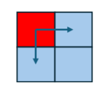

# API and semantics details for task group dynamic dependencies

*Note:* This document is a sub-RFC of the [[file:README.md][umbrella RFC for task group dynamic dependencies]]. 

## Introduction

This document contains a concrete API and semantics proposal for ``task_group`` extensions defined in the parent RFC. 
The following cases should be covered and be described:
* ``task_handle`` semantic extension to allow handling the ``task_group`` tasks in various states: created, submitted, executing and completed. 
  Current API only allows handling created tasks and the ``task_handle`` is changed to the empty state after passing to ``task_group::run`` or 
  ``task_arena::enqueue``.
* API for setting the dependencies between tasks in various states should be defined.
* API for transferring the dependencies from the currently running task to the task in various state should be defined.
* Semantics for returning a ``task_handle`` in various states from the task body should be described (while current preview extensions are enabled). 

## ``task_handle`` semantic extension

The parent proposal for extending the task group with APIs for setting dynamic dependencies defines the following states of the task in the ``task_group``:
* Created 
* Submitted
* Executing
* Completed

Practically, the task is `created` when the ``task_group::defer`` was called and the task is registered in the ``task_group``, but one of the submission methods (such as ``task_group::run``) was not yet called. 

The task state is changed to `submitted` when one of the submission methods was called and the task may be scheduled for the execution if all the
predecessors are completed.

The state is changed to `executing` when some thread takes the task for execution and executes the corresponding task body.

Once the thread finishes executing the task, its state is changed to `completed`.

The existing semantics only allows having ``task_handle`` in empty state meaning no task is associated and in non-empty state representing the task in `created` state using the terms above. Submitting a task, handled by ``task_handle`` for execution lefts the handle in an empty state.

The proposal is to
* Extend possible task states that can be handled by non-empty ``task_handle`` to be any tasks in any state
* Allow to use non-empty ``task_handle`` representing a task in any state for setting and transferring the dependencies between tasks

Since current API allows submitting the ``task_handle`` for execution only as rvalues, having any usage of ``task_handle`` object after submitting for execution 
(e.g. using ``task_group::run(std::move(task_handle))``) looks misleading even if some guarantees are provided for the referred handle object. It also creates an error-prone
for TBB developers - any move-construct or move-assign from the accepted handle will break the guarantee. Code analyzers?

To handle this, the proposal is to extend any method that takes the task handled by the ``task_handle`` with the new overload taking an lvalue reference and provide the following guarantees:
* Overloads accepting rvalue reference to ``task_handle`` take a non-empty handle and leave the handle in an empty state in the end (current behavior is preserved).
* New overloads accepting lvalue references to ``task_handle`` also take a non-empty handle object but does not leave it in an empty state after submission. Hence, the ``task_handle`` can be
  used after execution of the method to represent a task in submitted, executing or completed state and to set the dependencies on such tasks. Using such a task handle once again as an
  argument to the submission method results in undefined behavior.

The following APIs should be extended:

```cpp
class task_group {
    void run(task_handle&& h); // existing overload
    void run(task_handle& h); // new overload

    task_group_status run_and_wait(task_handle&& h); // existing overload
    task_group_status run_and_wait(task_handle& h); // new overload
};

class task_arena {
    void enqueue(task_handle&& h); // existing overload
    void enqueue(task_handle& h); // new overload
};

namespace this_task_arena {
    void enqueue(task_handle&& h); // existing overload
    void enqueue(task_handle& h); // new overload
};
```

Also, ``task_handle`` class API itself can be extended with the new methods, returning the status of the handled task. It may be useful to have the flags showing that it is safe to submit the
``task_handle`` for execution using one of the submission methods above:

```cpp
class task_handle {
    bool was_submitted() const;
    bool is_completed() const;
};
```

Having ``th.was_submitted()`` equal to ``true``, means the task state was changed from `created` to `submitted` in the past. The task can be either submitted, executing or completed.
Extra caution is required while working with this method anyway since even if it returns ``false`` it may be unsafe to submit the ``task_handle`` since the state can be changed by the other
thread.

``is_completed`` does not require any extra care since `completed` is the only state of the task that cannot be changed by any threads in the system.

## Semantics for submitting tasks handled by ``task_handle``

Tasks handled by ``task_handle`` can be submitter for execution using the following APIs:
* ``task_group::run`` and ``task_group::run_and_wait``
* ``task_arena::enqueue`` and ``this_task_arena::enqueue``
* Returning non-empty ``task_handle`` from the body of the currently executed task (when the ``task_group`` preview extensions are enabled)

Current proposal is to allow only the tasks in `created` state to be acceptable by all of these methods since tasks in other states were already submitted in the past.
Having a task in any other state in any cases described above should be considered undefined behavior.

## Semantics for setting dependencies between tasks

Lets consider creating a predecessor-successor dependency between ``predecessor_task_handle`` and ``successor_task_handle`` instances - 
``task_group::make_edge(predecessor_task_handle, successor_task_handle)``. 

As it was already stated in the parent RFC document, we would like to allow adding predecessor tasks in any state described above and to limit
the ``successor_task_handle`` to represent a task in a `created` state since otherwise it can be too late to add predecessor dependencies to
the task that already running or completed.

We can add this as a first formal limitation - if ``successor_task_handle`` does not represent a task in `created` state, the behavior is undefined.

Lets consider the different states of ``predecessor_task_handle``. 

If the predecessor task is in any state except the completed one (created/scheduled/running), the API registers the successor task
in the list of successors on the predecessor side and increase the corresponding reference counter on the successor side to ensure successor task
would not be executed before the predecessor task.

If the predecessor task is in `completed` state, the API has no effect in terms of list of successors and reference counters since no additional
dependencies required and the successor task can be executed if all other dependent tasks are executed as well. 

If the predecessor task state has changed while registering the task as a predecessor for any task, the API should react accordingly to make sure
adding dependencies and increasing the corresponding reference counters are not done for completed tasks.

Implementation-wise, this API requires adding a list of successors into the predecessor task itself and adding the new vertex instance that corresponds
to the successor task. This vertex would contain the reference counter and a pointer to the successor task itself. Each element in the task successor list
is a pointer to the vertex instance of the successor task.

The vertex instance is created once the first task is registered as a predecessor and is reused by any other predecessors. 

Once the predecessor task is completed, it should go through the list of successor vertices and decrement the reference counter. Once the reference
counter is equal to 0, the successor task can be scheduled for execution.

API-wise, the function that decreases the reference counter may also return the pointer to the task. If the reference counter is not equal to 0, the
returned pointer is ``nullptr``. Otherwise, the successor task pointer is returned. It is required to allow bypassing one of the successor tasks
if the body of the predecessor task did not return other task that should be bypassed.

This implementation approach is illustrated in the picture below:


### Adding successors to the current task

Consider use-case of parallel wavefront pattern on the 2-d grid. Each cell is computed as part of a separate task in ``task_group``. Each cell task computes
itself and creates more tasks to process the cell below and the cell on the right.



If there is a strong dependency between the currently computed cell and the following cells, it is required to currently executed task as a predecessor to the
tasks representing the following cells below and on the right. Since there is no ``task_handle`` representing the currently executed task, it is impossible to
use the ``make_edge`` function to set the dependencies. 

It is proposed to add the special function to add successors to the currently executed task to handle this use-case. The API can be 
``tbb::task_group::current_task::add_successor(task_handle& sh)`` and it has the same effect as ``make_edge`` between the ``task_handle`` that handles
the current task and ``sh``. 

## Semantics for transferring the current task successors to other task

Lets consider the use-case where the successors of the task ``current`` are transferred to the task ``target`` handled by the ``target_task_handle``. 
In this case, the API ``tbb::task_group::current_task::transfer_successors_to(target_task_handle)`` should be called from the body of ``current``.

As it was mentioned in the parent RFC, if ``transfer_successors_to`` is called outside of task belonging to the same ``task_group``, the behavior is
undefined.

It is also useful for this API to be flexible in regard to ``target_task_handle`` and to allow different task states.

If ``target`` task is in `created`, `scheduled` or `executing` state, this API should merge together the successors list of ``current``
and ``target`` and sets ``target`` to have the merged successors list. It should be thread-safe to add new successors to ``current`` and ``target``
by using the ``make_edge`` API with ``current`` or ``target`` as predecessors.

If ``target`` task is in `completed` state, it does not make sense to do any merging of successors list since new dependent task for the successors
that are transferring is already completed. In that case, the responsibility for "releasing" the successors is on the ``current`` task. The API should
release the reference counter of all successors of ``current`` in this case.


It is clear that while transferring from ``current`` to ``target`` the successors list of ``target`` should contain both previous successors of ``target``
and the successors of ``current``.

Interesting aspect is what should be done with the successors list of ``current``.

The first option is to consider ``current`` and ``target`` a separate tasks even after the transferring the successors from one to another.

In this case, after the transfer, the task ``current`` will have an empty successors list, and ``target`` will have a merged successors list:


After the transfer, the successors of ``current`` and ``target`` are still tracked separately and adding new successors to one of them would only
affect the successors list of one task:


Such an approach can be beneficial if ``current`` task is kind of generator task that collects the set of successors on each iteration of the loop
and then transfers it to the newly created task.

Alternative approach is to keep tracking ``current`` and ``target`` together after transferring. This requires introducing the new state of task - a `proxy` state.
The task changes its state to `proxy` once the ``transfer_successors_to`` is executed from the body of the task.

If the task ``current`` is a proxy to ``target`` they are sharing the single merged list of successors:


Any changes in the successors list operated on ``current`` or ``target`` will modify the same list of successors - adding or transferring will modify the
state of both "real" and proxy tasks:


Two racing use-cases should be considered as well for each approach:
    a. Adding new successors to ``A`` while it transfers it's successors to ``B``,
    b. Transferring successors from ``A`` to ``B`` while ``B`` is transferring it's successors to ``C``.

Lets consider the use-case (a) first.

There are two options how the actual modifications of the ``A`` successors list can be linearized - the new successor can be added before actual transferring
the entire list to ``B`` or after that. 

If the successors of ``A`` and ``B`` are tracked separately (the first option described), if the new successor was added before the transfer, the new successor
would be transferred to ``B`` together with the entire list.

If the transferring was done before adding the successor - the new successor would be added to ``A`` only and would not appear in the successors list of ``B``.

If the successors of ``A`` and ``B`` are tracked together (the second option described) in both linearization case the newly added successor will appear in both
successors list of ``B`` ("real" task) and ``A`` (task in `proxy` state).

In the use-case (b), there are also two options how the modifications can be linearized - the successors would be transferred from ``A`` to ``B`` before
transferring the successors from ``B`` to ``C`` or after that.

In case of separate successors tracking, if the successor's transfer ``A->B`` was done before the transfer ``B->C``, as a result both successors lists from
``A`` and ``B`` be transferred to ``C``. Successors lists of ``A`` and ``B`` will be empty after doing both transfers.

In the other case, the successors of ``B`` will be first transferred to ``C`` and then the successors from ``A`` will be transferred to ``B``. As a result, the
successors list of ``A`` will be empty, the successors list of ``B`` will contain all previous successors of ``A`` and the successors list of ``C`` will
contains the previous successors of ``B``.

In case of merged successors tracking, in both linearization scenarios ``A``, ``B`` and ``C`` will have the same successors list containing all of the successors.
Tasks ``A`` and ``B`` will be in a `proxy` state to task ``C``. 

Such semantics can be challenging to implement. Since task ``A`` is not participating in transferring successors from ``B`` to ``C``, the task ``B`` would need
to track it's proxy ``A`` (and all other proxies) and update the pointed list once the successors of ``B`` are transferred.

## API proposal summary

```cpp
namespace oneapi {
namespace tbb {

class task_arena {
    void enqueue(task_handle& h);
};

namespace this_task_arena {
    void enqueue(task_handle& h);
} 

class task_handle {
    bool was_submitted() const;
    bool is_completed() const;
};

class task_group {
    void run(task_handle& h);
    task_group_status run_and_wait(task_handle& h);

    static void make_edge(task_handle& ph, task_handle& sh);

    struct current_task {
        static void add_successor(task_handle& sh);
        static void transfer_successors_to(task_handle& h);
    };
}; // class task_group

} // namespace tbb
} // namespace oneapi
```

### Member functions of ``task_arena`` class

``void task_arena::enqueue(task_handle& h)``

Enqueues a task owned by ``h`` into the ``task_arena`` for processing.

``h`` is left in a state that allows tracking the state of the task and setting the dependencies.

If ``h`` is an empty ``task_handle`` or it handles the task that has been submitted for processing, the behavior is undefined.

### Functions in ``this_task_arena`` namespace

``void this_task_arena::enqueue(task_handle&& h)``

Enqueues a task owned by ``h`` into the ``task_arena`` that is currently used by the calling thread.

``h`` is left in a state that allows tracking the state of the task and setting the dependencies.

If ``h`` is an empty ``task_handle`` or it handles the task that has been submitted for processing, the behavior is undefined.

### Member functions of ``task_handle`` class

``bool task_handle::was_submitted() const``

Returns ``true`` if the task handled by ``*this`` was submitted for execution by ``task_arena::enqueue``, ``task_group::run`` or
``task_group::run_and_wait``. 
Returns ``false`` otherwise.

If ``*this`` is an empty task handle, the behavior is undefined.

``bool task_handle::is_completed() const``

Returns ``true`` if the task handled by ``*this`` is completed, ``false`` otherwise.

If ``*this`` is an empty task handle, the behavior is undefined.

### Member functions of ``task_group`` class

``void task_group::run(task_handle& h)``

Submits the task object handled by ``h`` for the execution. 

``h`` is left in a state that allows tracking the state of the task and setting the dependencies.

If one of the following conditions is ``true``, the behavior is undefined:
* ``h`` is an empty ``task_handle``.
* ``h`` handles the task that has been already submitted for processing.
* ``*this`` is the same ``task_group`` that ``h`` is created with.

``task_group_status task_group::run_and_wait(task_handle& h)``

Equivalent to ``{this->run(h); this->wait();}``. 

``h`` is left in a state that allows tracking the state of the task and setting the dependencies.

Returns the status of ``task_group``.

If one of the following conditions is ``true``, the behavior is undefined:
* ``h`` is an empty ``task_handle``.
* ``h`` handles the task that has been already submitted for processing.
* ``*this`` is the same ``task_group`` that ``h`` is created with.

``static void task_group::make_edge(task_handle& ph, task_handle& sh)``

Registers the task handled by ``ph`` to be a predecessor that must complete before the task handled by ``sh`` can start executing. 

If ``sh`` handles the task that was already scheduled for execution, the behavior is undefined. 

It is safe to add multiple predecessors to the same successor and add the same predecessor for multiple successor tasks.

It is safe to add predecessors to the ``task_handle`` handling the task that currently transfers it's successors to another task and
to the task to which the successors are transferred.

``static task_group::current_task::add_successor(task_handle& sh)``

Resisters currently executed task to be a predecessor that must complete before the task handled by ``sh`` can start executing.

If ``sh`` handles the task that was already scheduled for execution, the behavior is undefined. 

If is safe to use this function simultaneously with ``make_edge`` that adds more predecessors to ``sh`` and while transferring the successors
from ``sh``.

``static task_group::current_task::transfer_successors_to(task_handle& sh)``

The exact wording for the semantics of this method should be defined after making a decision about merged or separate tracking of tasks,
that was described above.

Open questions:
* Which approach for ``transfer_successors_to`` (merged or separate tracking) should be implemented.
* Are concrete names of APIs good enough and reflects the purpose of the methods?
* The performance targets for this feature were not defined by this RFC
* Exit criteria for this feature was not defined by this RFC
