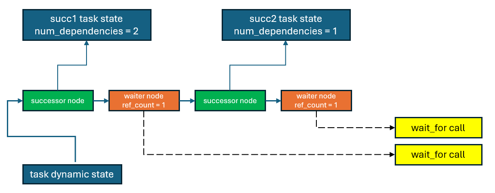
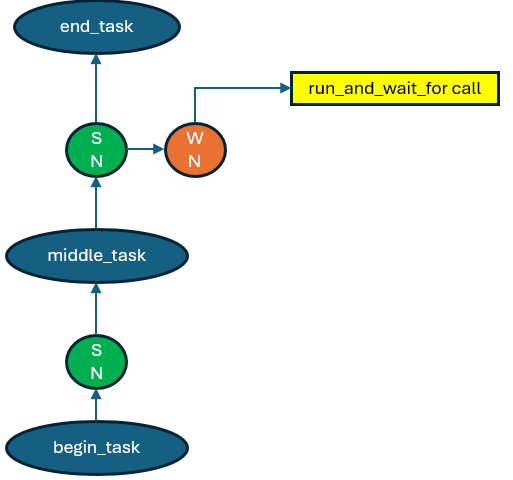

# Waiting for Individual Tasks in ``task_group``

This proposal introduces an extension for the oneTBB ``task_group`` and ``task_arena`` APIs, enabling the ability to wait for the completion of
individual tasks.

## Table Of Contents

* 1 [Introduction](#introduction)
* 2 [Proposal](#proposal)
* 2.1 [Member functions of ``task_group`` class](#member-functions-of-task_group-class)
* 2.2 [Member functions of ``task_arena`` class](#member-functions-of-task_arena-class)
* 3 [Future Enhancements](#future-enhancements)
* 3.1 [Run-and-wait methods for ``task_arena``](#run-and-wait-methods-for-task_arena)
* 3.2 [Work Isolation Issue](#work-isolation-issue)
* 4 [Exit Criteria and Open Questions](#exit-criteria-and-open-questions)
* 5 [Implementation Details](#implementation-details)
* 5.1 [Avoid Bypassing the Successor](#avoid-bypassing-the-successor)
* 6 [Alternative Implementation Approaches](#alternative-implementation-approaches)
* 6.1 [Assign Single ``wait_context`` to the Task](#assign-single-wait_context-to-the-task)
* 6.2 [Avoid ``wait_context`` Usage](#avoid-wait_context-usage)

## Introduction
The ``tbb::task_group`` class represents a collection of tasks that execute concurrently. Tasks can be dynamically added to the group during executing.

The [Task Group Dynamic Dependencies preview feature](../task_group_dependencies/README.md) extends the ``task_group`` API to support task dependencies, ensuring that a *successor* task begins execution only after all its *predecessors* have completed.

The current ``task_group`` API allows waiting for the completion of all tasks in the group using ``task_group::wait`` or ``task_group::run_and_wait``.
The waiting thread may participate in executing other tasks within the ``task_arena``, which may not be related to the specific ``task_group``.

Although waiting for all tasks suits many use cases, some workflows would benefit from the ability to wait for individual tasks.

Consider an example using an out-of-order SYCL queue.

```cpp
sycl::queue q{sycl::property::queue::in_order{false}};

// Creating multiple tasks for the queue
sycl::event task1 = q.single_task(task1_body);
sycl::event task2 = q.memset(some_memory_ptr, 0, 1024);

sycl::event task3 = q.submit([&](sycl::handler& h) {
    h.depends_on(std::vector<sycl::event>{task1, task2});

    // task1_body executes and some_memory_ptr is set before task3_body runs
    h.single_task(task3_body);
});

task3.wait(); // wait for event 

// Submit additional work
q.wait();
```

Consider implementing a similar model using ``tbb::task_group``. The queue can be represented as a ``task_group`` object, where tasks correspond to command groups in the queue, and events are modeled using ``tbb::task_completion_handle``s.

```cpp
using event = tbb::task_completion_handle;

class queue {
    template <typename Body>
    event single_task(Body body) {
        tbb::task_handle task = m_task_group.defer(body);
        tbb::task_completion_handle comp_handle = task;
        m_task_group.run(std::move(task));
        return {comp_handle};
    }

    void wait() { m_task_group.wait(); }
private:
    tbb::task_group m_task_group;
};
```

The ``sycl::handler::depends_on`` functionality can be implemented using the ``tbb::task_group::set_task_order`` API:

```cpp
class handler {
    void depends_on(const std::vector<event>& events) {
        for (event& e : events) {
            tbb::task_group::set_task_order(e, m_root);
        }
    }

    tbb::task_handle m_root;
};
```

Since the example above also uses ``sycl::event::wait`` for wait for the completion of a single task (``task3``), implementing this behavior with
a ``task_group`` requires support for waiting on a single ``task_completion_handle`` object.

## Proposal

The proposal aims to extend ``tbb::task_group`` and ``tbb::task_arena`` APIs by introducing new waiting functions that accept a
``task_completion_handle`` argument.
These functions exit when the task represented by the handle argument is completed or when the group execution is cancelled.
The completion of other tasks within the ``task_group`` is not guaranteed.

To simplify the submission and waiting process for a single task, it is also proposed to introduce submit-and-wait functions that accept a
``task_handle`` argument.

If task completion is transferred to another task using ``tbb::task_group::transfer_completion_to(other_task)``, the waiting functions will wait for
the completion of ``other_task``.

The current waiting functions return a ``task_group_status``, which can have three possible values:
* ``tbb::task_group_status::not_complete`` - The group execution is not cancelled, and not all tasks in the group have completed.
* ``tbb::task_group_status::complete`` - The group execution is not cancelled, and all tasks in the group have completed.
* ``tbb::task_group_status::canceled`` - The group execution is cancelled, and the completion status of tasks is unknown.

Since the new waiting functions track the progress of a single task, returning a ``task_group_status`` may be misleading.
If the group execution is cancelled, the tracked task may still execute, and returning ``canceled`` does not accurately reflect the task's 
completion status.
If execution is not cancelled, the function would need to track whether other tasks remain in the group and return ``not_complete` if any are still pending.

To address this, a new enum ``task_status`` is proposed to track the status of the awaited task. ``task_status::complete`` indicates that the tracked 
task was executed and completed, while ``task_status::canceled`` signifies that the task was not executed due to group cancellation.

The proposed API is summarized below:

```cpp
// Defined in <oneapi/tbb/task_group.h>
namespace oneapi {
namespace tbb {

enum class task_status {
    not_complete,
    complete,
    canceled
};

class task_group {
    task_status wait_for(task_completion_handle& comp_handle);
    task_status run_and_wait_for(task_handle&& handle);
};

// Defined in <oneapi/tbb/task_arena.h>
class task_arena {
    task_status wait_for(task_completion_handle& comp_handle);
};

} // namespace tbb
} // namespace oneapi
```

### Member functions of ``task_group`` class

```cpp
task_status wait_for(task_completion_handle& comp_handle);
```

Waits for the completion of the task represented by ``comp_handle``.
If completion was transferred to another task using ``tbb::task_group::transfer_completion_to``, the function waits for the completion of that task.

Returns ``task_status::completed`` if the task was executed, or ``task_status::canceled`` if it was not.

```cpp
task_status run_and_wait_for(task_handle&& handle);
```

Schedules the task represented by ``handle`` for execution (if it has no unresolved dependencies), and waits for its completion.

This is semantically equivalent to: ``task_completion_handle comp_handle = handle; run(std::move(handle)); wait_for(comp_handle)``.

Returns ``task_status::completed`` if the task was executed, or ``task_status::canceled`` if it was not.

### Member functions of ``task_arena`` class

```cpp
task_status wait_for(task_completion_handle& comp_handle);
```

Waits for the completion of the task represented by ``comp_handle``.
If completion was transferred to another task using ``tbb::task_group::transfer_completion_to``, the function waits for completion of that task.

This is semantically equivalent to: ``execute([&] { tg.wait_for(comp_handle); })``.

Returns: ``task_status::completed`` if the task was executed and ``task_status::canceled`` otherwise.

Introducing ``wait_for`` in the ``this_task_arena`` namespace is unnecessary, as it would be functionally identical to calling the ``task_group::wait_for`` API directly.

## Future Enhancements

### Run-and-wait methods for ``task_arena``

It may be beneficial to introduce APIs that simplify task submission into ``task_arena`` and support waiting for task completion.

This functionality would be semantically similar to:

```cpp
tbb::task_group tg;
tbb::task_arena arena;
tbb::task_handle task = tg.defer(...);

tbb::task_completion_handle comp_handle = task;
arena.enqueue(std::move(task));
task_status status = arena.wait_for(comp_handle);
```

One of possible name for such an extension is ``task_arena::enqueue_and_wait_for(task_handle&& task)``.
This function is semantically close to ``task_arena::execute`` (which may submit the task and waits for its completion), but it guarantees that
the task is enqueued into the arena.

A similar function could also be added to the ``tbb::this_task_arena`` namespace.

### Work Isolation Issue

Similar to other ``task_arena::wait_for`` overload that take a ``task_group`` argument, it makes sense to also consider work isolation for
the APIs introduced in this proposal.
If the wait is unrestricted, the waiting thread may execute any task from the arena, including those unrelated to the completion of the awaited
task or its associated ``task_group``.

Ideally, the waiting thread should only execute tasks that contribute to the completion of the awaited task. In such a model, all tasks
within the same subgraph would need to share a common isolation tag. In theory, a successor could inherit the isolation tag from
its predecessor. However, multiple predecessors will have different tags.

This would require changes to the current isolation mechanism to support multiple isolation tags, allowing a thread waiting for a successor
to execute tasks with any of its predecessor's tags. 

As an initial step, it makes sense to isolate the waiting thread so that it only executes tasks related to the same ``task_group`` as the awaited task - similar to the improvement described in the [RFC for another overload of ``task_arena::wait_for``](../task_arena_waiting/task_group_interop.md).

## Exit Criteria and Open Questions

* Performance targets for this feature should be clearly defined.
* Should the ``enqueue_and_wait`` API be added to ``task_arena``? Refer to the
  [Run-and-wait methods for ``task_arena`` section](#run-and-wait-methods-for-task_arena) for more details.
* Should work isolation constraints be applied while waiting for a task to complete? See the
  [Work Isolation Issue section](#work-isolation-issue) for more details.

## Implementation Details

To implement the proposed API, the successors list used in [Task Group Dynamic Dependencies](../task_group_dynamic_dependencies/implementation_details.md) can be reused.

The list can be modified to support two types of nodes representing entities that require notification upon task completion: successor nodes
and waiter nodes.
A successor node is an existing construct used to establish dependencies between tasks.
A waiter node represents a ``wait_context`` object with a reference count of ``1``, assigned to each ``wait_for`` call.

Each ``wait_for`` call creates a new waiter node and adds it to the notification list similarly to adding the successor node.

When a task completes, it traverses its notification list as follows:
* For each successor node, the dependency counter is decremented.
* For each waiter node, the reference counter in the associated ``wait_context`` is decremented, notifying the waiting thread of task completion.

The diagram below illustrates a notification list for a task with two successors and two ``wait_for`` calls awaiting its completion:



To differentiate between completed and canceled tasks and return the correct ``task_status``, distinct signals are sent while traversing the
notification list after ``task::execute`` and ``task::cancel``.

### Avoid Bypassing the Successor

Consider an example where a sequence of three tasks is implemented using ``task_group`` and waiting for the middle task:

```cpp
tbb::task_group tg;

tbb::task_handle begin_task = tg.defer(start_body);
tbb::task_handle middle_task = tg.defer(middle_body);
tbb::task_handle end_task = tg.defer(end_body);

tbb::task_group::set_task_order(begin_task, middle_task);
tbb::task_group::set_task_order(middle_task, end_task);

tg.run(std::move(begin_task));
tg.run(std::move(end_task));
tg.run_and_wait_for(std::move(middle_task));

// Post middle task actions

tg.wait();
```

The internal task graph is illustrated on the diagram below. ``SN`` and ``WN`` refer to the successor and waiter nodes in the notification list,
respectively.



For simplicity, assume that the task graph is executed within a single-threaded arena.

In the current implementation of Task Group Dynamic Dependencies, when a task completes and notifies its list,
one of the next ready-to-execute tasks (with zero dependencies) is bypassed.

When the calling thread invokes ``run_and_wait_for`` call, the ``begin_task`` is executed. After executing its body,
it notifies its single successor node in the list. The ``middle_task``'s dependency count becomes zero, and the task is bypassed.

When ``middle_task`` completes, it notifies its list, which contains both a successor node and a waiter node. The successor node notifies
``end_task``, making it available for execution. The waiter node decrements the reference count in the associated ``wait_context``, allowing the
corresponding ``run_and_wait_for`` call to complete.
The notified ``wait_context`` is the same context awaited by the calling thread.

If ``end_task`` is bypassed, the calling thread will not exit until all tasks in the graph have completed. If additional tasks follow ``end_task``,
the thread will only exit after each is bypassed sequentially.

However, since the current thread notifies the ``wait_context`` it is waiting on via the corresponding waiter node, it is more appropriate to avoid
bypassing the next task. Instead, the task should be spawned, and ``run_and_wait_for`` should exit after executing ``middle_task``.

This can be implemented by storing a pointer to the innermost ``wait_context`` that the current thread is waiting on, within the task
dispatcher associated with the calling thread.

When the wait node is notified, the thread checks whether the context pointer in the node matches the one the current thread is waiting on.
If so, a signal is sent to the notification step to avoid bypassing.

This check requires introducing a new entry point to access the ``wait_context`` stored in the task dispatcher.
The pseudo code is shown below:

```cpp
struct notification_list_node {
    // First element is a task pointer to bypass
    // Second element is true if the bypass is allowed
    using notify_result = std::pair<task_handle_task*, bool>;
    virtual notify_result notify(bool is_cancel_signal) = 0;
};

struct successor_list_node : notification_list_node {
    task_dynamic_state* my_successor_state;

    notify_result notify(bool is_cancel_signal) override {
        // Releasing the last dependency makes successor task available for execution
        if (my_successor_state->release_dependency() == 0) {
            // Second element is true since successor_list_node do not prohibit bypassing
            return {my_successor_state->get_task(), true}; 
        } else {
            return {nullptr, true};
        }
    }
};

struct wait_list_node : notification_list_node {
    wait_context my_wait_context{1};

    notify_result notify(bool is_cancel_signal) override {
        my_wait_context.release();
        if (r1::get_current_wait_context() == &my_wait_context) {
            // Signal the notification step to stop bypass loop
            return {nullptr, false};
        } else {
            return {nullptr, true};
        }
    }
};

// called from task::execute or task::cancel
task_handle_task* notify_list(notification_list_node* node, bool is_cancel_signal) {
    task_handle_task* bypass_task = nullptr;
    bool bypass_allowed = true;

    while (node != nullptr) {
        notification_list_node::notify_result result = node->notify(is_cancel_signal);

        if (!result.second) bypass_allowed = false;

        if (bypass_task == nullptr) {
            bypass_task = result.first;
        } else if (result.first) {
            spawn(*result.first);
        }

        node = node->next();
    }

    if (bypass_task && !bypass_allowed) {
        spawn(*bypass_task);
        return nullptr;
    } else {
        return bypass_task;
    }
}
```

This solution does not restrict the thread that is notified by another thread of the task completion from entering the bypass loop of the currently
executing task.

An alternative approach is to implement a general solution within the scheduler that exits the bypass loop and spawns the bypassed task if execution
should not continue.

## Alternative Implementation Approaches

### Assign Single ``wait_context`` to the Task

The first alternative approach is to assign a single ``wait_context`` to each task and reuse it for all waiters. The ``wait_context`` would become a field within the ``task_dynamic_state`` class:


This allows reuse of a single context object for all ``wait_for`` calls, but introduces challenges in supporting completion transfer.
If completion is transferred to another task, a different ``wait_context`` object from the new task's state should be used:

```cpp
// wait_for(comp_handle) implementation
task_dynamic_state* state = comp_handle.get_dynamic_state();

r1::wait(state->get_wait_context());

while (state->was_transferred()) {
    state = state->transfer_state();
    r1::wait(state->get_wait_context());
}
```

### Avoid ``wait_context`` Usage

The second alternative is to avoid using ``wait_context`` entirely, as it would hold only a single reference released upon task completion.
This requires the introduction of the generalized wait mechanism in the scheduler, allowing threads to wait on a predicate rather than 
a context object:

```cpp
struct wait_interface {
    virtual bool continue_execution() = 0;
    virtual std::uintptr_t wait_id() = 0;
};

void wait(wait_context&, task_group_context&); // existing entry point
void wait(wait_interface&, task_group_context&); // new entry point for generalized wait
```

``wait_interface::continue_execution`` acts as a predicate. When it returns ``false``, the waiting thread exits the scheduler, completing the 
corresponding ``wait_for`` call.

``wait_interface::wait_id`` should return a unique identifier for the wait, enabling notification of waiting threads via the concurrent monitor
in the TBB scheduler.

Existing entry point can be implemented using ``wait_interface``:

```cpp
// Existing class, fields and functions
class wait_context {
    std::atomic<std::uint64_t> m_ref_count;

    bool continue_execution() const {
        std::uint64_t r = m_ref_count.load;
        return r > 0;
    }
};

struct wait_on_context : wait_interface {
    wait_context& m_wait_context;

    bool continue_execution() override {
        return m_wait_context.continue_execution();
    }

    std::uint64_t wait_id() override {
        return std::uintptr_t(&m_wait_context);
    }
};

void wait(wait_interface&, task_group_context& ctx);

void wait(wait_context& context, task_group_context& ctx) {
    wait_on_context waiter(context);
    wait(waiter, ctx);
}
```

Waiting for a task to complete can be implemented as shown below:

```cpp
// Existing class, layout unchanged
class task_dynamic_state {
    task_handle_task*        m_task;
    successor_list_node*     m_successor_list_head;
    task_dynamic_state*      m_new_completion_point;
    std::atomic<std::size_t> m_num_dependencies;
    std::atomic<std::size_t> m_num_references;
    small_object_allocator   m_allocator;
};

struct wait_on_task : wait_interface {
    task_dynamic_state* m_task_state;

    bool continue_execution() override {
        return !m_task_state->represents_completed_task(); // reads m_successor_list_head state
    }

    std::uintptr_t wait_id() override {
        return std::uintptr_t(m_task_state);
    }
};

void wait_for(task_completion_handle& comp_handle) {
    task_dynamic_state* state = comp_handle.get_dynamic_state();

    wait_on_task task_waiter(state);

    r1::wait(task_waiter);

    while (state->was_transferred()) {
        state = state->transfer_state();
        wait_on_task transfer_waiter(state);

        r1::wait(transfer_waiter);
    }
}
```

A single ``r1::wait`` call cannot handle completion transfer, as the ``wait_id`` must be updated to ensure correct thread notification when the
transferred task completes.
