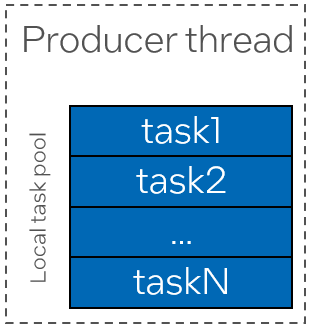
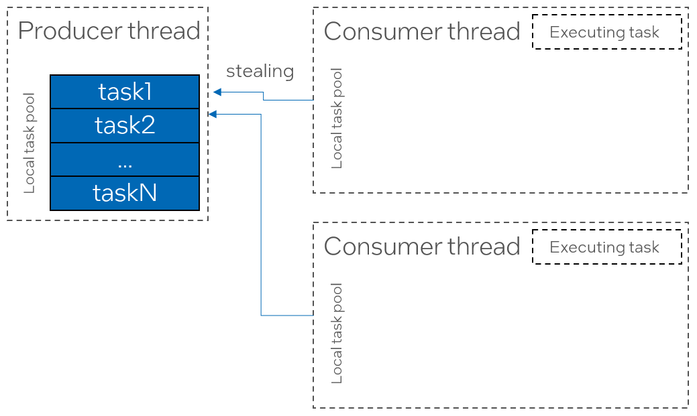
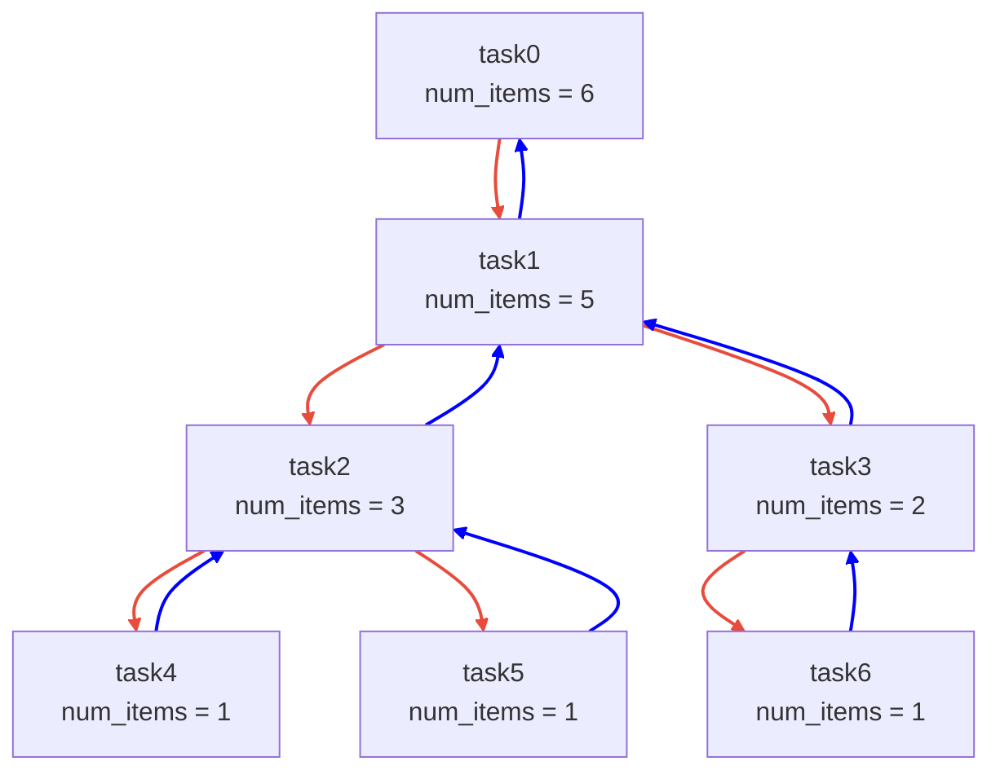
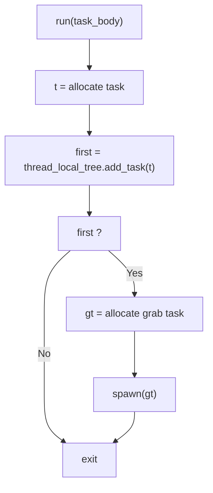
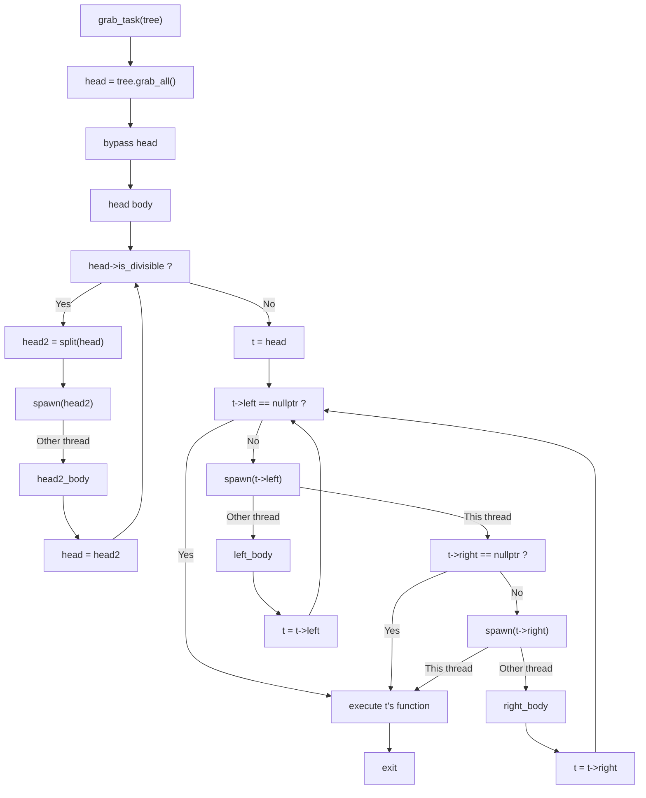
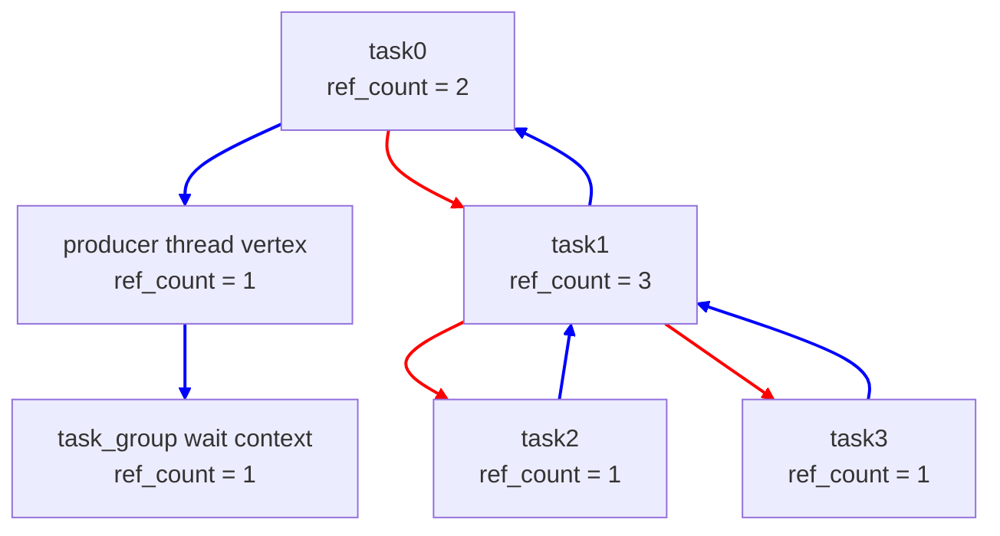
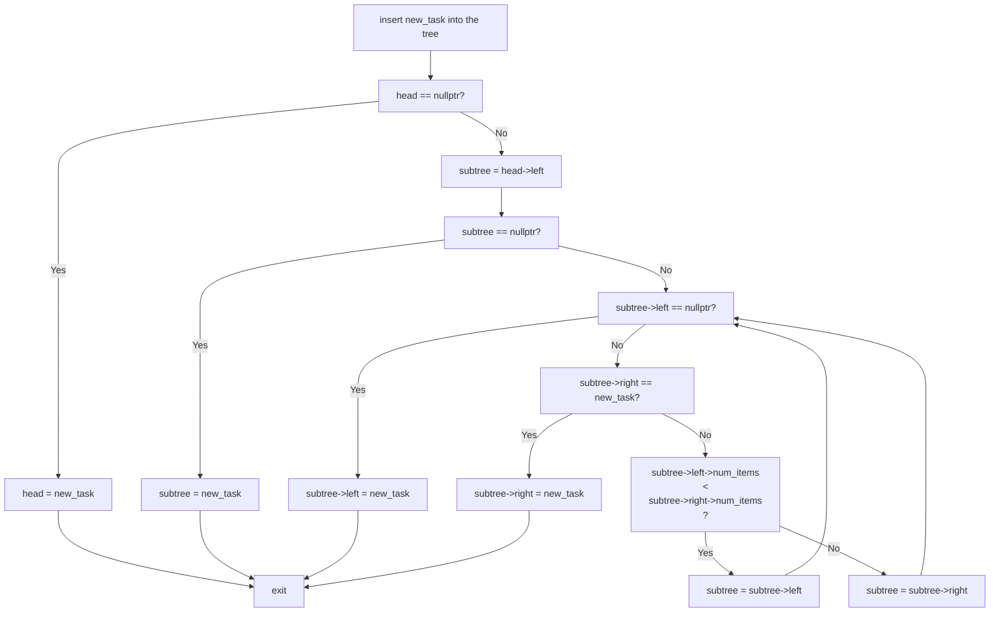

# Tasks Aggregation

This proposal describes a possible solution to the producer-consumer inefficiency that arises in the current ``task_group`` API.

## Introduction

Consider using a ``tbb::task_group`` in an application implementing a single producer - multiple consumers pattern, where one producer thread generates work items,
and multiple consumer threads process them in parallel:

```cpp

void produce() {
    tbb::task_group tg;

    auto work_item = get_work_item();

    while (work_item != end_of_work) {
        tg.run(process{work_item}); // Can be executed by one of the producer threads
    }

    tg.wait();
}
```

The ``get_work_item()`` function generates the work item for processing, e.g., by reading an input file or stream. When there is no more work to generate, it
returns ``end_of_work``. The exact number of work items to be generated is unknown in advance, which makes using parallel algorithms like
``tbb::parallel_for`` or ``tbb::parallel_for_each`` potentially inefficient, as they require buffering work items to form an input sequence
that delays computations on the first-came work items.
``tbb::task_group`` is semantically appropriate, as it immediately submits the available work for execution.

In the current implementation, ``tbb::task_group::run`` creates a task to process the given function and spawns it by pushing it into the local task pool of
the producing thread.



When consumer (worker) threads join the task arena, they must search for tasks to process. Since the only source of tasks in the arena is the local task pool
of the producing thread, consumer threads will steal individual tasks from it.



After executing the stolen task, consumer threads run out of work again and must steal from the same producer's local task pool.
Because the number of consumer threads can be large, stealing tasks from a single producer's task pool creates a bottleneck, resulting in significant
performance penalties and poor scalability.

Another bottleneck is a reference counter inside the ``tbb::task_group`` that is used to register the task in the group. The reference counter is incremented when a task 
is created and decremented when the task completes execution.

To improve the scalability of the reference counter, oneTBB ADD_VERSION introduced a per-thread reference counters - each thread that creates a task registers its thread-local
counter as a leaf in the ``task_group``'s reference counter. Tasks created by a thread holds a reference in the thread-local counter, which in turn holds a single reference
in the group's reference counter.

However, in the scenario above all tasks are created by a producer thread, so all of them holds references in a single producer thread's counter.

## Proposed Design

### Resolving the Single Task Source Bottleneck

This document proposes a task distribution mechanism combining the existing ``task_group`` spawning mechanism with the idea of the aggregator.

For simplicity, let's refer to the API implementing this idea as *aggregating-task-group* providing two
basic methods ``run(task_body)`` and ``wait()``, similar to the regular ``task_group``.

Tasks in an *aggregating-task-group* forms a binary task tree where the first and the second layers
contains a single task and each other N-th layer contains up to 2^N tasks.

Each tree node contains three pointers to other nodes
* Pointer to the left node on the next layer
* Pointer to the right node on the next layer
* Pointer to the parent node on the previous layer

Additionally, each node contains the number of items in the corresponding subtree.



Binary tree of tasks supports three basic actions:
* Adding a task into the tree
* Splitting the tree into halves
* Grabbing all items in the tree

The detailed description of all of these operations will be provided in separate sections below.

The *aggregating-task-group* instance supports a thread-local atomic pointer to the binary tree which is initially empty(``atomic<tree-task>`` set to ``nullptr``). 

Each call to ``run()`` appends a task to the calling thread's binary tree and if the tree was empty (i.e. the inserted task is the first in the tree),
spawns a service *grab-task* pointing to the tree.

The sequence diagram for ``run`` is shown below:



When the worker thread executes the *grab-task* stolen from the producer's local task pool, it grabs all the items in the producer's tree.

Since the producer's tree is left empty, further call to ``run`` would append a task to the empty tree, resulting in spawning new *grab-task*s.

After grabbing the task tree, the *grab-task* bypasses the head task of the tree.

The bypassed head task checks the number of items in the tree, and if it exceeds the specified grainsize - splits the tree into halves.
The head task of the second half of the tree is spawned and the currently executing task (that is now head of the first half of the tree)
is re-executed, resulting in recursive splitting until the grainsize is reached.
Once the grainsize is reached, the head of the tree spawns its left and right leaf tasks if any and executes the associated user body.

The sequence diagram for the grab and split tasks is shown below.



Consider the producer-consumer example from the introduction, now using *aggregating-task-group* instead of ``tbb::task_group``.

When the *aggregating-task-group* is created, the task tree of the producer thread is empty.

The first task submitted to the group is appended to the tree, and since the tree was empty, the ``grab_task`` is spawned (added to the local task pool).

Subsequent task submitted to the group are appended to the tree without spawning any tasks until the ``grab_task`` executes.

Once a consumer worker thread steals and executes the ``grab_task``, it grabs the tree containing some amount of tasks. Let's say it contains 1000 tasks.

Starting from this moment, the producer's task tree is empty again, hence subsequent ``run``s would spawn additional ``grab_task``s.

Consumer thread check if the grabbed tree is divisible and if it is - splits the tree into halves, spawns a task representing a second subtree, and re-executes
the current tree's head to keep dividing the tree until the desired grainsize is achieved. 

Let's consider a grainsize of 150 tasks. Producer thread appended 500 tasks into the task tree before the consumer thread 1 came and grabbed them. 
Thread 1 splits the tree into two halves (each containing 250 tasks) and spawns a head into thread 1's local task pool.

Assume Thread 2 steals the spawned task from Thread 1 - it will also split the subtree into two halves, each containing 125 tasks, but will spawn the second half to Thread 2's
local task pool.

Thread 3 can now steal the task spawned by Thread 2 and since it is not divisible - spawns the entire subtree to its local task pool.

Same amount of tasks would be spawned by Thread 2 when the task would be re-executed.

Thread 1 would split the tree once more resulting it once more stealing (let's say by Thread 4). 

Hence, for such a model, instead of spawning 500 tasks by the Producer Thread and further stealing from a single source, 4 threads have spawned 125 tasks each, resulting
in 4 different task sources for stealing that improves the stealing scalability.

This model can be interpreted also in the following manner. Consider a producer is going to generate N input work items. As it was mentioned, N is unknown in advance.
The execution using *aggregating-task-group* would be similar to buffering some amount of inputs, execute async parallel for on top of the buffer and start buffering again.
So processing *N* input work items can result in *M* ``parallel_for`` invocations over *K0*, *K1*, ..., *KM* iterations where *K0* + *K1* + ... + *KM* == *N*.

### Resolving the Reference Counting Bottleneck

As it was mentioned in the introduction, ``tbb::task_group`` in the single producer-multiple consumers case suffers from a bottleneck caused by tasks reference counting.

Since all of the tasks are created by a single thread, it's ``thread_reference_vertex`` holds a single reference in a ``task_group``s ``wait_context``, while each
task holds reference in a producer's ``thread_reference_vertex``. Since the tasks are likely stolen and executed by consumer threads, reference counter in producer's
``thread_reference_vertex`` would be decremented by multiple threads, resulting in negative performance effects.

In the *aggregating-task-group* task distribution approach, this can be solved by adding a reference counter to each task of the tree. A reference is held:
1. For a task itself
2. For a left task in a tree
3. For a right task in a tree

Before spawning, the *grab-task* holds a reference in a calling thread ``thread_reference_vertex``. Once it executes and grabs the task tree, it substitutes itself
with the head of the grabbed subtree in a waiting tree.

The lifetime of each task is extended until the reference counter is non-zero. Similar to 



In a diagram above, red arrows denotes a left or right child in a task tree and are not involved in a reference counting.
Blue arrows denotes a parent relationship in a waiting tree.

When a subtree is split into halves, only the red arrows are changing. The waiting tree remain unchanged.
Once a task executed it's body, it releases a self-reference held in a reference counter. Once the reference counter reaches zero,
the task is deallocated and releases a reference in it's parent in a waiting tree.

This approach allows to distribute the reference counting across multiple tasks and avoid bottleneck on a single counter.

### Allocator Bottleneck

Another bottleneck that appears in a single producer- multiple consumer scenario is an allocation bottleneck. In a regular ``task_group`` (as well as
in most of TBB parallel algorithms), tasks are allocated in a per-thread small object pool. Only an owner thread can allocate from a pool, but multiple
threads can release a memory to a pool. 

Since all of the tasks are created (i.e. allocated) by a single producer's small object pool, multiple stealers would release the memory to a single pool
during the group's work. Producer's small object pool becomes another bottleneck in a system.

Current version of the document do not propose concrete solution for this bottleneck. Possible solution may be to avoid deallocating the task tree on the
consumer's side, but create a service *free-task* pointing to the task tree and submitting it directly to the producer to guarantee that the memory would
be deallocated by the owner. But since the original tree structure is broken by the constant tree splitting, this approach is not straightforward to implement.

## Performance Analysis

## Alternative Approaches Considered

## Possible APIs

## Open Questions

## Task Tree operations in Details


Alternative approaches for how the *aggregating-task* should process the grabbed list can be considered.

For example, it may follow the approach of ``tbb::parallel_for_each`` for forward iterators: it cuts a single chunk
from the list, re-spawns the *chunking-task* with the reduced list, and bypasses the *chunk-task*.

For example, it may follow the approach of ``tbb::parallel_for_each`` for forward iterators: it cuts the single chunk
from the list, re-spawns the *chunking-task* with the reduced list and bypasses the *chunk-task*. When a worker thread
executes the stolen *chunking-task*, it cuts and bypasses the task for the next chunk and re-spawns the *chunking-task*.

The *chunking-task* is re-spawned until the list is empty.

## Possible APIs

It does not make sense to completely replace ``task_group::run`` spawning mechanism with task aggregation, as this could
introduce unnecessary performance penalties in other ``task_group`` use cases (e.g., divide-and-conquer patterns), where
tasks are produced by multiple threads or generate additional tasks.

There are several options for expressing tasks aggregation in the public API:

1. A separate ``task_group``-like API, e.g., ``tbb::aggregating_task_group``, providing the same set
   of member functions as ``tbb::task_group``.
2. Integrate it into the regular ``tbb::task_group`` API by providing an additional overload for ``task_group::run`` that
   accepts a policy parameter, or a separate function in ``task_group``.
3. Introduce a separate API not connected with the task groups. One option is ``tbb::parallel_while(generator, predicate, body)``,
   which executed ``body(input)`` in parallel while ``pred(input) == true``, with ``input`` generated by repeated calls to ``generator()``.

## Open Questions

* Which public APIshould be used to implement tasks aggregation? See the [Possible APIs section](#possible-apis) for details.
* Which chunking approach should be implemented? See the [Alternative Approaches for Chunking section](#alternative-approaches-for-chunking) for details.
* What chunk size should be chosen?


### Adding a task into the tree

Consider having an empty binary task tree.
The first added task replaces the head of the tree. The second task is inserted as a left subtask of the head. The right subtask of the tree is always ``nullptr`` to support the tree structure described above.

Starting from the third inserted task, the tasks are inserted into the left or right subtree containing less number of items.

The sequence diagram of the insertion is shown below:

