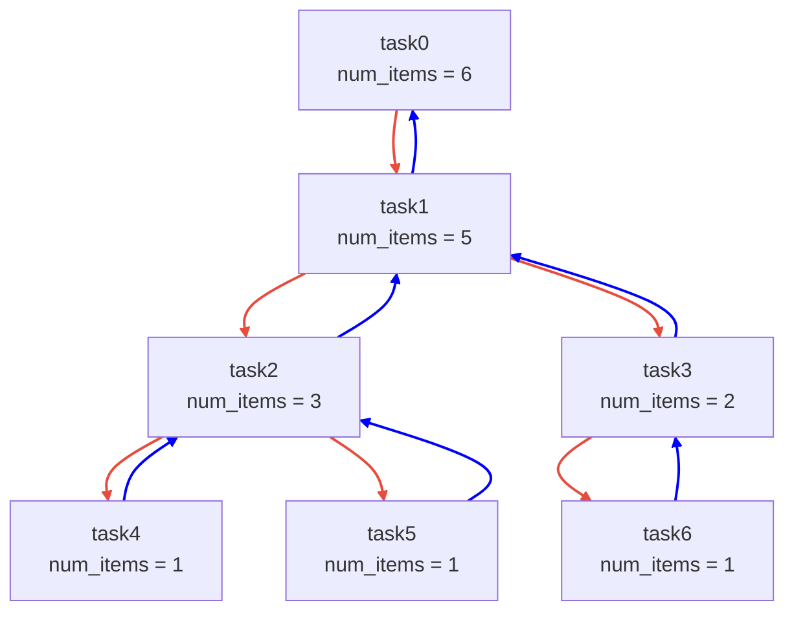
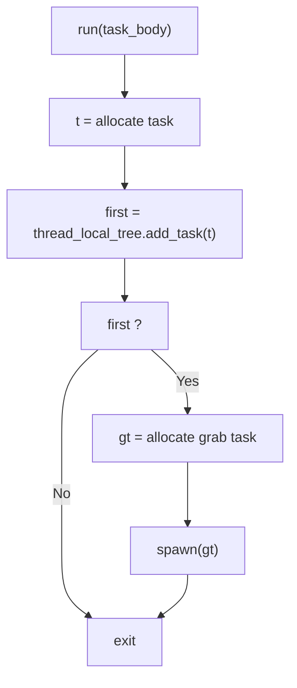
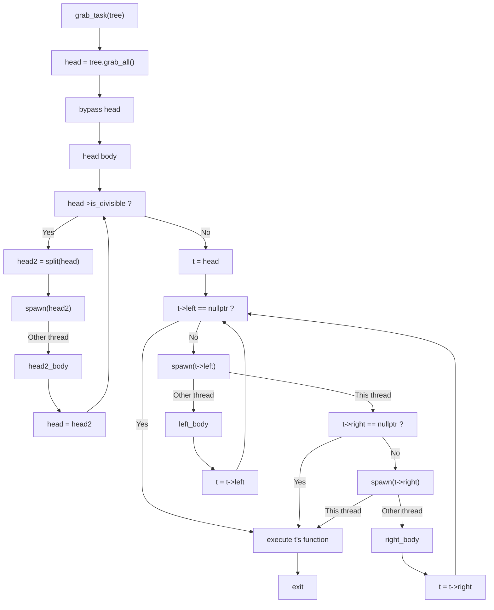
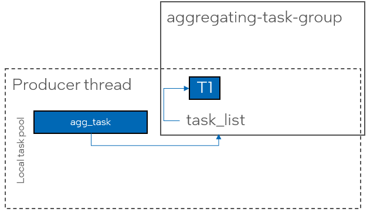
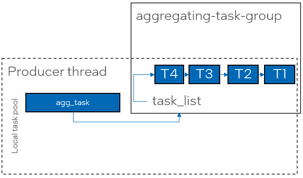
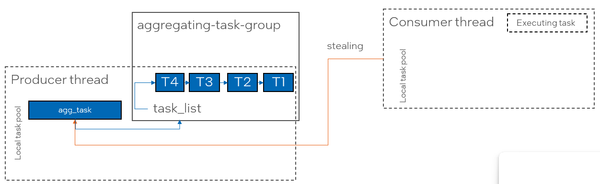
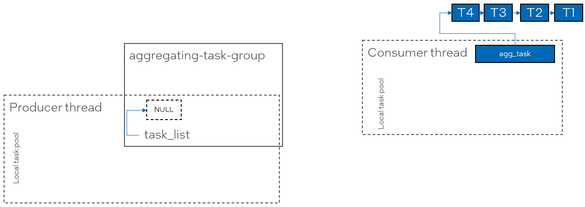
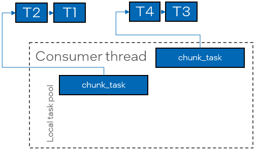
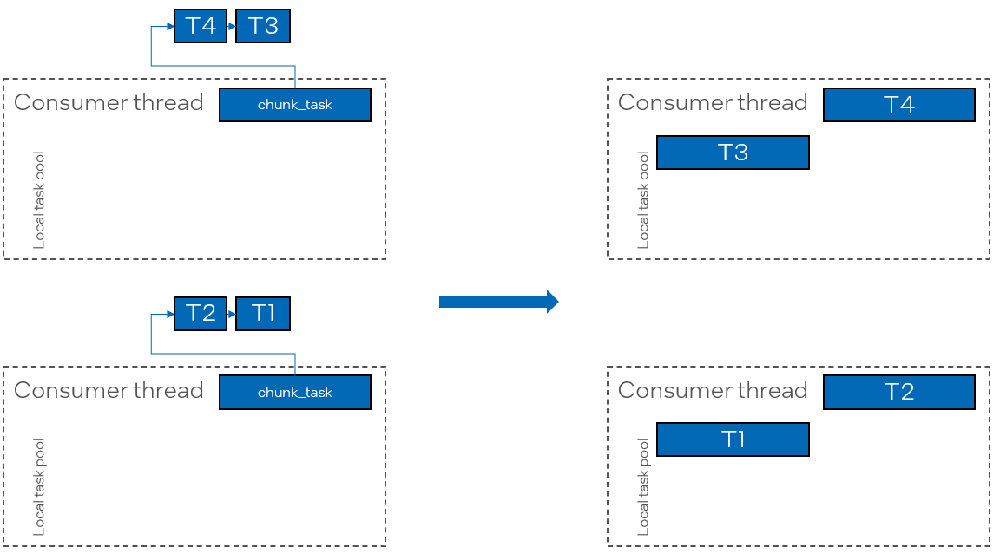
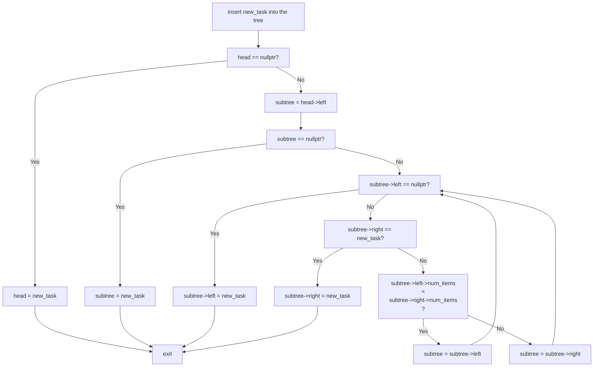

# Tasks Aggregation

This proposal describes a possible solution to the producer-consumer inefficiency that arises in the current ``task_group`` API.

## Introduction

Consider using a ``tbb::task_group`` in an application implementing a single producer - multiple consumers pattern, where one producer thread generates work items,
and multiple consumer threads process them in parallel:

```cpp

void produce() {
    tbb::task_group tg;

    auto work_item = get_work_item();

    while (work_item != end_of_work) {
        tg.run(process{work_item}); // Can be executed by one of the producer threads
    }

    tg.wait();
}
```

The ``get_work_item()`` function generates the work item for processing, e.g., by reading an input file or stream. When there is no more work to generate, it
returns ``end_of_work``. The exact number of work items to be generated is unknown in advance, which makes using parallel algorithms like
``tbb::parallel_for`` or ``tbb::parallel_for_each`` potentially inefficient, as they require buffering work items to form an input sequence
that delays computations on the first-came work items.
``tbb::task_group`` is semantically appropriate, as it immediately submits the available work for execution.

In the current implementation, ``tbb::task_group::run`` creates a task to process the given function and spawns it by pushing it into the local task pool of
the producing thread.


When consumer (worker) threads join the task arena, they must search for tasks to process. Since the only source of tasks in the arena is the local task pool
of the producing thread, consumer threads will steal individual tasks from it.


After executing the stolen task, consumer threads run out of work again and must steal from the same producer's local task pool.
Because the number of consumer threads can be large, stealing tasks from a single producer's task pool creates a bottleneck, resulting in significant
performance penalties and poor scalability.

Another bottleneck is a reference counter inside the ``tbb::task_group`` that is used to register the task in the group. The reference counter is incremented when a task 
is created and decremented when the task completes execution.

To improve the scalability of the reference counter, oneTBB ADD_VERSION introduced a per-thread reference counters - each thread that creates a task registers its thread-local
counter as a leaf in the ``task_group``'s reference counter. Tasks created by a thread holds a reference in the thread-local counter, which in turn holds a single reference
in the group's reference counter.

However, in the scenario above all tasks are created by a producer thread, so all of them holds references in a single producer thread's counter.

## Proposed Design

### Resolving the Single Task Source Bottleneck

This document proposes a task distribution mechanism combining the existing ``task_group`` spawning mechanism with the idea of the aggregator.

For simplicity, let's refer to the API implementing this idea as *aggregating-task-group* providing two
basic methods ``run(task_body)`` and ``wait()``, similar to the regular ``task_group``.

Tasks in an *aggregating-task-group* forms a binary task tree where the first and the second layers
contains a single task and each other N-th layer contains up to 2^N tasks.

Each tree node contains three pointers to other nodes
* Pointer to the left node on the next layer
* Pointer to the right node on the next layer
* Pointer to the parent node on the previous layer

Additionally, each node contains the number of items in the corresponding subtree.



Binary tree of tasks supports three basic actions:
* Adding a task into the tree
* Splitting the tree into halves
* Grabbing all items in the tree

The detailed description of all of these operations will be provided in separate sections below.

The *aggregating-task-group* instance supports a thread-local atomic pointer to the binary tree which is initially empty(``atomic<tree-task>`` set to ``nullptr``). 

Each call to ``run()`` appends a task to the calling thread's binary tree and if the tree was empty (i.e. the inserted task is the first in the tree),
spawns a service *grab-task* pointing to the tree.

The sequence diagram for ``run`` is shown below:



When the worker thread executes the *grab-task* stolen from the producer's local task pool, it grabs all the items in the producer's tree.

Since the producer's tree is left empty, further call to ``run`` would append a task to the empty tree, resulting in spawning new *grab-task*s.

After grabbing the task tree, the *grab-task* bypasses the head task of the tree.

The bypassed head task checks the number of items in the tree, and if it exceeds the specified grainsize - splits the tree into halves.
The head task of the second half of the tree is spawned and the currently executing task (that is now head of the first half of the tree)
is re-executed, resulting in recursive splitting until the grainsize is reached.
Once the grainsize is reached, the head of the tree spawns its left and right leaf tasks if any and executes the associated user body.

The sequence diagram for the grab and split tasks is shown below.



Consider the producer-consumer example from the introduction, now using *aggregating-task-group* instead of ``tbb::task_group``.

When the *aggregating-task-group* is created, the task tree of the producer thread is empty.

The first task submitted to the group is appended to the tree, and since the tree was empty, the ``grab_task`` is spawned (added to the local task pool).

Subsequent task submitted to the group are appended to the tree without spawning any tasks until the ``grab_task`` executes.

Once a consumer worker thread steals and executes the ``grab_task``, 



Subsequent tasks submitted to the group are appended to the head of the list without spawning additional aggregating tasks.



When a consumer worker thread looks for work, the only task available for stealing is ``agg_task``.



When the consumer thread executes the ``agg_task``, it grabs the task list and makes it empty again. Further calls to ``run()`` will
append the task to the empty list and spawn additional *aggregating-task*s to grab the new list.



After grabbing the task list, the consumer thread splits the list into chunks of fixed size. Assume a chunk size of ``2``.
In the example above, it will create two service *chunk-task*s pointing to the sub-lists. One is spawned, while the other is bypassed.

Chunk tasks reserve a reference in the aggregating task's reference counter and maintain another counter for individual listed tasks in the chunk.
The lifetime of a chunk task is extended until the last listed task in the chunk is executed.



Another consumer thread can now steal the *chunk-task* from the first consumer thread's local task pool.

When the consumer thread executes the *chunk-task*, it spawns all tasks except one and bypasses the last.



### Alternative Approaches for Chunking

Alternative approaches for how the *aggregating-task* should process the grabbed list can be considered.

For example, it may follow the approach of ``tbb::parallel_for_each`` for forward iterators: it cuts a single chunk
from the list, re-spawns the *chunking-task* with the reduced list, and bypasses the *chunk-task*.

For example, it may follow the approach of ``tbb::parallel_for_each`` for forward iterators: it cuts the single chunk
from the list, re-spawns the *chunking-task* with the reduced list and bypasses the *chunk-task*. When a worker thread
executes the stolen *chunking-task*, it cuts and bypasses the task for the next chunk and re-spawns the *chunking-task*.

The *chunking-task* is re-spawned until the list is empty.

## Possible APIs

It does not make sense to completely replace ``task_group::run`` spawning mechanism with task aggregation, as this could
introduce unnecessary performance penalties in other ``task_group`` use cases (e.g., divide-and-conquer patterns), where
tasks are produced by multiple threads or generate additional tasks.

There are several options for expressing tasks aggregation in the public API:

1. A separate ``task_group``-like API, e.g., ``tbb::aggregating_task_group``, providing the same set
   of member functions as ``tbb::task_group``.
2. Integrate it into the regular ``tbb::task_group`` API by providing an additional overload for ``task_group::run`` that
   accepts a policy parameter, or a separate function in ``task_group``.
3. Introduce a separate API not connected with the task groups. One option is ``tbb::parallel_while(generator, predicate, body)``,
   which executed ``body(input)`` in parallel while ``pred(input) == true``, with ``input`` generated by repeated calls to ``generator()``.

## Open Questions

* Which public APIshould be used to implement tasks aggregation? See the [Possible APIs section](#possible-apis) for details.
* Which chunking approach should be implemented? See the [Alternative Approaches for Chunking section](#alternative-approaches-for-chunking) for details.
* What chunk size should be chosen?


### Adding a task into the tree

Consider having an empty binary task tree.
The first added task replaces the head of the tree. The second task is inserted as a left subtask of the head. The right subtask of the tree is always ``nullptr`` to support the tree structure described above.

Starting from the third inserted task, the tasks are inserted into the left or right subtree containing less number of items.

The sequence diagram of the insertion is shown below:

