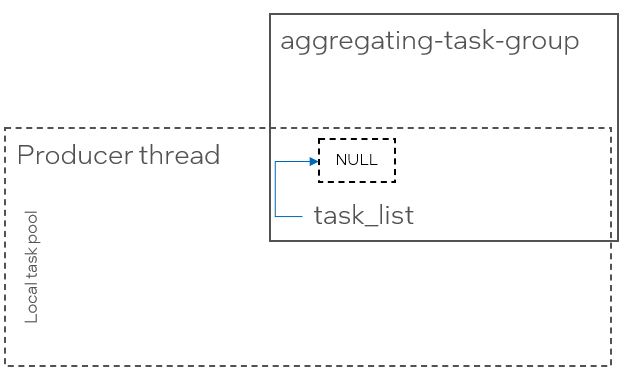

# Tasks Aggregation

This proposal describes a possible solution to the producer-consumer inefficiency that arises in the current ``task_group`` API.

## Introduction

Consider using a ``tbb::task_group`` in an application implementing a producer-consumer pattern where one producer thread generates work items,
and multiple consumer threads process them in parallel:

```cpp
void producer() {
    tbb::task_group tg;

    auto work_item = get_work_item();

    while (work_item != end_of_work) {
        tg.run(process{work_item});
    }

    tg.wait();
}
```

The ``get_work_item()`` function generates the work item for processing, e.g., by reading an input file or stream. When there is no more work to generate, it
returns ``end_of_work``. The exact number of work items to be generated is unknown in advance, which makes using parallel algorithms like
``tbb::parallel_for`` or ``tbb::parallel_for_each`` potentially inefficient, as they require buffering work items to form an input sequence.
``tbb::task_group`` is semantically appropriate, as it immediately submits the available work for execution.

In the current implementation, ``tbb::task_group::run`` creates a task to process the given function and spawns it by pushing it into the local task pool of
the producing thread.


When consumer (worker) threads join the task arena, they must search for tasks to process. |Since the only source of tasks in the arena is the local task pool
of the producing thread, consumer threads will steal individual tasks from it.


After executing the stolen tasks, consumer threads run out of work again and must steal from the same producer's local task pool.
Because the number of consumer threads can be large, stealing tasks from a single producer's task pool creates a bottleneck, resulting in significant
performance penalties and poor scalability.

Another bottleneck is a reference counter inside the ``tbb::task_group`` that is used to register the task in the group. The reference counter is incremented when a task 
is created and decremented when the task completes execution.

To improve the scalability of the reference counter, oneTBB ADD_VERSION introduced a per-thread reference counters - each thread that creates a task registers its thread-local
counter as a leaf in the ``task_group``'s reference counter. Tasks created by a thread hold a reference in the thread-local counter, which in turn holds a single reference
in the group's reference counter.

However, in the producer-consumer scenario, where all tasks are created by a single producer thread, this approach does not improve scalability.

## Proposed solution

The proposed solution combines the existing task spawning mechanism of ``task_group`` with an aggregator. For simplicity, let's refer to the API
implementing this idea as *aggregating-task-group*, which provides two methods ``run(task_body)`` and ``wait()`` - similar to the regular ``task_group``.

Tasks in an *aggregating-task-group* are represented as nodes in a singly linked list; each task contains a pointer to the next task.

The *aggregating-task-group* supports a thread-local singly linked list of tasks, which is initially empty(``atomic<listed-task*>`` set to ``nullptr``).

Each call to ``run()`` appends a task to the calling thread's list using an atomic CAS operation.

If the inserted task is the first task in the list, ``run()`` spawns a service *aggregating-task* pointing to the list.

The *aggregating-task* grabs the list it points to (``list_head.exchange(nullptr)``) and splits the grabbed list into chunks for processing.

Consider the producer-consumer example from the introduction, now using *aggregating-task-group* instead of ``tbb::task_group``.

When the *aggregating-task-group* is created, the list of the producer thread is empty.



The first task submitted to the group is appended to the list, and since the list was empty, it spawns (adds to the local task pool)
the ``agg_task``, which points to the producer thread's task list.

Aggregating tasks reserve a reference in the ``task_group``'s global counter and maintain a separate counter for tasks processing the chunks.
The lifetime of ``agg_task`` is extended until the last chunk of the grabbed list is processed.


Subsequent tasks submitted to the group are appended to the head of the list without spawning additional aggregating tasks.


When a consumer worker thread looks for work, the only task available for stealing is ``agg_task``.


When the consumer thread executes the ``agg_task``, it grabs the task list and makes it empty again. Further calls to ``run()`` will
append the task to the empty list and spawn additional *aggregating-task*s to grab the new list.


After grabbing the task list, the consumer thread splits the list into chunks of fixed size. Assume a chunk size of ``2``.
In the example above, it will create two service *chunk-task*s pointing to the sub-lists. One is spawned, while the other is bypassed.

Chunk tasks reserve a reference in the aggregating task's reference counter and maintain another counter for individual listed tasks in the chunk.
The lifetime of a chunk task is extended until the last listed task in the chunk is executed.


Another consumer thread can now steal the *chunk-task* from the first consumer thread's local task pool.

When the consumer thread executes the *chunk-task*, it spawns all tasks except one and bypasses the last.


### Alternative Approaches for Chunking

Alternative approaches for how the *aggregating-task* should process the grabbed list can be considered.

For example, it may follow the approach of ``tbb::parallel_for_each`` for forward iterators: it cuts a single chunk
from the list, re-spawns the *chunking-task* with the reduced list, and bypasses the *chunk-task*.

For example, it may follow the approach of ``tbb::parallel_for_each`` for forward iterators: it cuts the single chunk
from the list, re-spawns the *chunking-task* with the reduced list and bypasses the *chunk-task*. When a worker thread
executes the stolen *chunking-task*, it cuts and bypasses the task for the next chunk and re-spawns the *chunking-task*.

The *chunking-task* is re-spawned until the list is empty.

## Possible APIs

It does not make sense to completely replace ``task_group::run`` spawning mechanism with task aggregation, as this could
introduce unnecessary performance penalties in other ``task_group`` use cases (e.g., divide-and-conquer patterns), where
tasks are produced by multiple threads or generate additional tasks.

There are several options for expressing tasks aggregation in the public API:

1. A separate ``task_group``-like API, e.g., ``tbb::aggregating_task_group``, providing the same set
   of member functions as ``tbb::task_group``.
2. Integrate it into the regular ``tbb::task_group`` API by providing an additional overload for ``task_group::run`` that
   accepts a policy parameter, or a separate function in ``task_group``.
3. Introduce a separate API not connected with the task groups. One option is ``tbb::parallel_while(generator, predicate, body)``,
   which executed ``body(input)`` in parallel while ``pred(input) == true``, with ``input`` generated by repeated calls to ``generator()``.

## Open Questions

* Which public APIshould be used to implement tasks aggregation? See the [Possible APIs section](#possible-apis) for details.
* Which chunking approach should be implemented? See the [Alternative Approaches for Chunking section](#alternative-approaches-for-chunking) for details.
* What chunk size should be chosen?
