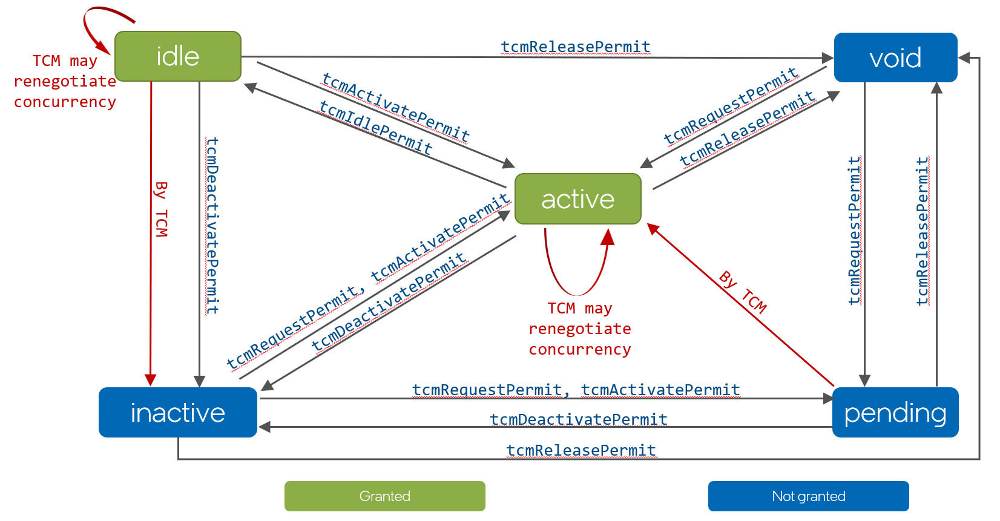

Developer Guide
###############

..
   * Composition Scenarios

     * General considerations for each of the composition type: what expected to happen with threads in each composition.
   * Draw a state machine diagram.
   * Give an example of concurrent thread pool from tests.

Usage Model
***********

Below is a simple example of a usage model a parallel runtime should follow to successfully use TCM.

#. Include :code:`tcm.h` header file and link the TCM library with the project.

   .. code-block:: cpp

       #include "tcm.h"

   *Note*: If necessary, adjust project settings so that the compiler can find :code:`tcm.h` header
   file and the TCM library when building and linking the project.

#. Register a client.

   .. code-block:: cpp

       tcm_client_id_t client_id;
       tcmConnect(client_callback, &client_id);

#. Describe the resources needed using the :code:`tcm_permit_request_t` data structure.

   .. code-block:: cpp

       tcm_permit_request_t request = TCM_PERMIT_REQUEST_INITIALIZER;

   *Note*: To describe a portion of platform resources adjust the fields of
   :code:`tcm_permit_request_t` object accordingly. Refer to description of
   :ref:`tcm_permit_request_t <tcm_permit_request_t>` data structure for more info.

#. Request a resources permit.

   .. code-block:: cpp

       uint32_t concurrency{};
       tcm_permit_t permit(&concurrency);
       tcm_permit_handle_t permit_handle = nullptr;
       tcmRequestPermit(client_id, request, &permit_handle, permit_handle, &permit);

   *Note*: The :code:`tcmRequestPermit` function might result in permit switched to :code:`PENDING`
   state, meaning that the requested resources are being used by another permit, and the requesting
   side should wait until TCM is able to satisfy the permit, hence activating it and notifying the
   client through invocation of a client callback.

#. Once the permit is activated, register that number of threads that were suggested by TCM.

   .. code-block:: cpp

       uint32_t suggested_concurrency = permit.concurrencies[0];

       // Wake up suggested_concurrency number of threads and register them with the permit
       tcmRegisterThread(permit_handle); // Invoked by each participating thread

#. Deactivate and activate the permit dependending on the resources usage model.

   .. code-block:: cpp

       // Once processing block ends, deactivate the permit
       tcmDeactivatePermit(permit_handle);

       // Activate permit when processing begins again
       tcmActivatePermit(permit_handle);

   *Note*: The activation of a permit might result in permit switched to :code:`PENDING` state,
   meaning that the requested resources are being used by another permit, and the requesting side
   should wait until TCM is able to satisfy the permit, hence activating it and notifying the
   client through invocation of a client callback.

#. Unregister threads and release permit once its resources are no longer needed.

   .. code-block:: cpp

       // By each thread, which was previously registered with the permit, run
       tcmUnregisterThread();

       // Invoke once
       tcmReleasePermit(permit_handle);

#. Disconnect from TCM when resources usage is no longer planned.

   .. code-block:: cpp

       tcmDisconnect(client_id);

**Warning**: When running application that uses TCM, set :code:`TCM_ENABLE=1` environment variable
to actually enable its use.

Refer to :doc:`api_reference` to find more information on TCM usage scenarios.

Permit State Transitions
************************

The diagram below shows possible transitions of a permit state.

Resource Permits and Teams of Threads
*************************************

The table below shows relation between permit state, team of threads, and whether the resources
described by a permit are allowed to be used or not.

Resource permit:

- Requested by language RT
- Granted by TCM
- Includes maximum concurrency and CPU mask (if :code:`tcm_cpu_constraints_t` was specified)
- The CPU mask may be different from concurrency

Team of threads

- Managed by language RT
- Can only be active with a valid resource permit

|----------------+------------------+-----------------------------------------------------------+------------------------------------|
| Permit State   | Resource usage   | Thread Team State                                         | Reactivation Speed                 |
|----------------+------------------+-----------------------------------------------------------+------------------------------------|
| Void/No permit | Not allowed      | **Cold**: Team sleeping or disbanded.                     | Slow - same as new request         |
|                |                  | No Language RT configuration maintained.                  |                                    |
|----------------+------------------+-----------------------------------------------------------+------------------------------------|
| Inactive       | Not allowed      | **Warm**: Team not actively consuming CPU resources.      | Fast - if reclaimed by Language RT |
|                |                  | Some configuration for Language RT is maintained.         |                                    |
|----------------+------------------+-----------------------------------------------------------+------------------------------------|
| Pending        | Not allowed      | **Warm** or **Cold**.                                     |                                    |
|                |                  | Language RT waits for the permit to be granted.           |                                    |
|----------------+------------------+-----------------------------------------------------------+------------------------------------|
| Idle           | Allowed          | **Hot**: Team is at quiescent point, might actively spin. | Fastest                            |
|                |                  | Highly configured for Language RT.                        |                                    |
|----------------+------------------+-----------------------------------------------------------+------------------------------------|
| Active         | Allowed          | **Active**: Team is executing tasks for Language RT.      | (Already Active)                   |
|                | (permit granted) | Highly configured for Language RT.                        |                                    |
|----------------+------------------+-----------------------------------------------------------+------------------------------------|

Composition Scenarios
*********************

The section describes various composition scenarios of parallel runtimes that can occur in runtime
providing details on transition of CPU resources between them.

Sequential Requests
===================

**Use Case:** One or more clients request resources one after the other.

Example:

*Listing 1: Sequential requests for resources from multiple clients.*

.. code:: cpp

    #pragma omp parallel for
    for(int i = 0; i < 100; ++i) {
        /*OpenMP threads working*/
    }

    tbb::parallel_for(0, 100,  {
        /*TBB threads working*/
    });

    #pragma omp parallel for
    for(int i = 0; i < 100; ++i) {
        /*OpenMP threads working again*/
    }

At every moment of time the resources are meant to be used by only one parallel runtime.

Although, this represents the simplest composition scenario, it is still can benefit from using
Thread Composability Manager. This is because usually resources are not released immediately after a
parallel region, but remain being used for some time anticipating new parallel work to appear soon.
It is important to notify TCM about such situation through a call to :code:`tcmIdlePermit` so that
permit resources can be re-used by subsequent requests from another runtime.

Concurrent Requests
===================

**Use Case:** Two or more clients request resources concurrently and independently. No client makes
new requests while holding one.

Possible scenarios:

1. *Independent requests*

   Requests are not coordinated and may compete for the same resources.

Example:

*Listing 2: Independent requests happening concurrently: one client requests for :math:`P_{1}`
resources, the other - for :math:`P_{2}`.*

.. code:: cpp

    std::thread omp_call([&] {
        #pragma omp parallel for num_threads(P1)
        for(int i = 0; i < 100; ++i) {
            /*OpenMP threads working*/
        }
    });

    std::thread tbb_call([&] {
        tbb::task_arena a(P2);
        a.execute([&] {
            tbb::parallel_for(0, 100,  {
                /*TBB threads working*/
            });
        });
    });

    omp_call.join();
    tbb_call.join();

2. *Perfect or hierarchical concurrency*.

   Multiple resource requests are spread across available resources with no oversubscription. For
   example, each request is done for cores in a separate NUMA domain.

Nested Requests
===============

**Use Case:** One or more clients request resources while using the permit from one of the previous
requests.

Common case:

*Listing 3: Nested requests for resources from different runtimes.*

.. code:: cpp

    tbb::parallel_for(0, 100,  {
        /*TBB threads working*/

        #pragma omp parallel for
        for(int i = 0; i < 100; ++i) {
            /*OpenMP threads working*/
        }
    });

Possible scenarios:

1. *Agnostic nesting*.

   Each level requests parallelism independently, as if it was alone. This is the typical case of
   oneAPI Math Kernel Library (oneMKL) calls nested in oneAPI Threading Building Blocks (oneTBB)
   calls.

2. *Perfect or hierarchical nesting*.

   The outer level limits its concurrency requesting widely spread resources (e.g. one core per
   every socket), under the assumption/knowledge about inner levels utilizing “close” resources
   (e.g. all cores in a socket).

Combined Use Cases
==================

The combined use cases include sequential, concurrent, and nested use cases mixed in the code.

Sequential with Nested
----------------------

*Listing 4: Example of sequential with nested calls.*

.. code:: cpp

    #pragma omp parallel for
    for(int i = 0; i < 100; ++i) {
        /*OpenMP threads working*/
    }

    tbb::parallel_for(0, 100,  {
        /*TBB threads working*/
        #pragma omp parallel for
        for(int i = 0; i < 100; ++i) {
            /*OpenMP threads working again*/
        }
    });

